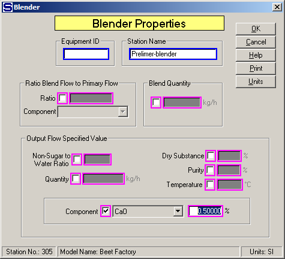
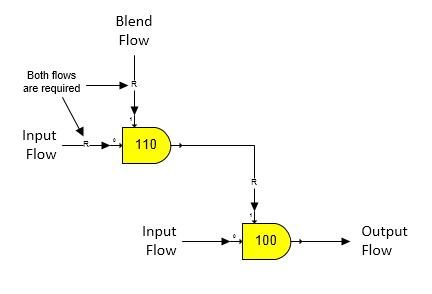

# Blender Examples

 

As shown on the Blender Properties window below, a blend flow is being
blended into an input flow until the output flow contains 0.50% CaO.
Other possibilities are for the blend flow to be controlled to give an
output flow Non-Sugar to Water Ratio, Quantity, Dry Substance, Purity,
or Temperature.  And, the blend flow can be made a ratio of the input
(primary) flow as either to the total input flow or a component in the
input flow; or, the blend flow quantity can be set to a specified value
(Blend Quantity).

 

 

Blend (port 1) flows to a blender are always required flows regardless
of whether they are internal, or external flows. Conversely, the input
(primary) port 0 flow into the blender will be a required flow only if
the output flow from the blender is required by another station. If the
output flow is a required flow, and a Quantity has been specified, the
required value will be used instead of the specified Quantity; however,
Sugars will give a warning message that the specified Quantity was not
used. The figure below shows two blenders cascaded together to blend a
second blend flow into a blend flow for another blender. Because the
blend flow into station no. 100 is required, the output flow from
station no. 110 is required; hence, Sugars will calculate the quantities
of both flows into station no. 110 (i.e., both input flows are
required).

 

 

Because the output flow from a blender station can be a required flow,
the blender station can be used to mix two flows at a set ratio to
satisfy the needs of another station; for example, the vapor
requirements of a pan station can be satisfied by a blender with two
vapor input flows of different pressure that are combined together in a
specified ratio.

 

 

[Blender Features](Blender_Features.htm)

[Blender Properties](Blender_Properties.htm)
