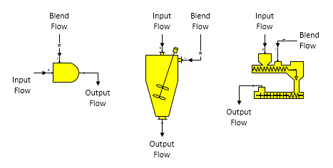

# Blender Features

 

Blender  Blender stations are used to blend one flow
stream into
another.  For
example, blenders are used for mixing (blending) syrup with sugar
crystals to produce magma, blending condensate with steam to remove
superheat, blending milk of lime with juice for juice liming,
etc.

 

A blender station has two input flows as shown for each of the shapes in
the figure below. The input flow goes into port 0 and the blend flow
goes into port 1 (zoom in on the shape to see the port identifiers). The
orientation of the blender can be changed easily using the Visio shape
rotation and/or flipping features, but the text will stay parallel to
the input and output flows.

 

 

General Features  The blend (port 1) flow is controlled by setting the
properties for the blender to give either a weight ratio of the blend
flow to the input (port 0) flow rate (or, one of its
components), to a specified quantity of blend flow (Blend Quantity), or
to a set value in the output flow; for example, Non-Sugar to Water
Ratio, Quantity, Dry Substance, Purity, Temperature, or Component
percent. The input flow goes to input port 0 (zoom in on the blender
shape to see the input port numbering). The blend flow goes to input
port 1 and it will always be made a required flow by Sugars; that is,the
blend flow rate will be calculated by Sugars.

 

Change of phase is considered for water (that is, water may vaporize, or
condense). Sucrose crystals may dissolve, but not grow. Blender stations
can be used to add dilution water to a flow stream (for example,
molasses dilution water). Also, a blender can be used for pressure
feedback when either of the input flows is a pressure feedback flow and
the other flow defines the pressure to be fed back. And, if both input
flows are pressure feedback flows, the output flow will be a pressure
feedback flow (same as a [Receiver](../Receiver/Receiver_Features.htm)
station).

 

The output flow pressure from a blender station will be equal to the
minimum of the pressures for the blend and primary flows - the same as
for a receiver station (see
<a href="../Receiver/Receiver_Features.htm" class="hcp5">Receiver
Features</a>). And, the temperature of the output flow will be a result
of the heat contents of the blend and input flows. Other features of a
blender station are similar to a receiver station; for example, flow
components and quantity of the output flow are a result of the blend and
input flows, and the input flows can be pressure feedback flows. If the
input flow is a pressure feedback flow, the pressure fed back will be
the pressure of the blend flow into the blender. Conversely, if the
blend flow is a pressure feedback flow and the input flow is not, then
the blend flow pressure will be set to the input flow pressure.  If the
output flow from a blender is a pressure feedback flow and the flow
leaves the model, then the pressure for the flow and the feedback
pressure will be set to the atmospheric pressure (see
<a href="../Overview/Program_Overview.htm" class="hcp5">Program Overview
&gt; User Interface</a>).

 

The output flow solubility coefficients will be a
weight-weighted-average of the input and blend flows if the solubility
function coefficients for the blend flow are different from the input
flow.

 

 

[Blender Properties](Blender_Properties.htm)

[Blender Examples](Blender_Examples.htm)
