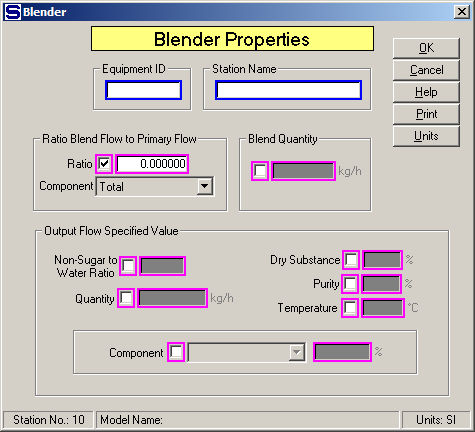

# Blender Properties

 

 

Equipment ID  An equipment ID of up to 11 characters can be used to
identify the station with an actual station in the process. Any
combination of numbers and letters that are used in the factory/refinery
to identify equipment can be entered. For example, Equipment ID =
123.456A. It is not necessary to make an entry in the Equipment ID field
if the station in the model does not have a corresponding station in the
factory/refinery.

 

Station Name  A name of up to 20 characters must be entered for the
station. For example, Station Name = Magma Mixer.

 

Ratio Blend Flow to Primary Flow  Select the Ratio Flow to Component
entry fields by clicking in the small box between "Ratio" and the ratio
entry field. This will cause the other fields to gray out and not be
accessible. After the box is checked, make an entry in the Ratio field
and select a Component from the component drop-down list. Magenta
colored borders on the entry fields are used to indicate that only one
of the entries can be selected; that is, when one is selected the others
are not accessible.

 

Ratio  The quantity of blend flow is controlled by a ratio value of the
quantity of flow in a component of the primary flow, or to the total
flow. For example, Ratio = .3 to use a ratio of .3 to the quantity of
the component selected in the Component entry box.

 

Component  The component drop-down box allows for a selection to be made
from the components in the primary flow stream for use with the ratio
value to control the blend flow into the blender. The blend flow will be
controlled to flow into the blender in a ratio to the quantity of
component flow in the primary input flow. For example, Component = CaO
means the quantity of blend flow will be controlled to the ratio entry
value times the quantity of input flow times the component fraction of
CaO. Component = Total means the quantity of blend flow will be
controlled to the ratio entry value times the total quantity of input
flow.

 

Blend Quantity  Select the Blend Quantity entry field by clicking in the
box to the left of the entry field. Enter the quantity of blend flow
into the blender in the weight units shown to the right of the entry
field. The quantity of output flow from the blender will be the sum of
the primary input flow plus the specified blend flow. For example, Blend
Quantity = 12450.0 means that 12,450 weight units (kg, or lb) per hour
will be added to the primary flow.

 

Output Flow Specified Value  The amount of blend flow can be controlled
by the non-sugar to water ratio, quantity, dry substance, purity,
temperature, or percent of a component in the output flow. Check the
small box next to the entry field and make an entry in the field to
select an option.

 

Non-Sugar to Water Ratio  Enter a Non-Sugar to Water Ratio for the
output flow that is to be controlled by the blend flow. Non-sugars are
the dissolved non-sucrose components. For example, Non-Sugar/Water Ratio
= 2.37.

 

Quantity  Enter a Quantity for the output flow and the blend flow will
be used to control the output flow to the value entered. For example,
Quantity = 150,000.00 means that the quantity of blend flow into the
blender station will be controlled to give an output flow of 150,000
kg/h (when SI units are selected).

 

Dry Substance  Enter a Dry Substance of the output flow from the blender
that is to be controlled by the blend flow. The Dry Substance is the
dissolved solids and crystalline sucrose (if any) divided by the total
liquid and crystalline sucrose quantity (that is, dissolved solids,
crystalline sucrose and water). For example, Dry Substance = 62.50%.

 

Purity  Enter a Purity of the output flow from the blender that is to be
controlled by the blend flow. The Purity is the dissolved and
crystalline (if any) sucrose divided by the dissolved dry substance and
crystalline sucrose (if any). For example, Purity = 87.60%.

 

Temperature  Enter a Temperature of the output flow from the blender
that is to be controlled by the blend flow into the blender. For
example, Temperature = 74.5.

 

Component  The quantity of blend flow will be adjusted to satisfy the %
field entry using the Component for the output flow. Select the
Component from the drop-down box
by clicking the down arrow. For example, Component is CaO and entry is
3.0000 in the % field will give 3.00% CaO in the output flow. Or, when
Component is Water and entry is 85.0000 in the % field, the blend flow
will be adjusted to control the output flow to have 85.00% water.

 

 

[Blender Features](Blender_Features.htm)

[Blender Examples](Blender_Examples.htm)

 
