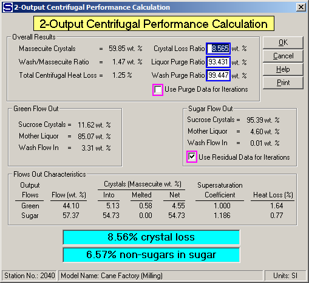

# 2-Output Centrifugal Evaluation

 

 

The resultant centrifugal performance calculation is shown on the above
window. The calculated performance values are used by Sugars to predict
how different massecuites will be separated into the green (or molasses)
and sugar output flows.

 

The Overall Results section of the performance calculations gives the
following values.

 

Massecuite Crystal = weight % of crystal content in the massecuite,

Wash/Massecuite Ratio = weight % of the wash flow to the massecuite flow
into the centrifugal,

Total Centrifugal Heat Loss = total loss of heat,

Crystal Loss Ratio  = weight % of crystals lost from the massecuite to
the green (or molasses),

Liquor Purge Ratio  = weight % of the mother liquor in the massecuite
purged out to the green (or molasses),

Wash Purge Ratio (wt. %) = weight % of the wash flow into the
centrifugal purged out to the green (or molasses).

 

Two of the most significant results of the performance calculations, are
the "Crystal Loss Ratio (wt. %)" and "Liquor Purge Ratio (wt. %)" and
their relationship to the "Wash/Massecuite Ratio (wt. %)". These ratios
have a direct impact on the performance of a process. Obviously, the
centrifugal performance and process efficiency will be better with more
mother liquor purged to the green (or molasses) at a low Wash/Massecuite
Ratio (wt. %) and low Crystal Loss Ratio (wt. %).

 

The crystals lost to the green (or molasses) are due to crystals passing
through the screen and/or melting.
The "Crystal Loss Ratio (wt. %)" is the total of these losses. A high
crystal loss may suggest that the centrifugal screen needs to be
replaced, or excessive wash water is being used if the crystal loss is
high due to melting. A highlighted summary of crystal loss and
non-sugars in sugars gives: (1) the total crystal loss that is the sum
of those lost to the green (or molasses) and those that melt in the
sugar flow, and (2) the non-sugars that remain with the sugar flow out
of the centrifugal. Low values of total crystal loss and non-sugars in
sugar are the result of good centrifugal performance and good sugar
crystallization.

 

The "Green Flow Out" and "Sugar Flow Out" sections of the window show
the makeup of each of the two output flows. That is, they are made up of
sucrose crystals (both solid and/or melted) and mother liquor from the
massecuite and wash from the wash flow into the centrifugal.

 

The check box for "Use Residual Data of Iterations" selects the residual
of mother liquor and wash flow in that remains on the sucrose crystals
and is to be held during the balance calculations. The other alternative
is to select the "Use Purge Data for Iterations" as the values to be
held during the balance calculations. The two options for the iteration
calculations are to allow for a selection of the preferred method by a
user. The default selection is to hold the residual mother liquor and
wash flow in values that adhere to the crystal surface instead of the
Liquor Purge Ratio and Wash Purge Ratio values.

 

The "Flows Out Characteristics" section shows a breakdown of the weight
percent of the total flow in (massecuite and wash) that goes out in the
green (or molasses) and sugar flows. This evaluation also shows the
weight percentage of crystals that initially flow to each output stream
and the portion melted. The melting calculation is based on the
saturation level of the flow. If the flow is under saturated, Sugars
will assume that crystals melt until sucrose saturation is achieved.
However, if the flow is supersaturated, Sugars assumes that crystal
growth will not occur. No crystal growth is considered in the
centrifugal station. Finally, a heat loss (%) is given for each output
flow to show which flow is responsible for most of the heat lost.

 

During a simulation by Sugars, different massecuites flowing to the
centrifugal are analyzed for their crystal content and mother liquor
properties. The performance values for the centrifugal are used to
determine the efficiency of the separation of the mother liquor and wash
from the crystals. The values calculate for the data entered can be
modified and the corresponding data that would have to be produced by
the centrifugal is calculated by Sugars. Editing the performance values
and rebalancing the model is a good way to see the effectiveness of a
centrifugal station to the performance of a factory.

 

The input data for the green (or molasses) and sugar flow out must also
change if the centrifugal performance values change. That is, the
percent dry substance (%DS) and purity for the green (or molasses) and
sugar leaving the centrifugal must have values that coincide with the
crystal loss, liquor purge and wash purge ratios. Sugars will calculate
these values after new performance values are entered on the 2-Output
Centrifugal Performance Calculation results window.

 

Sometimes when trying to do centrifugal performance evaluations, the
input data is not consistent and performance calculations cannot be done
because of error messages from Sugars. In these cases, %DS and purity
values for the green and sugar can be used that do give performance
values and then these performance values can be edited to obtain new
values for the %DS and purity of the green and sugar. By using
trial-and-error, the proper %DS and purity values can be obtained that
will give performance results for the centrifugal when the data has
errors.

 

Color calculations are done for each output flow from the centrifugal
based on the color of the massecuite and wash flow in. The massecuite
color is made up of the color of the mother liquor and sucrose crystals.
Pure sucrose crystals have the same color as the color assigned to pure
sucrose, but the color of the mother liquor is a combination of the
color of pure sucrose, N.S. \#1 and N.S. \#2 (if any). When the
centrifugal calculations are done during the balance calculations, the
color of the output flow streams is determined by the makeup of each
output flow for sucrose crystals, mother liquor and wash. If the
calculated color of the sugar flow out does not match with the measured
color of the sugar leaving the actual centrifugal station, the sugar
color can be revised by making small changes in the purity of the sugar
flow out. The color calculation is used to revise the sugar purity
values because the laboratory cannot usually measure purity close enough
to coincide with the color of sugar. For example, suppose that the
measured color of the sugar out was 180 IU, but the calculated value of
the color as determined by Sugars after the balance calculations was 130
IU. Decreasing the sugar purity value used in the centrifugal
performance calculations can raise the color value of the sugar out. The
sugar purity field allows up to one thousandths changes to make the
small changes that are necessary to get color values that agree with the
measured ones. Usually, a small change in the last few digits of the
purity is all that is required to get agreement with the measured color
values. The purity value is changed by trial-and-error until the color
value as calculated by Sugars agrees with the measured color.

 

 

[Centrifugal Features](Centrifugal_Features.htm)

[2-Output Centrifugal Properties](2-Output_Centrifugal_Properties.htm)

[Centrifugal Examples](Centrifugal_Examples.htm)
