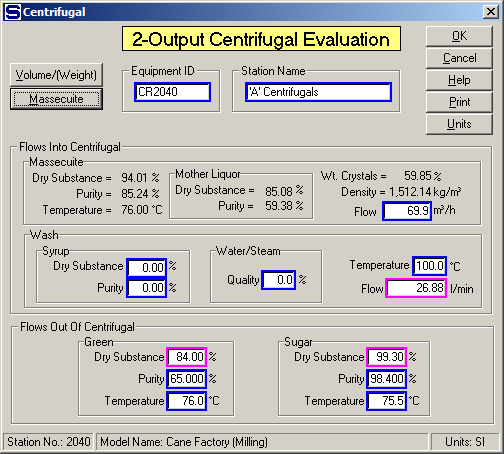

# 2-Output Centrifugal Properties

 

Actual data from a centrifugal in the factory, or process, being modeled
is entered on the centrifugal evaluation window shown below. All entry
fields are shown with a blue border and optional fields are shown with a
magenta border. The three magenta fields are: (1) flow rate of wash flow
in, (2) %Dry Substance of Green flow out, and (3) %Dry Substance of
Sugar flow out. Two of these three fields must be entered and Sugars
will calculate the remaining value. If the wash flow into the
centrifugal is 0.0, leave the wash flow in temperature (°C) and
volumetric flow values blank (or 0.0); also, enter 0.0 for the %DS of
both the green and sugar (that is, only the purity and temperature
values are necessary) and Sugars will calculate the %DS for both the
molasses and sugar. Example entries are shown on the window below.

 

 

Equipment ID  An equipment ID of up to 11 characters can be used to
identify the station with an actual station in the process. Any
combination of numbers and letters that are used in the factory/refinery
to identify equipment can be entered. For example, Equipment ID =
123.456A. It is not necessary to make an entry in the Equipment ID field
if the station in the model does not have a corresponding station in the
factory/refinery.

 

Station Name  A name of up to 20 characters must be entered for the
station. For example, Station Name = 'A' Centrifugal.

 

Massecuite Flow  Enter the flow of massecuite into the centrifugal. The
flow can be entered in either volume units (m3/h, or ft3/h), or in
weight units (t/h, or ton/h). The massecuite flow quantity is necessary
to determine the ratio of Wash/Massecuite into the centrifugal.

 

Wash  Enter values to define the wash flow into the centrifugal. The
wash can be water, syrup, steam, or a combination of these.

 

Syrup  Enter the % Dry Substance and Purity if syrup is being used for
the wash.

 

Water/Steam  Enter the Quality of the steam if steam, or a mixture of
steam and condensate, is used for the wash. For example,

 

100.0% Quality = 100% steam,

0.0% Quality = 100% water (that is, zero steam).

 

Temperature  Enter the temperature (°C, or °F) of the wash.

 

Flow  The quantity of wash flow into the centrifugal is optional. Only
two of the three fields with magenta borders need to be entered. The
third field that is not entered is calculated by Sugars. If the wash
flow into the centrifugal is 0.0, leave the wash flow in temperature and
flow values 0.0 and enter 0.0 for the Dry Substance (%) for the green
and sugar (that is, only the purity and temperature values are
necessary) and Sugars will calculate the Dry Substance (%) for both the
green and sugar.

 

Green  Enter the Dry Substance (%), Purity (%) and Temperature (°C, or
°F) for the green (molasses) flow out of the centrifugal. The Dry
Substance (%) does not have to be entered if the quantity of wash and
the Dry Substance (%) of the sugar are known and entered. Sugars will
calculate the green Dry Substance (%) if 0.0 is entered for the green
Dry Substance (%) and the other two magenta fields have entries.

 

Sugar  Enter the Dry Substance (%), Purity (%) and Temperature (°C, or
°F) for the sugar flow out of the centrifugal. The Dry Substance (%)
does not have to be entered if the quantity of wash and the Dry
Substance (%) of the green are known and entered. Sugars will calculate
the sugar Dry Substance (%) if 0.0 is entered for the sugar Dry
Substance (%) and the other two magenta fields have entries.

 

After entering all of the data on the 2-Output Centrifugal Evaluation
window, click on the OK button and the unknown
values will be displayed. Review the results and click on the
OK button to
display the calculated results (see [2-Output Centrifugal
Evaluation](2-Output_Centrifugal_Evaluation.htm)), or click on the
Cancel button to
redo any entries.

 

 

[Centrifugal Features](Centrifugal_Features.htm)

[2-Output Centrifugal Evaluation](2-Output_Centrifugal_Evaluation.htm)

[Centrifugal Examples](Centrifugal_Examples.htm)
