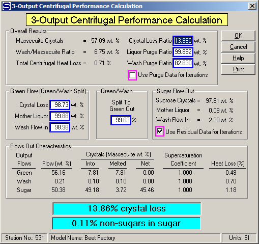

# 3-Output Centrifugal Evaluation

 

 

The results from a batch centrifugal evaluation are similar to those
from a continuous centrifugal, except that an additional evaluation is
made of the split between the green (or molasses) and wash output flows.
This evaluation shows how much of the purged wash water, mother liquor
and crystal loss goes to the green. The remainder, of course, goes to
the wash flow out.

 

As discussed earlier for 2-Output centrifugals (see [2-Output
Centrifugal Evaluation](2-Output_Centrifugal_Evaluation.htm)), crystals
lost to the green and wash are from crystals that pass through the
screen and/or from crystals that melt. The "Crystal Loss Ratio (wt. %)"
is the total of these losses. The highlighted summary above the "Model
Name" line on the above window gives the total crystal loss that is the
sum of those lost to the green and wash and the non-sugars that remain
with the sugar flow out of the centrifugal.

 

The Overall Results section of the performance calculations gives the
following values.

 

Massecuite Crystal (wt. %) = crystal content in the massecuite,

Wash/Massecuite Ratio (wt. %) = ratio of the wash flow to the massecuite
flow into the centrifugal as a weight percentage,

Total Centrifugal Heat Loss (%) = total loss of heat,

Crystal Loss Ratio (wt. %)  = weight percent of crystals lost from the
massecuite to the green (or molasses) and wash output flows,

Liquor Purge Ratio (wt. %)  = percentage of the mother liquor in the
massecuite purged out to the green (or molasses) and wash output flows,

Wash Purge Ratio (wt. %) = percentage of the wash flow into the
centrifugal purged out to the green (or molasses) and wash output flows.

 

Two of the most significant results of the performance calculations, are
the "Crystal Loss Ratio (wt. %)" and "Liquor Purge Ratio (wt. %)" and
their relationship to the "Wash/Massecuite Ratio (wt. %)". These ratios
have a direct impact on the performance of a process. Obviously, the
centrifugal performance and process efficiency will be better with more
mother liquor purged from the sugar at a low Wash/Massecuite Ratio (wt.
%) and low Crystal Loss Ratio (wt. %).

 

Worn centrifugal screens or excessive wash water being used if the loss
is from melting can cause a high crystal loss. The highlighted summary
above the of crystal loss and non-sugars in sugar gives: (1) the total
crystal loss that is the sum of those lost to the green and wash flows
out and those that melt in the sugar flow, and (2) the non-sugars that
remain with the sugar flow out of the centrifugal. Low values of total
crystal loss and non-sugars in sugar are the result of good centrifugal
performance and good sugar crystallization.

 

The "Green Flow (Green/Wash Split)" section of the window shows the
percentage of the Crystal Loss, Mother Liquor and Wash Flow In that go
to the green of the total that goes to both the green and wash flows out
of the centrifugal. This is labeled the "Green/Wash Split, wt. %". It
shows how the total losses of sucrose crystals, mother liquor purged and
wash flow in purged are divided between the green and wash flows out.

 

The "Sugar Flow Out" section of the window shows the makeup of the sugar
flow leaving the centrifugal. That is, it is made up of sucrose crystals
(both solid and/or melted) and mother liquor from the massecuite and
wash from the wash flow into the centrifugal.

 

The check box for "Use Residual Data of Iterations" selects the residual
of mother liquor and wash flow in that remains on the sucrose crystals
and is to be held during the balance calculations. The other alternative
is to select the "Use Purge Data for Iterations" as the values to be
held during the balance calculations. The two options for the iteration
calculations are to allow for a selection of the preferred method by a
user. The default selection is to hold the residual mother liquor and
wash flow in values that adhere to the crystal surface instead of the
Liquor Purge Ratio and Wash Purge Ratio values. When the Sugar Flow Out
values are selected instead of the ratios, the crystal loss is the same,
but the condition of the massecuite flow into the centrifugal will have
less effect on the sugar flow out because the same amount of sucrose
crystal, mother liquor and wash flow in will be used for the sugar flow
out. However, if the loss and purge ratios are selected as the values to
be held during the balance calculations, the loss of sucrose crystal and
the purge of mother liquor and wash flow in will remain constant and the
makeup of the sugar flow out will change as the massecuite flow in
changes.

 

The "Flows Out Characteristics" evaluation shows a breakdown of the
weight percent of the total flow in (massecuite and wash) that goes out
in the green (or molasses), wash and sugar flows out. This evaluation
also shows the weight percentage of crystals that initially flow to each
output stream and the portion melted. The melting calculation is based
on the saturation level of the flow. If the flow is under saturated,
Sugars will assume that crystals melt until sucrose saturation is
achieved. However, if the flow is supersaturated, crystal growth is not
considered in the centrifugal station and Sugars assumes that crystal
growth will not occur. Finally, a heat loss (%) is given for each output
flow to show which flow is responsible for most of the heat lost.

 

Different massecuites flowing to the centrifugal are analyzed for their
crystal content and mother liquor properties during a simulation (that
is, during the balance calculations) by Sugars. The performance values
for the centrifugal, as shown in the figure above, are used to calculate
the green, wash and sugar flows out of the centrifugal with their
corresponding dry substance (%DS), purity and temperature values.

 

The performance values can be edited, if necessary. The center of the
window shows the Green/Wash Split (% to Green Out) as a percentage of
the total of green and wash out of the centrifugal. Individual values of
Crystal Loss, Mother Liquor and Wash Flow in values in the Green Flow
(Green/Wash Split) box can be changed without affecting the other two
values; however, changing the Green/Wash Split (% to Green Out) value
will cause all three values for the Green Flow (Green/Wash Split) to
change.

 

Sometimes when trying to do centrifugal evaluations, the input data is
not consistent and performance calculations cannot be done because of
error messages from Sugars. In these cases, %DS and purity values for
the green and sugar can be used that do give performance values and then
the performance values can be edited to obtain new values for the %DS
and purity of the green, wash and sugar. By using trial-an-error, the
proper %DS and purity values can be obtained that will give performance
results for the centrifugal when the data has errors.

 

Color calculations are done for each output flow from the centrifugal
based on the color of the massecuite and wash flow in. The massecuite
color is made up of the color of the mother liquor and sucrose crystals.
Pure sucrose crystals have the same color as the color assigned to pure
sucrose, but the color of the mother liquor is a combination of the
color of pure sucrose, N.S. \#1 and N.S. \#2 (if any). When the
centrifugal calculations are done during the balance calculations, the
color of the output flow streams is determined by the makeup of each
output flow for sucrose crystals, mother liquor and wash. If the
calculated color of the sugar flow out does not match with the measured
color of the sugar leaving the actual centrifugal station, the sugar
color can be revised by making small changes in the purity of the sugar
flow out.

 

The color measurement of the sugar flow out can be used to revise the
sugar purity values because the laboratory cannot usually measure purity
close enough to coincide with the color of sugar. For example, suppose
that the measured color of the sugar out was 29 IU, but the calculated
value of the color as determined by Sugars after the balance
calculations is 18 IU. Decreasing the purity of the sugar used in the
centrifugal performance calculations can increase the color value of the
sugar out. Usually, a small change in the last few digits of the purity
will be all that is required to get agreement with the color values. The
purity value is changed by trial-and-error until the color value as
calculated by Sugars agrees with the measured color.

 

 

[Centrifugal Features](Centrifugal_Features.htm)

[3-Output Centrifugal Properties](3-Output_Centrifugal_Properties.htm)

[Centrifugal Examples](Centrifugal_Examples.htm)
