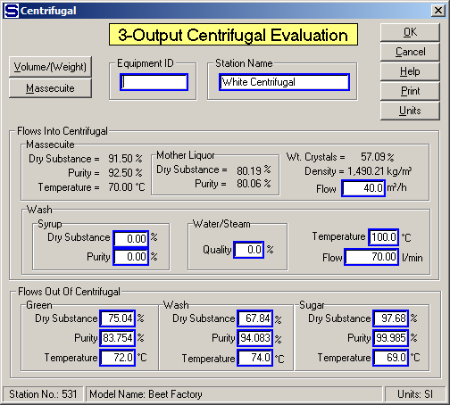

# 3-Output Centrifugal Properties

 

 

Equipment ID  An equipment ID of up to 11 characters can be used to
identify the station with an actual station in the process. Any
combination of numbers and letters that are used in the factory/refinery
to identify equipment can be entered. For example, Equipment ID =
123.456A. It is not necessary to make an entry in the Equipment ID field
if the station in the model does not have a corresponding station in the
factory/refinery.

 

Station Name  A name of up to 20 characters must be entered for the
station. For example, Station Name = White Centrifugal.

 

Massecuite  Enter the flow of massecuite into the centrifugal. The flow
can be entered in either volume units (m3/h, or ft3/h), or in weight
units (t/h, or ton/h). The massecuite flow quantity is necessary to
determine the ratio of Wash/Massecuite into the centrifugal.

 

Wash  Enter values to define the wash flow into the centrifugal. The
wash can be water, syrup, steam, or a combination of these.

 

Syrup  Enter the % Dry Substance and Purity if syrup is being used for
the wash.

 

Water/Steam  Enter the Quality of the steam if steam or a mixture of
steam and condensate is used for the wash. For example,

 

100.0% Quality = 100% steam,

0.0% Quality = 100% water (that is, zero steam).

 

Temperature  Enter the temperature (°C, or °F) of the wash.

 

Flow Enter the quantity of wash flow into the centrifugal. If the wash
flow in is 0.0, be sure to set the wash flow temperature to 0.0.

 

Green  Enter the Dry Substance (%), Purity (%) and Temperature (°C, or
°F) for the green (molasses) flow out of the centrifugal.

 

Wash  Enter the Dry Substance (%), Purity (%) and Temperature (°C, or
°F) for the wash flow out of the centrifugal. Entries must be made for
all fields

 

Sugar  Enter the Dry Substance (%), Purity (%) and Temperature (°C, or
°F) for the sugar flow out of the centrifugal.

 

After making all of the entries on the 3-Output Centrifugal Evaluation
window, click on the OK button
and the performance calculations will be done by Sugars and the results
will be displayed on the 3-Output Centrifugal Performance Calculation
window (see [3-Output Centrifugal
Evaluation](3-Output_Centrifugal_Evaluation.htm)).

 

 

[Centrifugal Features](Centrifugal_Features.htm)

[3-Output Centrifugal Evaluation](3-Output_Centrifugal_Evaluation.htm)

[Centrifugal Examples](Centrifugal_Examples.htm)
