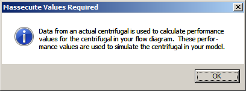
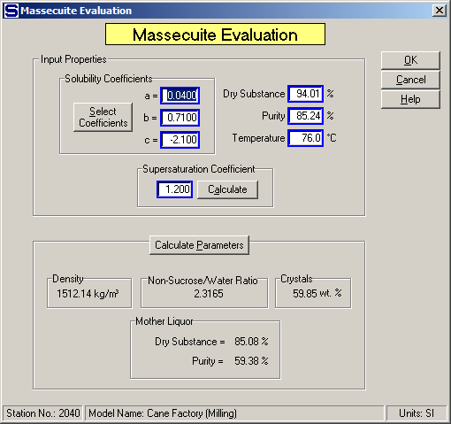
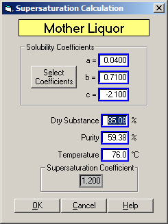

# Centrifugal Evaluations

 

Centrifugal evaluations are used by Sugars to evaluate the separation of
sucrose crystals and mother liquor from a massecuite processed by a
centrifugal during a simulation. The performance calculations for a
centrifugal station are a direct result of the input data provided.
Sugars uses the input data to do a material balance for the station to
find the amount of mother liquor in the massecuite and wash flow into
the centrifugal that is purged and the amount of sucrose crystals that
are lost to the green or molasses (and wash flow out if a 3-Output
centrifugal is being evaluated).

 

Frequent updating of the centrifugal input data and performance
calculations will provide the best simulation accuracy for a factory
because of the changing nature of the centrifugal station. Further
details regarding the method of calculation for centrifugal stations are
given in the [Theory \> Centrifugal
Calculations](../Theory/Theory.htm#Centrifugal_Calculations) section.

 

The evaluation of both 2-Output and 3-Output centrifugals is initiated
by first doing an evaluation of the massecuite into the centrifugal.

 

 

The above window shows the message window that appears when a new
centrifugal station is being evaluated for the first time. This message
window will only appear if the centrifugal has not been previously
evaluated. Click on the OK button to close the window and begin the
evaluation by entering data in the Massecuite Evaluation window (shown
below with data already entered).

 

The massecuite characteristics are obtained from an actual sample of the
massecuite going into the centrifugal being evaluated. Massecuite data
that needs to be provided from an actual sample includes the percent dry
substance (%DS), purity, temperature and supersaturation of the
massecuite as it flows into the centrifugal. Also, the massecuite 'a',
'b' and 'c' coefficients should be entered that correspond to the
massecuite being evaluated (that is, the coefficients may be different
for the actual massecuite than the coefficients being used in the
model). After the data is entered, the calculated parameters give the
specific weight, non-sucrose/water ratio, weight percent of crystals,
and mother liquor dry substance and purity for the massecuite (see
window below).

 

 

If the supersaturation coefficient is not known, it can be calculated
from a measurement of the mother liquor dry substance and purity. These
values can be entered on the window that appears if the Calculate button
is pressed that is to the right of the Supersaturation Coefficient
field. The non-sucrose/water ratio is maintained when the
supersaturation coefficient is calculated. That is, the
non-sucrose/water ratio as calculated from the massecuite dry substance
and purity will be maintained for the mother liquor (see window below).

 

 

After the massecuite evaluation is completed, the centrifugal
performance evaluation is done by Sugars using measured data for the
output flows from the centrifugal. The windows for entering this data
are different for the different types of centrifugals; that is, the
2-Output Centrifugal (see [2-Output Centrifugal
Properties](2-Output_Centrifugal_Properties.htm)) and the 3-Output
Centrifugal (see [3-Output Centrifugal
Properties](3-Output_Centrifugal_Properties.htm)) have their own entry
windows. Data is entered into these windows and Sugars checks the data
for consistency and then calculates the performance of the centrifugal.
The performance calculations are displayed on different windows for each
type of centrifugal. That is, the 2-Output Centrifugal performance is
shown on the 2-Output Centrifugal Performance Calculation window (see
[2-Output Centrifugal Evaluation](2-Output_Centrifugal_Evaluation.htm)),
and the 3-Output Centrifugal performance is shown on the 3-Output
Centrifugal Performance Calculation window (see [3-Output Centrifugal
Evaluation](3-Output_Centrifugal_Evaluation.htm)). A discussion of each
of these windows follows in their respective sections.

 

 

[Centrifugal Features](Centrifugal_Features.htm)

[2-Output Centrifugal Properties](2-Output_Centrifugal_Properties.htm)

[3-Output Centrifugal Properties](3-Output_Centrifugal_Properties.htm)

[2-Output Centrifugal Evaluation](2-Output_Centrifugal_Evaluation.htm)

[3-Output Centrifugal Evaluation](3-Output_Centrifugal_Evaluation.htm)

[Centrifugal Examples](Centrifugal_Examples.htm)
