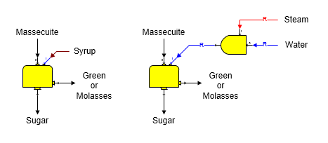
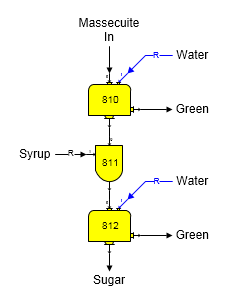

# Centrifugal Examples

 

Wash flow into a centrifugal station can be water, syrup, or a
combination of water and steam, or syrup and steam. The diagrams below
show syrup wash and water with steam wash for a two output (continuous)
centrifugal. The ratio between the steam and water (or syrup) can be
controlled in a blender station, as shown below, when a combination of
steam and water (or steam and syrup) is used. The wash flow into the
centrifugal is always required (small 'R' on flow line); therefore, when
a blender station is used to blend steam with the wash flow, the primary
flow into the blender will also be made required. That is, the quantity
of steam and water (or syrup) to the centrifugal will be controlled by
the requirements of the centrifugal station as determined by the
centrifugal performance evaluation.

 

 

Any output flow from a centrifugal can be required, but not more than
one. Sugars will give an error message if a model is constructed that
causes more than one output flow to be a required flow. This would cause
the model to be over constrained and therefore not solvable. The
massecuite flow into the centrifugal will be required if an output flow
from the centrifugal is required. The figure above on the left shows a
2-Output centrifugal with the sugar flow out required and the figure on
the right shows a 3-Output centrifugal with the green (or molasses) flow
out required (small 'R' on these flow lines). In both cases, the
massecuite flow into the centrifugal is a required flow (small 'R' on
flow line). The wash flow into the centrifugal is always required.

 

Two centrifugals can be used in series to simulate the operation of a
double continuous centrifugal. The diagram below shows a model of a
double continuous centrifugal that uses two continuous (2-Output)
centrifugals. The performance of each individual centrifugal is adjusted
to give the same performance as the double centrifugal. Syrup is mingled
with the sugar going from the first centrifugal (station no. 810), using
a blender station (no. 811), before it is fed to the second centrifugal
(station no. 812). In this example, a blender station is used to mingle
syrup with the sugar from the 1st centrifugal so that melting of sucrose
crystals will occur; however, if crystal melting does not occur, a
receiver station could be used in place of the blender station. A
blender station allows the quantity of syrup used for mingling to be a
ratio to the sugar, or to give a percent dry substance, or purity, in
the mingled flow. Sucrose crystals melt until the flow out of the
blender is saturated with sucrose; that is, crystals will melt until the
supersaturation equals 1.0 for the flow going from the blender to the
2nd centrifugal. No crystals will melt when either a blender, or
receiver, is used if the syrup into the blender is at saturated
conditions.

 

 

Double centrifugals are evaluated as two individual centrifugals.
Performance data is entered for both centrifugals; however, data
covering the properties of the sugar flow leaving the 1st centrifugal
(station no. 810) is not always easy to obtain. If this data is not
available, trial-and-error may be necessary until the performance of the
model matches with the performance of the actual double centrifugal when
the centrifugal performance evaluations are done. Editing the
performance parameters for each centrifugal, as shown in the [2-Output
Centrifugal Evaluation](2-Output_Centrifugal_Evaluation.htm), can help
to arrive at the proper values that match with the actual performance of
the double centrifugal.

 

Solubility coefficients and color for each of the output flows from a
centrifugal will be the result of the amount of wash flow in and mother
liquor in the massecuite that flow out each output flow. If the wash
flow in does not contain any non-sucrose components, the solubility
coefficients for each output flow will be the same as the massecuite
flow into the centrifugal; however, if the wash flow in is a syrup with
non-sucrose components, the solubility coefficients for the output flows
will be a weight-weighted average of the amount of wash and mother
liquor in each output flow and their respective solubility coefficients.
The color of each output flow will be dependent on the concentration of
mother liquor, wash flow in and sucrose (crystalline or dissolved) in
each output flow and the color of each of these components that make up
the output flow.

 

Any gas components in either the wash flow in, or the massecuite, will
pass to the green, or molasses. Water vapor in the massecuite, or wash
flow in, will condense if the temperature of the massecuite and/or wash
flow in is less than the saturation temperature for vapor. Also, if the
massecuite does not contain any sucrose crystals, all of the massecuite
and wash flow in will go to the molasses flow out. None will go to the
wash, or sugar, flows out.

 

 

[Centrifugal Features](Centrifugal_Features.htm)

[Centrifugal Evaluations](Centrifugal_Evaluations.htm)
