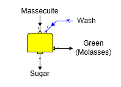
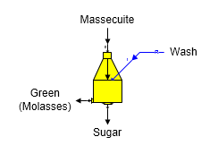
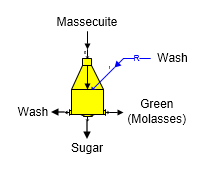

# Centrifugal Features

 

Sugars can simulate the operation of 2-Output (both Continuous and
Batch) and 3-Output (Batch) centrifugals. The calculations are similar
for both types. Centrifugal stations are used to separate sucrose
crystals in massecuite from the mother liquor.

 

2-Output Centrifugal (Continuous) The shape for a continuous 2-Output
Centrifugal station is shown in the diagram below. Massecuite goes into
input port 0 and wash water (and/or steam, or syrup) goes into input
port 1.

 

 

2-Output Centrifugal (Batch) The general shape for a batch 2-Output
Centrifugal station is shown below with identification of the input and
output flows. Massecuite goes into input port 0 and wash water (or
syrup) goes into input port 1.

 

3-Output Centrifugal (Batch) The general shape for a batch 3-Output
Centrifugal station is shown below with identification of the input and
output flows. Massecuite goes into input port 0 and wash water (or
syrup) goes into input port 1.

 

# 

 

General Features Two types of centrifugal stations are available in
Sugars: (1) 2-Output Centrifugal and (2) 3-Output centrifugal. Normally,
2-Output Centrifugals are continuous machines; whereas, 3-Output
Centrifugals are batch machines. However, a batch machine can have two
output flows instead of three. For both types of centrifugals, two input
flows are required: one for massecuite (port 0), and one for wash (port
1). The wash flow in can be either: water, syrup, steam, or a
combination of these flows. Sucrose solubility coefficients, color,
temperature, and components of the output flows will be a result of the
solubility coefficients, color, temperature and components of the
massecuite and wash (water, syrup and/or steam) flows into the
centrifugal and the separation performance of the centrifugal. The
pressure of all output flow streams from a centrifugal will be at
atmospheric pressure, regardless of the pressures of the flows into the
centrifugal.

 

The performance of a centrifugal station is calculated by Sugars using
actual data from an operating centrifugal. That is, data for the
massecuite and wash flows into the centrifugal and data for the green,
wash and sugar output flows from the centrifugal are entered into
Sugars. This data is analyzed by Sugars to find the performance of the
centrifugal station. The performance results are used to find the
separation of mother liquor and sucrose crystals and the purging of the
wash flow in to arrive at the characteristics of the green, wash and
sugar flows out of the centrifugal during the balance calculations.
Therefore, centrifugal performance calculations by Sugars, using actual
data from an operating centrifugal, are used to find how the centrifugal
in a model will process massecuite fed to it during the balance
calculations. Centrifugal performance evaluations for each centrifugal
station in a model give Sugars the necessary information to figure out
how efficiently each centrifugal will separate the mother liquor and
sucrose crystals for different massecuites. A centrifugal evaluation
only applies to centrifugals of a similar design that are operated in a
similar manner. The performance of centrifugal stations can have a
significant impact on the overall sucrose recovery of a factory.

 

 

[Centrifugal Evaluations](Centrifugal_Evaluations.htm)

[2-Output Centrifugal Properties](2-Output_Centrifugal_Properties.htm)

[3-Output Centrifugal Properties](3-Output_Centrifugal_Properties.htm)

[2-Output Centrifugal Evaluation](2-Output_Centrifugal_Evaluation.htm)

[3-Output Centrifugal Evaluation](3-Output_Centrifugal_Evaluation.htm)

[Centrifugal Examples](Centrifugal_Examples.htm)
