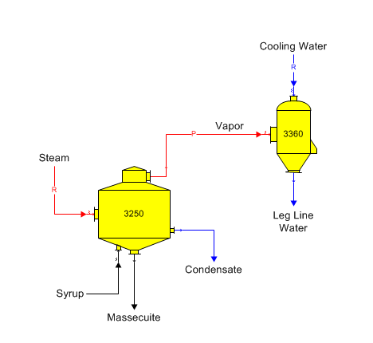
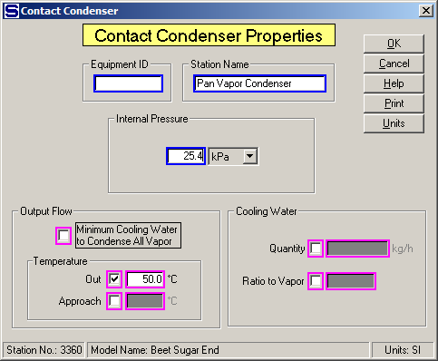

# Contact Condenser Examples

 

The temperature of the water flow leaving the
condenser is normally set to control the cold-water flow into a
direct-contact
condenser.  Temperature
Out or Approach is usually set to a value that is equal to the leg line
water temperature as measured in the factory, or to a temperature that
is below the saturation tempera­ture for the vapor so that the vapor will
condense.  Also, the
cold water flow can be set to a ratio of the vapor flow in, to a
specified quantity, or to the minimum cold water flow necessary to
con­dense the entire vapor
flow.  Contact
condensers are used to condense pan and evaporator
vapors.  The diagram
below shows a contact condenser condensing pan vapor using cooling water
from an external
source.  The input
data for the condenser is the temperature of the combined condensed
vapor and warm water out (i.e., condenser or leg line
water).  Pressure
feedback is used in this example for the pressure of the vapor leaving
the pan; and hence, an internal (vacuum) pressure is needed.

 

 

The window below shows the input data window for the
condenser.  Entries
are shown for the name, internal (vacuum) pressure and the output
temperature.

 

 

 

If pressure feedback isn’t used, the Output Flow Temperature Out or
Temperature Approach entry is usually the only entry needed other than
the Station Name of the condenser.

 

 

[Contact Condenser Features](Contact_Condenser_Features.htm)

[Contact Condenser Properties](Contact_Condenser_Properties.htm)
