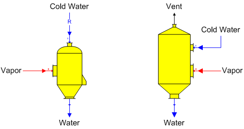

# Contact Condenser Features

 

Contact Condenser Contact condenser (direct-contact condenser) stations
are used to condense a vapor flow stream using cold water directly
injected into the vapor.

 

 

General Features The vapor flow goes to input port 0
(zoom in on the contact condenser shape to see the input port
numbering), and the cold water flow goes to input port 1 which is made a
required flow by
Sugars.  Vapor is
condensed from the cold water
flow.  The output
flow pressure is equal to atmospheric pressure set for the model
(see [Program Overview \> User
Interface](../Overview/Program_Overview.htm)) and the
temperature of the output flow is a result of the heat contents of the
vapor and cooling water input
flows.  No
connection is made to the vent if the contact condenser has one - it is
simply shown for visual representation of an actual condenser.

 

Flow components and quantity of the output flow are a
result of the vapor and cooling water
flows.  Also, a
contact condenser can be used for pressure feedback when the vapor input
flow is a pressure feedback flow and the internal pressure of the
contact condenser defines the feedback
pressure.  The
internal pressure is defined on the Contact Condenser Properties
window.  The output
flow solubility coefficients will be a weight-weighted-average of the
vapor and cooling water flows if the solubility function coefficients
for the cooling water flow are different than the vapor flow (solubility
coefficients are only important if either one of the input flows
contains any non-sucrose components).

 

 

[Contact Condenser Properties](Contact_Condenser_Properties.htm)

[Contact Condenser Examples](Contact_Condenser_Examples.htm)
