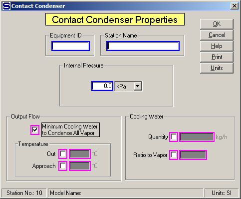

# Contact Condenser Properties

 

 

Equipment ID An equipment ID of up to 11 characters can be used to
identify the station with an actual station in the process. Any
combination of numbers and letters that are used in the factory/refinery
to identify equipment can be entered. For example, Equipment ID =
123.456A. It is not necessary to make an entry in the Equipment ID field
if the station in the model does not have a corresponding station in the
factory/refinery.

 

Station Name A name of up to 20 characters must be entered for the
station. For example, Station Name = Pan Vapor Cond.

 

Internal Pressure Enter an internal pressure for the
contact condenser if pressure feedback is being used for the vapor flow
into the
condenser.  For
example, Internal Pressure = **30** kPa to make the vapor flow line into
the contact condenser have a pressure of 30 kPa if the station supplying
the vapor is using pressure feedback to control the pressure of the
vapor leaving the station.

 

Output Flow Either click the box to calculate the
Minimum Cooling Water to Condense All Vapor flow into the condenser, or
specify the temperature of the water leaving the
condenser.  Selecting
the minimum cooling water calculation will cause Sugars to calculate the
minimum cold water flow necessary to completely condense the
vapor.  The
temperature of the combined cold water and vapor flow out will be just
slightly below the vapor saturation
temperature.  Alternatively,
the temperature of the combined flow out can be held to a specified
temperature by clicking the box next to the temperature selection, or
the approach temperature can be
specified.   Magenta
colored borders on the entry fields are used to
indicate that only one of the entries can be selected; that is, when one
is selected the others are not
accessible.  Select
the appropriate entry field by checking the small box next to the
field.

 

Temperature
 Select
either the temperature of the output flow or the approach temperature of
the output flow to the flow into port 0.

 

Out  Enter the temperature of the output flow from the condenser that is
to be controlled by the cooling water flow into the
condenser.  For example, Temperature Out =
**45.0**.

 

Approach  Enter the temperature of approach that
will be used to control the cooling water flow into the
condenser.  The
temperature of approach is the difference between the vapor saturation
temperature and the water output flow if the port 0 input flow is
vapor.  Otherwise,
the temperature of approach is the difference between the temperature of
the flow into port 0 and the water output flow if the port 0 input flow
doesn’t contain
vapor.  For
example, Temperature Approach = **20.0**

 

Cooling Water Select either the Quantity or Ratio to
Vapor entry field by clicking in the small box next to the
field.  This will
cause the other fields to gray out and not be accessible for
entry.  After the
box is checked, make an entry in the selected field.

 

Quantity Select the Quantity entry field by clicking in the box to the
left of the entry field. Enter the quantity of cooling water into the
condenser in the weight units shown to the right of the entry field. The
quantity of output flow will be the sum of the vapor flow in plus the
specified cooling water flow. For example, Quantity = 124500.0 means
that 124,500 weight units (kg, or lb) per hour will be added to the
vapor flow; however, if insufficient cold water is specified, the
combined flow out of the condenser may still contain vapor.

 

Ratio to Vapor The quantity of cold water flow is controlled by a ratio
value of the quantity of vapor flow into the condenser. For example,
Ratio = 3.0 means the weight quantity of cold water flow will be three
times the weight quantity of vapor flow.

 

 

[Contact Condenser Features](Contact_Condenser_Features.htm)

[Contact Condenser Examples](Contact_Condenser_Examples.htm)
