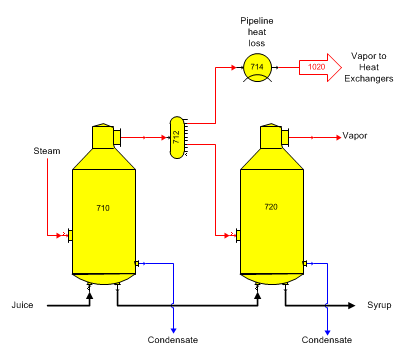
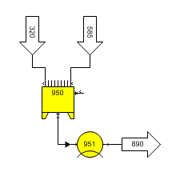

# Cooler Examples

 

Vapor Flow Heat Loss Use a cooler station to allow for heat loss in a
flow stream. Enter a value for heat loss in either %, or kJ/kg (BTU/lb).
Do not enter a temperature drop for vapor flow that is at the saturation
temperature, or the complete vapor flow will condense.

 

 

Tank Heat Loss Heat loss can be added to a tank by using a cooler
station with a tank station. Enter a value for the heat loss either in
temperature drop, %, or kJ/kg.

 

 

 

 

[Cooler Features](Cooler_Features.htm)

[Cooler Properties](Cooler_Properties.htm)
