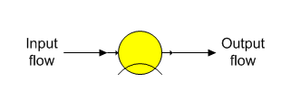
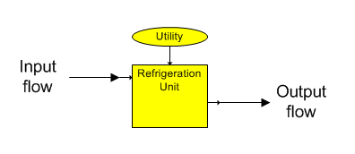

# Cooler Features

 

Cooler stations are used to remove heat and/or condense water vapor in a
flow stream. The heat loss can be due to radiation and/or convection, or
a separate cooling (refrigeration) unit.

 

Cooler The general shape for a cooler station is shown below with
identification of the input and output flows. A cooler station is used
to remove energy from a flow stream and can account for unknown losses
in a process.

Refrigeration Unit The shape for a refrigeration station is shown below
with identification of the input and output flows. A refrigeration unit
is a cooler station that is used to remove heat from a flow stream. No
consideration is given to the utility needs of the unit.

General Features Cooler stations are used to account
for unknown heat losses in process equipment such as tanks, pipelines,
etc.  A cooler
station can be used for a cooling tower (when no consideration is given
to the use of cooling water), refrigeration unit, or other equipment
heat losses.  Input
data for a cooler station is used to cool a flow stream by a drop in
temperature or to a specified output temperature, or by a percent heat
loss or a specified heat (kJ/kg, or BTU/lb)
loss.  A phase
change is considered for the liquid-vapor phase if the flow stream
contains vapor - even if all input parameters are
zero.  Sucrose
crystal growth isn’t allowed (i.e., the same weight of crystals will be
contained in the output flow) and all other flow stream components
remain the
same.  The output
flow may be supersaturated because crystal growth isn’t considered if
the input flow stream contains sucrose crystals, or if conditions are
such that crystals could grow at the cooled temperature of the output
flow.

 

Only a temperature drop and condensing of vapor can occur in a cooler
station.  If a heat loss is
specified for a saturated vapor, the temperature may not change if the
heat loss is less than the latent heat, but condensation will occur and
the output flow will contain both condensate and vapor.

 

 

[Cooler Properties](Cooler_Properties.htm)

[Cooler Examples](Cooler_Examples.htm)
