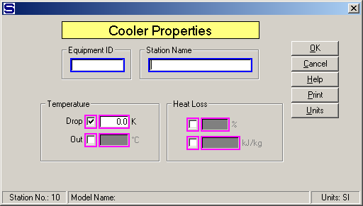

# Cooler Properties

 

 

Equipment ID  An equipment ID of up to 11 characters can be used to
identify the station with an actual station in the process. Any
combination of numbers and letters that are used in the factory/refinery
to identify equipment can be entered. For example, Equipment ID =
123.456A. It is not necessary to make an entry in the Equipment ID field
if the station in the model does not have a corresponding station in the
factory/refinery.

 

Station Name  A name of up to 20 characters must be entered for the
station. For example, Station Name = Pipe heat loss.

 

Enter the Temperature Drop, Temperature Out, Heat Loss in percent (%),
or Heat Loss in enthalpy (KJ/kg, or BTU/lb) to allow for a heat loss in
the flow stream. The Heat Loss is a percentage loss of the total heat in
the input flow, or the actual loss of enthalpy; however, the Temperature
Drop is a simple loss of temperature due to cooling. Select one of the
three input parameters by clicking in the small check box next to the
entry field for the parameter. Magenta colored borders on the entry
fields are used to indicate that only one of the entries can be
selected; that is, when one is selected the others are not accessible.

 

Temperature

 

Drop  Enter a Temperature Drop for flow going
through the cooler. The drop in temperature may cause condensation in a
vapor flow stream, but it will not give any sucrose crystal growth if
the flow stream contains sucrose - instead, the flow will become
supersaturated. For example, Temperature Drop (C) = 3.0

 

Out  Enter the Temperature Out for the flow
leaving the cooler. The Temperature Out should be cooler than the
temperature of the flow into the cooler and it may cause condensation in
a vapor flow stream, but it will not give any sucrose crystal growth if
the flow stream contains sucrose - instead, the flow will become
supersaturated. For example, Temperature Out (C) = 39.0

 

Heat Loss

 

(%)  Enter a heat loss in percent (%) for flow
going through the cooler. Heat Loss may cause a drop in temperature and
condensation may occur in a vapor flow stream; however, sucrose crystal
growth will not occur. For example, Heat Loss (%) = 5.0.

 

(kJ/kg or BTU/lb)  Enter a Heat Loss as kJ/kg,
or BTU/lb, of flow through the heater. For example,

 

 Heat content of flow into cooler = 200 kJ/kg

 Heat loss in cooler = 10 kJ/kg

 Heat content of flow out of cooler = 190 kJ/kg

 Entry for Heat Loss is: 10 kJ/kg

 

 

[Cooler Features](Cooler_Features.htm)

[Cooler Examples](Cooler_Examples.htm)
