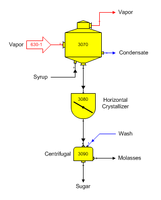
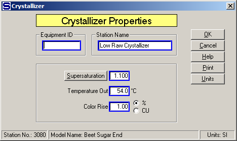

# Crystallizer Examples

 

Massecuite Crystallizer A crystallizer can be used to represent the
holding tank for massecuite going to the centrifugals. This can be used
to account for the small amount of cooling and crystal growth time that
occurs in the tank before the massecuite enters the centrifugal. The
diagram below shows a horizontal crystallizer that represents a holding
tank between a pan and a centrifugal.

 

 

Supersaturation, temperature out and color rise can be specified for the
crystallizer to represent the condition of the massecuite as it leaves
the holding tank and enters the centrifugal. The window below shows the
Crystallizer Properties window for the horizontal crystallizer that
represents the holding tank.

 

 

 

[Crystallizer Features](Crystallizer_Features.htm)

[Crystallizer Properties](Crystallizer_Properties.htm)
