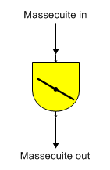
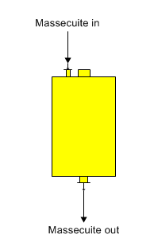

# Crystallizer Features

 

Both horizontal and vertical crystallizers are used to increase the
crystal content of a massecuite by specifying an outlet temperature and
supersaturation.

 

Horizontal Crystallizer The shape for a horizontal crystallizer is shown
below.

 

 

Vertical Crystallizer The shape for a vertical crystallizer is shown
below.

 

 

General Features Crystallizer stations are used to increase the crystal
content of a material flow stream (massecuite) due to a reduction in the
temperature and/or sucrose supersaturation of the massecuite that causes
growth of sucrose crystals. A color rise may also occur in a
crystallizer. The solubility equation coefficients for the input flow
are used to find the resultant crystal content of the output flow from
the station. A crystallizer station may be used at any point in the flow
diagram where crystal growth is to be considered; for example, in a
holding tank with a long residence time, etc.

 

Full crystallization occurs in a crystallizer station when the
massecuite output flow from the crystallizer is saturated; that is, the
supersaturation of the output flow is equal to 1.0. Normally, the
massecuite flow out of a crystallizer will have some supersaturation and
its temperature will be less than the temperature of the massecuite flow
into the crystallizer. If the supersaturation of the massecuite isn’t
known, and the values of the mother liquor percent dry substance (%DS)
and purity can be measured, Sugars can calculate the supersaturation
coefficient for the massecuite output flow by clicking the "Calculate"
button next to the Supersaturation Coef. entry field when entering the
crystallizer parameters. A small window will appear where the mother
liquor values can be entered. After the values are entered, click on the
"OK" button to calculate the supersaturation value and Sugars will enter
it into the Supersaturation Coefficient field of the Crystallizer
Properties window.

 

 

[Crystallizer Properties](Crystallizer_Properties.htm)

[Crystallizer Examples](Crystallizer_Examples.htm)
