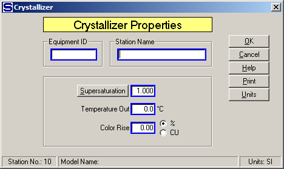
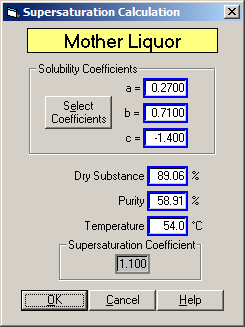

# Crystallizer Properties

 

 

Equipment ID  An equipment ID of up to 11 characters can be used to
identify the station with an actual station in the process. Any
combination of numbers and letters that are used in the factory/refinery
to identify equipment can be entered. For example, Equipment ID =
123.456A. It is not necessary to make an entry in the Equipment ID field
if the station in the model does not have a corresponding station in the
factory/refinery.

 

Station Name  A name of up to 20 characters must be entered for the
station. For example, Station Name = 'B'
Massecuite Mixer.

 

Supersaturation  Enter a supersaturation coefficient for output flow
leaving the crystallizer station. Click the
Supersaturation
button to calculate supersaturation using dry substance (%DS) and Purity
of the mother liquor if the supersaturation coefficient is not known,
but mother liquor values are known. Supersaturation is defined as:

 

 

 

Where,  is at the same temperature
and with the same non-sucrose to water ratio as the sample being
analyzed. For example, Supersaturation = 1.15.

 

Sugars will calculate the supersaturation coefficient for the massecuite
output flow by clicking the
Supersaturation
button if the supersaturation of the massecuite isn't known, and the
values of the mother liquor percent dry substance (%DS) and purity can
be measured. Enter the mother liquor parameters on the small window that
appears (see below) and click on the OK button
to calculate the supersaturation value and enter it into the
Supersaturation field of the Crystallizer Properties window. New values
for the 'a', 'b' and 'c' coefficients can be entered if they are
different than the values for the flow going into the crystallizer. The
initial values shown will be from the output flow leaving the
crystallizer in the model. If a different temperature value is entered
for the mother liquor, this value will be retained as the temperature
for the massecuite leaving the crystallizer as shown on the Crystallizer
Properties window. The other Mother Liquor entry values are not retained
for the station.

 

 

Temperature Out Enter the temperature (°C) of the massecuite as it
leaves the crystallizer station. A crystallizer will cool the
massecuite; hence, the temperature of massecuite out of the crystallizer
should be less than the temperature of the massecuite into the
crystallizer. For example, Temperature Out = 54.0°C.

 

Color Rise Enter the increase in color of the massecuite as it flows
through the crystallizer. The increase can be specified in percent (%),
or in amount. If the amount of color rise is used, the units can be any
color units (CU) that are consistent for the complete model. For
example, Color Rise = 5.0 %, or Color Rise = 300 ICUMSA color units
(CU).

 

 

[Crystallizer Features](Crystallizer_Features.htm)

[Crystallizer Examples](Crystallizer_Examples.htm)
