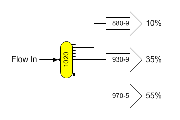
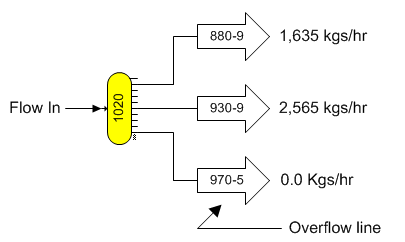
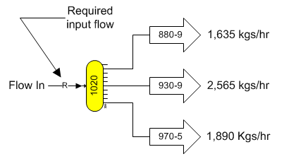
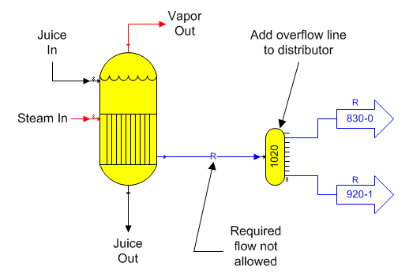

# Distributor Examples

 

Two methods are available for defining the quantity of flow in each
output flow from a distributor station (if none of its output flows are
required): (1) by specifying a percentage of the input flow quantity for
the quantity of each output flow; or, (2) by specifying a quantity for
each output flow. When data is being entered for a new distributor
station, if any of the output flows from a distributor are required,
only the quantity can be specified for the other output flows that are
not required; whereas, if none of the output flows are required,
Quantity %, Quantity kg/hr, or Quantity lb/hr can be selected by
clicking on the quantity button. In either case, each output flow will
have the same pressure, temperature, flow component fractions, color and
solubility coefficients as the input flow. The sum of the flow
percentages specified for the output flows must total 100%.

 

 

The above figure shows the distributor station with percentage values
for each output flow as specified on the distributor properties window.
None of the output flows from the distributor shown above are required.
Therefore, the output flows may be specified to be either a percentage
of the input flow (as shown), or a quantity. Each output flow will have
the same pressure, temperature, flow stream components, color and
solubility coefficients as the input flow.

 

 

The above figure shows the distributor station with flow stream
quantities for each output flow. The output flow stream going to station
no. 880 (input port 9 on station no. 880) does not have a specified
quantity and it is the overflow line for the distributor. Any quantity
of input flow, which exceeds the sum of the specified output flow
quantities, will be sent down the overflow line. An overflow line does
not apply when percentage values are used.

 

It is always possible to switch from weight quantity to percentage
quantity by clicking the left mouse button on the "Quantity kg/hr", or
"Quantity lb/hr". And, to switch from quantity in percent (%) to weight
quantity, click the left mouse button on the "Quantity %" button. Sugars
will zero out any entries in any of the fields when switching between
quantity and percent. Sugars will not allow a switch from weight
quantity to percent if any of the flows out of the distributor are
required flows (it is not possible to have required and percent flows
intermingled).

 

A distributor station can be used to set the quantity of flow going to
another station (or out of the model). If all of the output flows from
the distributor are specified to have a quantity greater than 0.0, the
input flow to the distributor will become a required flow.

 

 

The figure above shows a required input flow into the distributor
because all of the output flows have a specified quantity.

 

A distributor station can have output flows required by other stations.
For example, steam flow to a pan, wash water flow to a centrifugal,
heating flow to a heater where a specified temperature change has been
requested, heating flow to a melter with a specified output flow
temperature, etc. If all of the output flows from the distributor are
required, the input flow to the distributor will be required. If the
flow to the distributor is from an external source (i.e., it is an
external flow), Sugars will automatically calculate the quantity of flow
that must flow into the model from the external source to satisfy all of
the required flows leaving the distributor. If the flow into the
distributor comes from another station, then Sugars will force the
quantity of flow from the other station to equal the required quantity
for the distributor station. This feature can cause a conflict if the
quantity of flow from the originating station does not equal the
quantity of the required flow for the distributor; for example,
condensate flow from an evaporator body does not exactly equal the wash
water flow required by a centrifugal station. Distributor stations can
avoid this conflict by using an overflow line out of the distributor to
allow excess flow, beyond what is needed by the required output flows
from the distributor, to go to another station, or out of the model.

 

The figure below shows an evaporator station with a distributor station
on the condensate line leaving the evaporator with two output flows that
are both required. Because all of the flows out of the distributor are
required, Sugars will make the input flow into the distributor required;
however, condensate flow from an evaporator station cannot be a required
flow; hence, Sugars will give an error message if this occurs.

 

 

Adding an overflow line to a distributor station will prevent Sugars
from making the flow into the distributor a required flow; so that flow
from the originating station does not have to equal the quantity of all
required flows out of the distributor and any excess can be directed
elsewhere.

 

A distributor can have both specified and required output flows. If the
input flow to the distributor station comes from an external source
(i.e., it is an external flow), then all of the output flows from the
distributor can be specified and/or required. The quantity of the input
flow will be adjusted automatically by Sugars to satisfy all of the
output flow quantities; however, if the flow into the distributor is
from another station and all of the output flows are specified and/or
required, then the input flow will be made required by Sugars if the
station supplying the distributor can have a required flow. If the
supplying station cannot have a required flow, Sugars will give an error
on the error message box and the balance calculations may not be
possible. Generally, having an extra flow line leaving the distributor
to act as an overflow line is best unless the flow into the distributor
is an external flow, or it comes from another distributor station that
has an overflow line.

 

If the flow into the distributor from another station is not sufficient
to satisfy the required and specified output flows, Sugars will reduce
the specified flows until the input and output flows are balanced
(Sugars will give a warning/comment message if this occurs). If reducing
the quantity of flow for any required flows is necessary, the heat and
material balance will not be possible and Sugars will give an error
message that a balance was not achieved.

 

 

[Distributor Features](Distributor_Features.htm)

[Distributor Properties](Distributor_Properties.htm)
