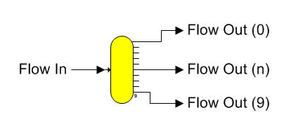

# Distributor Features

 

Distributor A distributor station is used to split one input flow into
as many as 10 output flows (numbered from 0 to 9) with each having the
same characteristics as the input flow. The shape for a distributor
station is shown below.

 

 

General Features  Distributor stations are used to
split one flow stream into two, or more,
flows.  The amount
of the split can be specified as either a percentage of the input flow,
or as a quantity of weight units (kg/hr for SI units and lb/hr for US
units).  Output
flows from a distributor that are given a specified quantity of flow are
called *specified*
flows.  Also, a
distributor station is used to satisfy required
flows.  That is,
when a distributor has output flows that have a quantity of flow
required by another station, the required flows will be satisfied first
and then any flows with specified quantities will be satisfied
next.  Finally, the
remaining flow, or overflow, will go out the first flow stream that is
neither required nor
specified.  If there
is more than one output flow that is neither required nor specified,
then all of the excess flow will go out the port with the lowest
numerical
number.  The output
ports are numbered from ‘0’ to ‘9’ (zoom in on the distributor station
to see the beginning and ending port numbers).

 

The input flow to a distributor station is made
required by Sugars when all of its output flows are required and/or
specified**.**** **  When
the distributor station input flow is made required, Sugars searches for
the origination of the input flow and makes this flow required; however,
if flow from the station cannot be required, an error will
occur.  Either
remove a quantity entered for one of the distributor output flows, or
change the flow diagram if the input flow to the distributor cannot be
made a required flow.

 

A summary of the possible distributor conditions is as follows.

 

I. Distributor station with its output flows specified to be a
percentage of the input flow. Each output flow will have a percent
quantity of the input flow as its output flow quantity. All of the
properties of each output flow will be the same as the input flow
properties; i.e., the pressure, temperature, component fractions, color
and solubility coefficients of the output flows all will be the same as
the input flow.

 

II\. Distributor station with its output flows specified on a quantity
weight basis. In each case below, the properties of each output flow
will be the same as the input flow properties.

 

1\. All output flows are required by other stations; i.e., Sugars has
determined that each output flow is required by other stations. Here,
Sugars will make the input flow to the distributor a required flow.

 

2. Output flows from the distributor are partly required, specified
and/or unspecified.

 

a) The input flow quantity is greater than necessary for the required
and specified quantity output flows. The excess output flow (i.e., the
amount that is greater than required by the specified and required
flows) will overflow to the lowest numbered output port that is
unspecified and goes to another station. If there are not any
unspecified output flows going to other stations, then the excess flow
will go out the lowest numbered output port that is unspecified for a
flow leaving the model. And, if all flows leaving the model are
specified, then the overflow will go out the first output flow leaving
the model regardless of the amount specified and a warning/comment
message will be given.

 

b) The input flow quantity is less than necessary for the required and
specified quantity flows. The deficiency of flow will be taken from the
specified output flows until all of the specified flow has been removed
(warning/comment message will be given). If there still is not
sufficient input flow to satisfy the required output flows after all of
the specified flow quantities have been made zero, a warning/comment
message will be given by Sugars when it does the balance calculations.

 

c) The input flow is an external flow. The quantity of the input flow
will be adjusted automatically by Sugars to satisfy all of the required
and/or specified flows leaving the distributor.

 

In all cases, output flows from a distributor that leave the model
(i.e., flow diagram), and are specified to have a zero quantity, are
considered specified by Sugars to have zero flow unless the flow out of
the model is the only flow, or the only non-required/unspecified flow
out of the distributor; in which case, it will become the overflow line.
Zero quantity output flows to other stations are always considered
unspecified. If more than one output flow to another station is
unspecified, Sugars will send all excess flow down the lowest numbered
output port that has a connected flow line and subsequent ports with
unspecified output flows will not have any flow quantity.

 

Distributor stations can be cascaded if more than ten output flows are
required, and if all output flows are required and/or specified, this
information will be passed back to the previous distributor so that the
output flow line from the previous distributor will be considered a
required flow.

 

 

[Distributor Properties](Distributor_Properties.htm)

[Distributor Examples](Distributor_Examples.htm)
