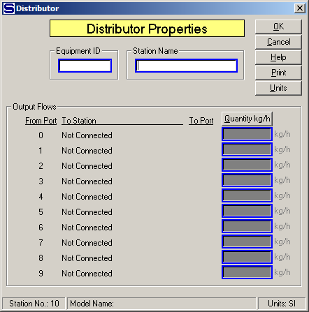
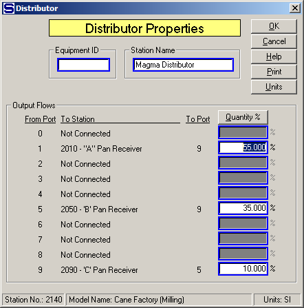

# Distributor Properties

 

 

Equipment ID  An equipment ID of up to 11 characters can be used to
identify the station with an actual station in the process. Any
combination of numbers and letters that are used in the factory/refinery
to identify equipment can be entered. For example, Equipment ID =
123.456A. It is not necessary to make an entry in the Equipment ID field
if the station in the model does not have a corresponding station in the
factory/refinery.

 

Station Name  A name of up to 20 characters must be entered for the
station. For example, Station Name = 1st Vapor Distri.

 

Output Flows  Each output port from the distributor that is connected to
a flow stream has entries for Goes To, Station Name, Port No. and
Quantity (kg/hr, or lb/hr).

 

From Port  Port on the distributor station from which the output flow is
connected.

 

To Station  Station number and name of the destination station for the
output flow.

 

To Port  Input port number of the destination station for the output
flow going into the destination station.

 

Quantity kg/hr (or lb/hr)  Output flow quantity in weight units. Enter
the quantity of flow that goes out the distributor to the station
identified by the To Station text. Switch to percent (%) by left
clicking on the "Quantity kg/hr" (or "Quantity lb/hr" when US units are
being used) button, or pressing the Alt-Q keys. If any of the output
flows are required flows, then percent values cannot be used - only
weight quantities can be entered. Clicking on the Quantity kg/hr (or
lb/hr) button will cause all entries in the quantity column to be zeroed
when the switch is made to percent values.

 

 

Quantity %  Output flow quantity in percent (%). Enter the percent of
the input flow into the distributor that goes out of the distributor
identified by the Goes To and Station Name values. The percentage values
entered must add up to 100%. If any of the output flows are required
flows, percent values cannot be used. Clicking on the "Quantity %"
button will cause all entries in the quantity column to be zeroed when
the switch is made to weight values. The window above shows entries for
quantity in percents.

 

 

[Distributor Features](Distributor_Features.htm)

[Distributor Examples](Distributor_Examples.htm)
