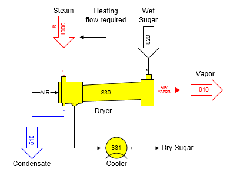
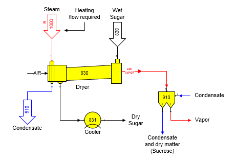

# Dryer Examples

 

The figure below shows a sugar granulator model that
uses a dryer and cooler
station.  Steam is
used to heat the material flow in by a heat exchanger in the dryer that
heats the
airflow.  An Output
Flow Temperature
(°C) value was
entered for the temperature of the material flow out port
0.  The steam flow
in is a required flow (see the small ‘R’ on the flow line from station
no. 1000 to the dryer station no. 830).

 

 

Using a dryer and cooler station to model a
granulator station is best; even though, the output temperature of the
dryer could be specified to equal the temperature of the sugar out of
the actual granulator in the
factory.  However,
if the model of the granulator is not constructed with a dryer and
cooler station, **the energy required to heat the sugar for drying will
not be correct** if the actual granulator consists of a heating section
and a cooling section using
air.  The energy
required for the heating section can only be calculated correctly if the
temperature of the sugar leaving the heating section of the granulator
is entered into the dryer Output Flow Temperature
(°C)
property.  Energy
lost to the air during cooling in a granulator is accounted for in the
cooler station that follows the dryer.

 

In the model, the vapor flow stream out of the dryer
does not contain air because the components for air are not in the
Sugars
program.  Fifteen
components are considered in Sugars, and the four gas components are:
water vapor, ethanol vapor, CO2, and
NH3.  So, air
through the dryer is not
considered.  Vapor
from the dryer will only contain water vapor and any dry matter carried
over with the
vapor.  The vapor
can be sent to other stations to recover the dry matter that may contain
sucrose if a granulator is being
modeled.  Usually, a
separator station is used to split the dry matter (sucrose) carried over
from the water vapor
component.  Diluent
water can be used in the separator, as in a Rotoclone, to carry the dry
matter to other stations for recovery of the sucrose.

 

 

The above diagram shows the granulator from the previous diagram with a
separator station on the vapor flow out to strip the dry matter from the
vapor after it leaves the dryer.  The
condensate flow (diluent flow) into the separator goes to input port 1
of the separator and is used by the separator to recover the dry
matter.  The combined flow of dry matter and
condensate leaves the separator in output no. 2 where it can be sent to
other stations in the factory for recovery of the sucrose.

 

Also, a dryer station will allow additional crystal growth until the
output flow stream is saturated (i.e., sucrose supersaturation equals
1.0) if sucrose crystals entering the dryer have a film of
supersaturated mother liquor (water).

 

 

[Dryer Features](Dryer_Features.htm)

[Dryer Properties](Dryer_Properties.htm)
