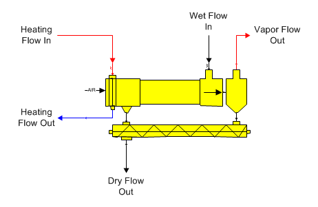
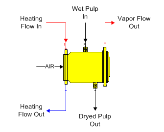
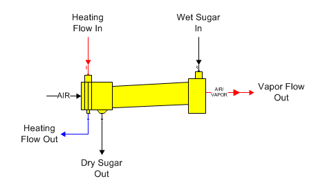

# Dryer Features

 

Dryers are used to remove water from an insoluble solid material. The
calculations are the same for all types - only the shapes shown on the
flow diagram are different.

 

Dryer  The shape for a general purpose dryer is shown
in the diagram
below.  The material
to be dried goes into input port 0 and steam or condensate goes into
input port 1 (zoom in on the shape to see the port identifiers - input
port 1 is red).  The
steam/vapor or condensate flow into the dryer is not always a required
flow.

 

 

Steam Pulp Dryer  The shape for a steam pulp dryer is
shown in the diagram
below.  The material
to be dried goes into input port 0 and steam or condensate goes into
input port 1 (zoom in on the shape to see the port identifiers - input
port 1 is red).  The
steam/vapor or condensate flow into the dryer is not always a required
flow.

 

 

Sugar Dryer  The shape for a sugar dryer is shown in
the diagram
below.  Syrup goes
into input port 0 and steam goes into input port 1 (zoom in on the shape
to see the port identifiers - input port 1 is
red).  Steam/vapor
or condensate flow into the dryer not is always a required flow.

 

 

General Features  A dryer station is used to dry a
material flow stream (for example, pulp or sugar) using a heating flow
(for example, steam or condensate) to heat an air stream to drive the
water out of the
material.   Only one
material flow into port 0 and one heating flow into port 1 is
allowed.  If the
flow in contains sucrose crystals, crystal growth will occur until the
flow out is at sucrose
saturation.  The
flow out pressure will be at atmospheric while the vapor flow out
pressure will correspond to the saturation temperature of the vapor
leaving the dryer.

 

The heating flow into the dryer does not have to be a required flow
because effectiveness can be used to control the transfer of heat from
the heating flow to the air stream. If effectiveness is not used, the
heating flow into the dryer will be a required flow; that is, Sugars
will calculate the quantity of steam flowing into the dryer.

 

Entrainment loss can occur in the dryer from particles that are
entrained in the air/vapor mixture leaving the dryer. Particles that are
not recovered in a cyclone will leave with the air/vapor. The particles
contain sucrose in the same percentage, as there is sucrose in the dried
material leaving the dryer.

 

Heat loss can be entered for any heat loss that occurs due to
convection, venting, conduction, or radiation of heat from the dryer to
the surroundings. The % heat loss is for the amount of heat that is lost
from the steam, or vapor, as heat is transferred to the wet material.

 

The vapor flow out of the dryer cannot be made a required flow (i.e.,
quantity of flow calculated by Sugars). Sugars will give a warning
message if it detects that the vapor flow out of the dryer is required
because a balance may not be possible. The condensate flow out of the
dryer can be required if effectiveness is used for the heat transfer in
the dryer.

 

The dried flow out of a dryer can be a required flow. If it is required,
the wet flow into the dryer also will be required. The quantity of wet
material flow into the dryer is not dependent on the properties of the
dryer; so, making the dried flow out a required flow does not cause a
warning message.

 

 

[Dryer Properties](Dryer_Properties.htm)

[Dryer Examples](Dryer_Examples.htm)
