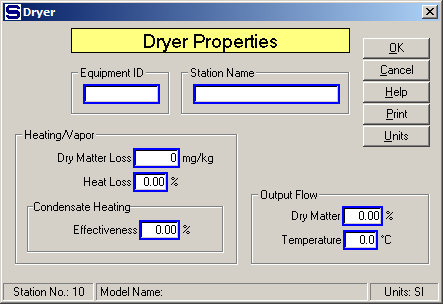

# Dryer Properties

 

 

Equipment ID An equipment ID of up to 11 characters can be used to
identify the station with an actual station in the process. Any
combination of numbers and letters that are used in the factory/refinery
to identify equipment can be entered. For example, Equipment ID =
123.456A. It is not necessary to make an entry in the Equipment ID field
if the station in the model does not have a corresponding station in the
factory/refinery.

 

Station Name. A name of up to 20 characters must be entered for the
station. For example, Station Name = Sugar Dryer.

 

Heating/Vapor

 

Dry Matter Loss (PPM) Enter Dry Matter Loss in parts per million (PPM)
of total dry matter for flow into dryer. It includes loss of sucrose and
non-sucrose, soluble and insoluble solids. For example, Dry Matter Loss
(mg/kg) = 50.

 

Heat Loss (%) Enter Heat Loss in percent (%) for the heat that is lost
in the dryer station. The Heat Loss is the percentage (%) of heat lost
from the total heat that is transferred to the material and air (if any
is used) flow stream. Dryers using air to transfer the heat to the
material flow stream have a substantial heat loss. For example, Heat
Loss (%) = 45.0.

 

Condensate Heating

 

Effectiveness (%) Enter 0.0 (or leave blank) for effectiveness if
heating flow to dryer is steam, or vapor. If the heating flow is
condensate (or a liquid) flow stream, enter an effectiveness value for
heat transfer from condensate to material and/or airflow (if used).
Typical values may be as low as 10% and as high as 50% or more. The
calculation for heating flow rate is based on heating flow being the
minimum of the maximum heat transfer for the value of effectiveness
entered (see [Heat Exchanger
Properties](../Heat_Exchanger/Heat_Exchanger_Properties.htm) for further
information about effectiveness).

 

Output Flow

 

Dry Matter (%) Enter percent (%) Dry Matter of the output flow from
dryer. Dry Matter is the fraction of all soluble and insoluble solids in
flow stream. (%) Dry Matter equals 100 minus percent (%) moisture of the
flow out of the dryer. For example, Dry Matter = 99.98 % means 0.02%
moisture in the flow leaving the dryer.

 

Temperature Enter Temperature (°C) of output flow from dryer. Flashing
will occur in dryer if output flow temperature is specified to be less
than input flow, or greater than heating flow temperatures. For example,
Temp (°C) = 65.0.

 

 

[Dryer Features](Dryer_Features.htm)

[Dryer Examples](Dryer_Examples.htm)
