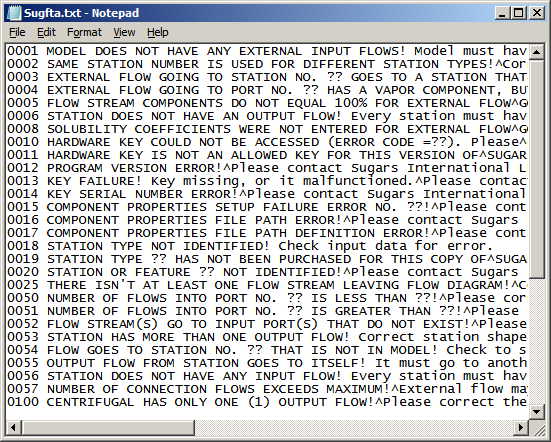
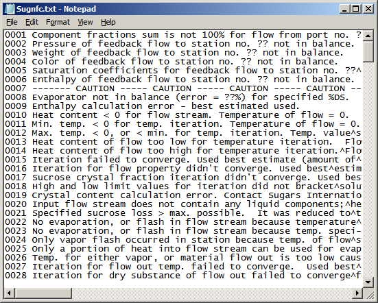

# Error Messages

 

Error messages are given by Sugars if errors are detected during
execution. Some of these messages are for information about the flow
diagram it is analyzing, or calculations that it has done. Other
messages are fatal to the evaluation by Sugars; e.g., missing
connections, missing data, an improper flow diagram, etc. Error message
files are used to store the text messages for errors that are detected
during the input checking, and balance calculations. These files are
stored as separate text files in the directory where Sugars is
installed.

 

The four files named Sugfta.txt, Sugnfa.txt, Sugftb.txt and Sugnfb.txt
are used during checking of the connections between stations and the
input data for each station. The Sugfta.txt (shown below), Sugftb.txt
and Sugftc.txt files contains messages that are fatal to the evaluation;
i.e., they contain error message text for errors found while checking
the flow diagram connections and/or input data values for each station.
The Sugnfa.txt, Sugnfb.txt and Sugnfc.txt files contain error message
text for warnings and/or comments about the model that are not fatal.
Non-fatal errors will not stop the balance calculations, while fatal
errors stop the calculations.

 

 

 

The remaining two files named Sugnfc.txt (shown below) and Sugftc.txt
are used during the balance calculations. The Sugnfc.txt file contains
messages that are not fatal to the balance calculations; e.g., incorrect
temperature values, incorrect input data, etc. Messages in the
Sugftc.txt file are for fatal errors that prevent Sugars from doing the
balance calculations.

 

 

Each error message in the error message files has a number for the
message and text that goes with the error number. The text is on one
line for each message. The text in these files can be translated into
different languages and/or revised if necessary.
