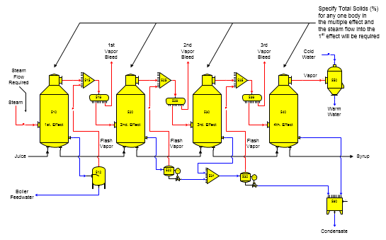
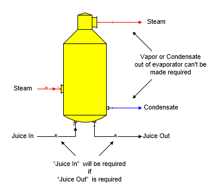

# Evaporator Examples

 

Specifying a Total Solids (%) for any one body in a multiple-effect will
cause the steam flow into the 1st effect of the multiple to become a
required flow. If the input steam quantity isn't known, one body in the
multiple-effect must have the "Total Solids (%)" specified for the
output flow from that body. Sugars will calculate the quantity of steam
used by the multiple-effect to give an output syrup flow having the
Total Solids (%) for the effect specified. If a Total Solids (%) is not
specified for any effect in the multiple, then the quantity of steam to
the multiple must be specified for Sugars to calculate the Total Solids
(%) in the syrup leaving the multiple.

 

 

It is possible to have a multiple-effect that uses "1 - First Effect"
for each of the effects. To use this approach, the quantity of steam
into the 1st body, or the "Total Solids (%)" of the output flow from the
1st body of the multiple-effect station must be given to Sugars. Each
additional body in the multiple-effect may have a value entered for the
"Total Solids (%)" in the output flow from the body; or instead, the
quantity of vapor from a previous effect will be used to find the
evaporation that occurs in the station. Distributor stations must be
used for the vapor flow between each effect if the "Total Solids (%)" is
being specified for each body when all effects in the multiple-effect
station are given "1 - First Effect"; otherwise, the vapor flow leaving
one body may not equal the required steam flow into the next body and a
balance will not be achieved by Sugars. If the quantity of steam from a
previous effect is not sufficient to satisfy the needs of a subsequent
effect for the Total Solids (%) specified, Sugars will give an error
message and the Total Solids (%) values for the effects should be
revised.

 

It is necessary that the driving, or motive, steam for a
multiple-effect, flow into the first effect; however, the juice
(material) flow does not have to flow into the first body initially and
more than one juice flow can go to the multiple. Also, having additional
steam flowing into an effect is possible other than the first effect, if
the quantity of the additional steam is known. Sugars will only adjust
the steam flowing into the first effect when it is doing the balance
calculations to arrive at a specified "Total Solids (%)" for one body in
the multiple-effect station.

 

The material, or juice, flow out of an evaporator station can be made a
required flow if, for example, a quantity of juice is required by
another station, or for another specified purpose; however, neither the
vapor, nor condensate, leaving an evaporator station can be made
required. Sugars will give an error message if a model is built that
causes either the vapor, or condensate, to become required. A balance
for the model may not be possible if either one of these flows is
required because the model is over specified with more conditions to
satisfy than are possible. The model is over specified because the
performance parameters for the evaporator control the quantity of vapor
and condensate that leave the evaporator. If another station requires a
certain quantity of vapor, or condensate, from the evaporator, the
performance parameters for the evaporator will be in conflict with the
station that is requiring a quantity of vapor, or condensate, from the
evaporator.

 

 

If the syrup out flow leaving a multiple-effect evaporator is made
required by another station, the juice flow into the first effect would
become a required flow. This feature is useful for cases when a quantity
of syrup is needed to satisfy another station in a model and the
quantity of juice into the multiple has to be calculated to produce the
needed syrup. By making the syrup, or juice, flow out of the
multiple-effect evaporator required, Sugars will automatically calculate
the quantity of juice into the multiple-effect that is necessary to
satisfy the syrup needs of the other station.

 

Normally, when modeling multiple-effect evaporator stations in a
factory, the model of the multiple-effect is built and data is entered
into Sugars for all measurable parameters. For example, the heating
surface area is usually known, a heat loss for each effect can be
estimated, or calculated, a color rise across each effect can be
measured, or estimated, the sugar loss due to entrainment can be
measured from the condensates, and the vapor temperature out of each
effect can be measured, or calculated from the vapor pressures for each
effect (or instead, the juice temperature out of each effect can be
measured). This data is then entered into the Evaporator Properties
window for each effect and a balance is done by Sugars for the multiple.
After the balance is completed and verified to represent the
multiple-effect being analyzed, the heat transfer coefficients are
calculated by entering "Calculate" which will give the Heat Transfer
Coefficient Window. The Heat Transfer Coefficient & Heating Surface
Calculation window is used to calculate the heat transfer coefficient
for the effect using the heating surface.

 

Calculation of the heat transfer coefficient is based on the results
from the balance calculations done by Sugars using the temperature data.
Details of the calculations are shown on the window.

 

Different heat transfer coefficient values can be entered. The heating
surface calculated by entering a new value for the Heat Transfer
Coefficient and clicking the left mouse button on the
Calculate Surface button below the Heating
Surface window.

 

After a new value is calculated for the Heat Transfer Coefficient, or
for the Heating Surface using an entered value for the Heat Transfer
Coefficient, click the left mouse button on the
OK button and Sugars will replace the
temperature entry on the Evaporator Properties window with the new heat
transfer coefficient (and heating surface, if it was changed).

 

Evaporator bodies that use a heat transfer coefficient and heating
surface instead of temperatures will have different pressure and
temperature results for the vapor and juice flows out of the effect when
the balance calculations are done if the demands on the body change.
That is, the temperature and pressure values will float based on the
juice and vapor flow quantities and temperatures into the effect. For a
complete multiple-effect evaporator station, the bleed vapor
temperatures will fluctuate as the load to the multiple-effect changes
from variations in the vapor usage, or the quantity of juice flow into
the multiple from changes in beet slice, or cane grind, rate.

 

Sugars calculates the complete heat balance for each effect during the
overall balance calculations; i.e., the heat (enthalpy) in the steam and
liquid flows into each effect will equal the enthalpy in the liquid,
vapor and condensate flows out less any heat loss that occurs in the
effect. The boiling point elevation is calculated for the difference in
temperatures between the liquid and vapor flows out. The boiling point
elevation depends on the %DS, purity and vapor pressure of the liquid
flow steam in the effect. Any entrainment loss in the vapor flow out is
considered in the calculations, and the iterations are continued until
all specified values are satisfied and the energy and mass balance is
achieved. Juice flow into the evaporator will flash if the juice
temperature is greater than the temperature of the juice flow out.

 

When the vapor, or liquid, flow out temperature is specified for an
effect, the heat flow into the liquid from the steam flowing into the
effect is calculated and then an iteration is done until the heat into
the liquid equals the heat leaving with the vapor and liquid output
flows while maintaining the boiling point elevation between the liquid
and vapor output flows. When the heat transfer coefficient and heating
surface parameters are specified, the heat transferred to the liquid
flow is calculated by first assuming the temperature of the liquid flow
out of the effect. The enthalpy of the vapor and liquid flows leaving
the effect is balanced with the enthalpy of the liquid flow in and the
heat transferred into the liquid from the vapor flow in. Iterations are
continued until the heat transferred equals the heat leaving the body in
the vapor and liquid flow streams while maintaining the boiling point
elevation between the liquid and vapor output flows. If the vapor flow
into the effect contains more heat than can be used, 100% condensation
will not occur and the condensate leaving the body will still contain
vapor.

 

See the [Examples](../Examples/Examples.htm) section for further
illustrations of multiple-effect models.

 

 

 

[Evaporator Features](Evaporator_Features.htm)

[Evaporator Properties](Evaporator_Properties.htm)
