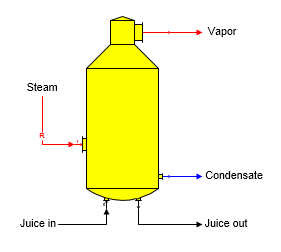
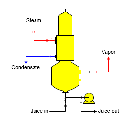
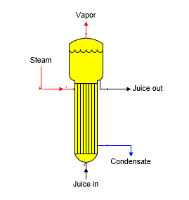
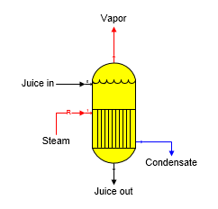
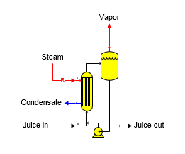
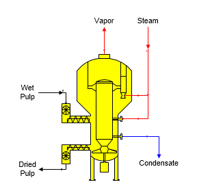

# Evaporator Features

 

Sugars can simulate the operation of many different evaporator types.
The calculations are the same for all types - only the shapes shown on
the flow diagram are different. Zoom in on the shape to see the port
identifiers - input port 1 is red when viewed in Visio.

 

Robert Evaporator The shape for a Robert evaporator body is shown in the
diagram below. Juice goes into input port 0 and steam goes into input
port 1 (red input line).

 

 

Falling Film Evaporator The shape for a Falling Film evaporator body is
shown in the diagram below. Juice goes into input port 0 and steam goes
into input port 1 (red input line).

 

 

Long Tube Evaporator The shape for a Long Tube evaporator body is shown
in the diagram below. Juice goes into input port 0 and steam goes into
input port 1 (red input line).

 

Calandria Evaporator The shape for a general purpose evaporator body is
shown in the diagram below. Juice goes into input port 0 and steam goes
into input port 1 (red input line).

 

Forced Circulation Evaporator The shape for a Forced Circulation
evaporator body is shown in the diagram below. Juice goes into input
port 0 and steam goes into input port 1 (red input line). Electrical
consumption of the circulating pump is not considered in the
calculations by Sugars.

 

Steam Pulp Dryer The shape for a Steam Pulp Dryer is shown in the
diagram below. Wet pulp goes into input port 0 and high-pressure steam
goes into input port 1. An electric powered turbine circulates vapor
inside the dryer to dry the pulp. Electrical consumption of the turbine
for circulating vapor through the high-pressure steam heat exchanger and
fluidizing the pulp is not considered in the calculations by Sugars.

 

 

General Features Evaporator stations are used to remove water from a
flow stream. Sucrose crystals are not grown in an evaporator; even if,
the output flow and dry substance (%DS) are suitable to cause crystals
to form. The number, if any, of crystals in the input flow will be
maintained in the output flow - no new crystal growth will be
considered. Hence, the sucrose saturation of the output flow may be
different from the input flow. Only one juice input flow into port 0,
and only one steam/vapor input flow into port 1 is allowed. The pressure
of the juice flow out of an evaporator body will be the same as the
pressure of the vapor flow leaving the body. Pressure feedback can be
used to define the vapor pressure leaving the evaporator.  Neither the
vapor or condensate flows out can be required; however, the process flow
out port 0 can be required; and if it is, the process flow into port 0
will be made required.

 

One evaporator station (effect or body) may be used either alone, or in
combination with other bodies to comprise a complete multiple-effect
station. The evaporation done in a body is determined by Sugars based on
either a known quantity of steam flowing into the body; or, a specified
Total Solids (%) in the output flow. If the Total Solids (%) is
specified for a body, the steam flow into the body (or the steam flow
into the 1st effect if the body is part of a multiple-effect) will
become a required flow. Only one Total Solids (%) entry can be made for
a multiple-effect. A multiple-effect is identified by the "Effect No."
entry on the Evaporator Properties window for successive evaporator
stations in a multiple. The effect numbers must be in numerical sequence
with the station numbers. That is, effect no. 1 must have a lower
station number than effect no. 2 and so on for each subsequent effect in
a multiple.

 

More than one multiple-effect evaporator station can exist in a model of
a process. For each body in a multiple-effect station, one of three
input parameters is required: (1) the Flow Out Temperature, (2) the
Vapor Out Pressure (or Saturation Temperature), or (3) the Heat Transfer
Coefficient (and Heating Surface area). These three fields (and the
Vapor Out Saturation Temperature) are shown with a magenta border color
on the Evaporator Properties window. Also, instead of specifying a Vapor
Out Pressure, Pressure Feedback can be selected instead and the check
box for selecting this option is shown with a magenta border.

 

Evaporator calculations use the total heat in the vapor flow in, but the
temperature difference for the Heat Transfer Coefficient calculations
are based on the Saturation Temperature of the vapor flow in and the
Temperature of the Flow Out. Also, the Condensate Drop is considered in
the calculations if an amount is entered.

 

 

[Evaporator Properties](Evaporator_Properties.htm)

[Evaporator Examples](Evaporator_Examples.htm)
