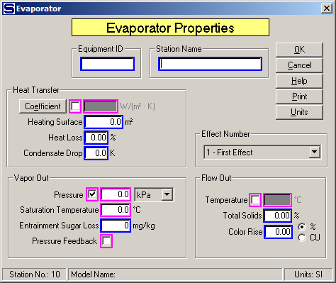
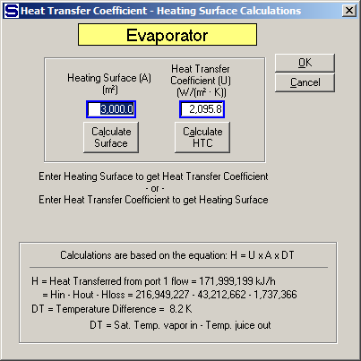

# Evaporator Properties

 

 

Equipment ID An equipment ID of up to 11 characters can be used to
identify the station with an actual station in the process. Any
combination of numbers and letters that are used in the factory/refinery
to identify equipment can be entered. For example, Equipment ID =
123.456A. It is not necessary to make an entry in the Equipment ID field
if the station in the model does not have a corresponding station in the
factory/refinery.

 

Station Name A name of up to 20 characters must be entered for the
station. For example, Station Name = 1st Effect.

 

Magenta colored borders on the entry fields are used to indicate that
only one of the entries can be selected; that is, when one is selected
the others are not accessible. For example, if Heat Transfer Coefficient
is chosen, then Vapor Out Pressure (and Saturation Temperature),
Pressure Feedback and Flow Out Temperature cannot be selected. And, if
any of the others are selected, then Heat Transfer Coefficient cannot be
used in addition to the other entries with magenta borders that were not
selected.

 

Heat Transfer

 

Coefficient Left click on the check box next to the Coefficient to enter
a heat transfer coefficient for the transfer of heat from the steam, or
vapor to the juice. Only one entry can be made for the Heat Transfer
Coefficient, Vapor Out Pressure, or Flow Out Temperature. For example,
Coefficient = 1,506.4 W/M2·°K. Or, click on the Coefficient button to
open a window (see below) to calculate the Heat Transfer Coefficient for
a given Heating Surface, or a Heating Surface for a given Heat Transfer
Coefficient.

 

 

Heating Surface Enter the surface area for heat transfer from
steam/vapor to the juice being evaporated. If a value is entered for the
Heat Transfer Coefficient, an entry must be made for the Heating
Surface. This parameter must be specified if the Heat Transfer
Coefficient is being used to calculate the evaporation in each body. For
example, Heating Surface = 2,000.0 M2.

 

Heat Loss Enter the loss of heat in percent (%) for heat lost in the
evaporator. The Heat Loss is the loss of heat from the total heat that
is transferred to the juice from the steam/vapor. This loss can account
for radiation, conduction, venting, etc. losses that can occur in each
body. For example, Heat Loss = 2.00% (that is, 2.0% heat loss for the
station).

 

Condensate Drop Enter a temperature drop for the condensate if it leaves
the evaporator with a temperature that is lower than the saturation
temperature of the vapor heating flow into the evaporator. For example,
if the vapor saturation temperature for vapor flow into the evaporator
is 119°C and the condensate leaves the evaporator at 115°C, then
Condensate Drop = 4.0 K.

 

Effect Number Enter the effect number of the body in the multiple whose
input parameters are being entered. Driving steam for a multiple-effect
must go to the 1st effect while juice flow for evaporation can go to any
effect (body). If a multiple-effect model is being evaluated, each
effect is numbered in sequence. The first effect is the effect into
which the motive steam flows. Other effects in the multiple-effect
station can have vapor from a previous effect, but the first effect must
have steam either supplied to the first body in a known amount, or a
required flow when the "Total Solids (%)" is being specified for the
multiple-effect station. Sugars will not allow the effects to be
numbered out of sequence, or to have effect numbers repeated within a
multiple-effect model.

 

Total Solids (%) can be specified for each effect in a multiple by
making each Effect No. "1"; that is, make the multiple a series of
single effects.

 

Vapor Out

 

Pressure Left click the check box next to the Pressure field to select
the vapor pressure and saturation temperature instead of the juice out
Temperature. Vapor Saturation Temperature may be entered instead of
Pressure when the check box next to the Pressure field is selected. The
drop-down box next to the Pressure field can be used to select the
pressure units for entry. The Saturation Temperature will be calculated
and displayed by Sugars when an entry is made for the Pressure. For
example, Pressure = 0.5 bar gives 81.3°C. If "mm Hg" or "in Hg" units
are used for the Pressure, the entered value should be \< 0.0 if the
pressure is below the atmospheric pressure.

 

Saturation Temperature Left click the check box next to the Pressure
field to allow access to the vapor saturation temperature. Saturation
Temperature of the vapor leaving the evaporator will result in a
temperature of the juice leaving the evaporator that is equal to the
Saturation Temperature value plus the boiling point elevation of the
juice. The Saturation Temperature may be entered as either a temperature
value or as a Pressure value and once a value is entered for either one,
the other value will be calculated and displayed by Sugars. For example,
Saturation Temperature = 85.00°C gives 57.9 kPa.

 

Entrainment Sugar Loss Enter the entrainment loss of sugar that is
carried over by the vapor during evaporation. The loss is expressed as
milligrams per kilogram (mg/kg), or parts per million (ppm) of sugar in
the total condensable vapor flow. For example, Entrainment Sugar Loss =
80 ppm.

 

Entrainment Sugar Loss allows for entrainment of sucrose and non-sucrose
material in the vapor flow leaving the evaporator body. The input
parameter is for sugar loss; however, Sugars will consider the droplets
entrained with the vapor to have the same %DS and Purity as the syrup
leaving the evaporator. Normally, the measurement of entrainment loss in
an evaporator is determined from a measurement of sugar in the vapor
flow line (or, leg water line from the condenser). Because Sugars
considers the entrained droplets to have both sucrose and non-sucrose,
the Entrainment Sugar Loss also gives a non-sucrose loss. Also, sugar
loss is in mg/kg, or ppm of the condensable components in the vapor flow
leaving the evaporator; that is, non-condensable components (for
example, CO2, or NH3) are not considered when calculating the loss.

 

Pressure Feedback Left click the check box to use pressure feedback to
define the pressure of the vapor leaving the evaporator. For example, if
the vapor out goes to a condenser, the internal pressure of the
condenser will be fed back to the evaporator as the vapor out pressure.
If the vapor flow out goes out of the model and pressure feedback is
used, the atmospheric pressure for the model (see [Program Overview \>
User Interface](../Overview/Program_Overview.htm)) will be used as the
feedback pressure.

 

Flow Out

 

Temperature Left click the check box next to the Temperature field to
select the juice flow out temperature instead of Heat Transfer
Coefficient, or Vapor Out Pressure. Only one of these three parameters
can be entered; however, a different parameter may be selected for each
body in a multiple-effect station. For example, Flow Out Temperature =
103.5°C

 

BPE Factor Enter a value to adjust the boiling point elevation for the
boiling liquid in the evaporator.  

 

Total Solids Enter the percent (%) Total Solids out of the effect. Only
one Total Solids entry can be made for a multiple; however, any effect
in the multiple can be selected for entering the Total Solids. Sugars
will automatically calculate the amount of input steam to the 1st effect
necessary to give the Total Solids for the effect selected. An
evaporator station consisting of several effects can have more than one
Total Solids entered if each section in the multiple begins with a new
number "1 - First Effect" effect. For each Total Solids entry, Sugars
will automatically adjust the steam into the number "1 - First Effect"
effect to give the requested percent solids. For example, Total Solids =
68.00%.

 

Color Rise Enter the increase (rise) in color for juice flowing through
the evaporator body. The color of the juice will increase from time and
temperature effects during evaporation. The increase in color is
accounted for by entering a value in percent (%), or in actual color
units (CU). For example, Color Rise = 4.25 % (color of flow through the
effect will increase by 4.25%), or Color Rise = 326 CU (color of flow
through the effect will increase by 326 units). Color units can be any
system of color measurement, but they must be consistent for the entire
model.

 

 

<a href="Evaporator_Features.htm" class="hcp9">Evaporator Features</a>

<a href="Evaporator_Examples.htm" class="hcp9">Evaporator
Examples</a>
