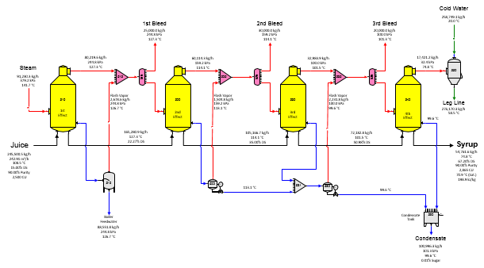
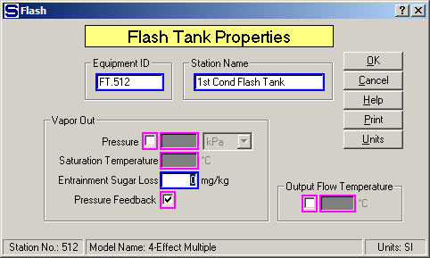

# 4-Effect Multiple

The flow diagram for a model of a four-effect multiple-effect evaporator
station is shown in the above diagram. Juice flows into the 1st effect
(station no. 510) and syrup leaves from the 4th effect (station no.
540). Steam also flows into the 1st effect and condensate from the 1st
effect goes to a flash tank for flashing to 1st vapor before leaving the
flow diagram (normally, for boiler feed), while condensates from the 2nd
and 3rd effects are flashed to the vapor out of their respective bodies.
Residual condensates from the 2nd and 3rd effects, and the 4th effect
condensate, are combined (in tank station no. 590) and they flow out of
the flow diagram. Receiver station models are used to combine the vapor
from each effect with the flash vapor from the condensate flash tanks.
The vapor flow from each receiver is sent to a distributor station that
allows for bleed vapor flows if needed. Bleed vapors can be specified
for the first, second and third vapors and specified quantities have
been given for the first (25,000 kg/h), second (30,000 kg/h) and third
(20,000 kg/h) vapors in this example.

Each effect in this example uses the heat transfer coefficient and
heating surface area to specify how much heat is transferred from the
steam, or vapor to the juice. It is not necessary to know the
temperatures and/or pressures in the multiple-effects when the heat
transfer coefficient is used, and as revisions are made in the model,
the vapor temperatures, and pressures, will change as the bleed demands
change.

The input parameters for the flash tank stations (numbers 512, 522 and
532) have been specified to use pressure feedback for the pressure of
the output flow and the vapor out (see Flash Tank Properties window
below). Pressure feedback is used because the flash tank stations will
be given vapor pressure values from the receiver stations (nos. 515, 525
and 535). These pressure values come from the pressures of other vapors
that flow into the receivers (that is, from previous effects) and the
pressure values for the flash tank vapors are derived from the receivers
that feedback their pressures to the flash tanks. This feature in Sugars
is called pressure feedback, and it can be used for any flash tank with
a vapor flow out that flashes to a receiver station that has another
input flow with a known pressure value. Note the small "P" on these flow
lines in the flow diagram.

The effect on the steam demand for the multiple-effect evaporator due to
additional bleed vapors, thin juice quantity, heat transfer coefficient,
heating surface, supply steam temperature, etc can be evaluated easily
by simply changing the appropriate values in the input windows and then
redoing the balance calculations. Scaling in the evaporator bodies can
be evaluated by simply lowering the heat transfer coefficients for each
effect in proportion to the amount of scaling.

If additional condensates from other sections of the factory are
available for flashing, the condensates can be entered as external flows
to the receiver stations that precede the flash tanks. Also, changing
the flash tanks to flash their vapors to different effects can be
evaluated to see whether the steam consumed by the multiple will
increase, or decrease.
