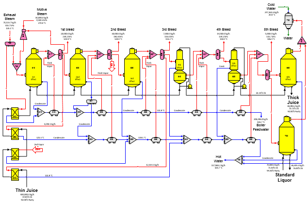

# 6-Effect Multiple

 

 

The flow diagram for a six-effect evaporator with
thin juice heating, thermocompression, split condensate flashing, and
standard liquor concentration is shown in the above
diagram.  Required
and pressure feedback flows are identified on the flow diagram.
 Steam pressure of
the flow leaving the thermocompressor (station no. 619) is set by
receiver station no. 750 while the motive steam flow into the
thermocompressor is
specified.  The
steam flow from the thermocompressor (station no. 619) to the steam
receiver (station no. 750) is a pressure feedback
flow.  Additional
steam needed by the multiple-effect to concentrate thin juice into thick
juice at the percent (%) dry substance specified in the last effect (6th
effect, station no. 660) is provided by the exhaust steam distributor
(station no.
690).  Exhaust steam
is also used for the 4th thin juice heater (station no. 540); so, both
output flows from the exhaust steam distributor are required
flows.  Because both
flows out of the distributor are required, the flow into the exhaust
steam distributor is
required.  Therefore,
the quantity of exhaust steam required in the model is automatically
calculated by
Sugars.  Changing
the thin juice flow into the model at station no. 510 will result in
Sugars calculating a new value for the exhaust
steam.  Also, if the
quantity of standard liquor to the standard liquor concentrator is
changed, the consumption of 5th vapor by the standard liquor
concentrator (station no. 700) will change, and the new exhaust steam
into the model will be calculated automatically by Sugars during the
balance
calculations.  Pressure
values have been specified for the vapor out of each effect and for the
standard liquor concentrator; therefore, if the quantity of thin juice
is changed, the vapor pressure (and temperature) for each effect will
remain
constant.  The
specified vapor pressure for each effect can be changed to use heat
transfer coefficient instead so that the vapor pressure and temperature
for each effect will fluctuate as the load on the multiple-effect
changes (see section
 [Evaporator Properties](../Evaporator/Evaporator_Properties.htm)
for changing heat transfer coefficients).
