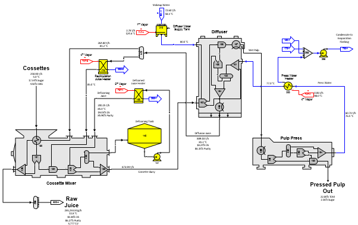
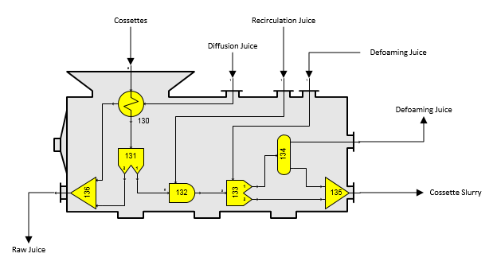
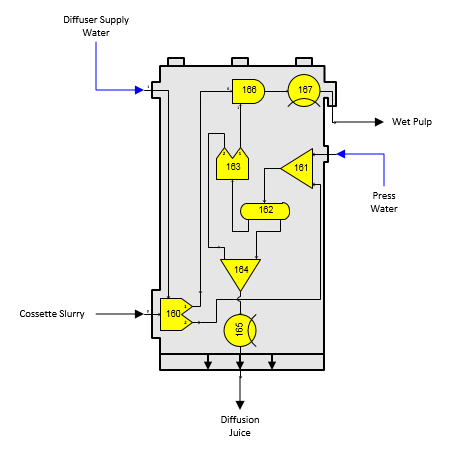
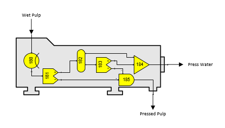
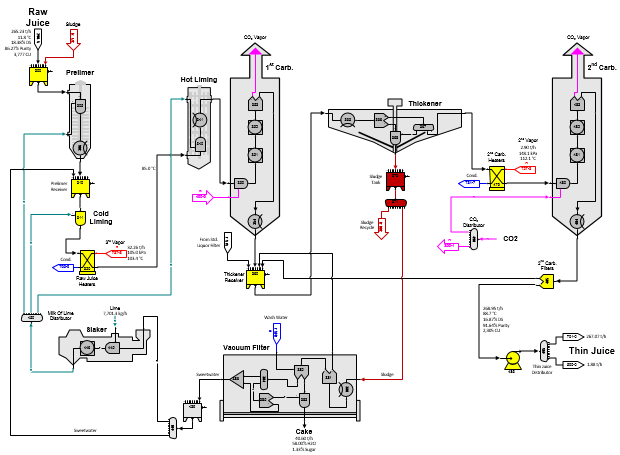
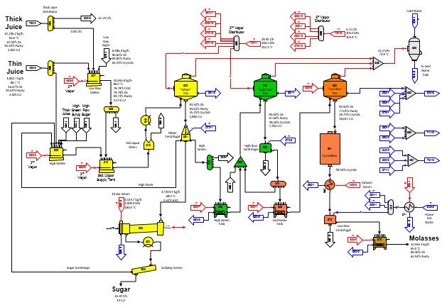
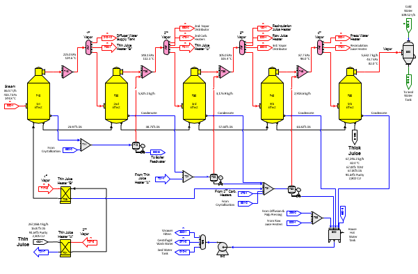
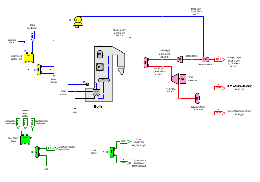
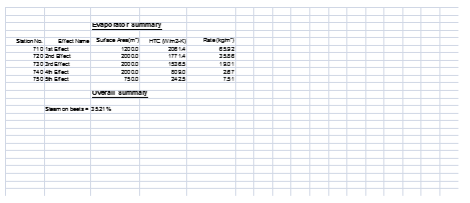

# Beet Factory

 

The flow diagram for the beet factory example model is a five page
model. Page 1 (shown below) covers the cossette mixer, tower diffusion
and pulp pressing. The equipment models are provided on the "Equipment -
beet" stencil.

 

Page 1

 

Cossettes enter the cossette mixer where they are heated and denatured
(scalded) by the recirculation juice from the diffuser and the defoaming
juice from the cossette mixer.

 

 

The diagram above shows a larger view of the cossette mixer with the
Sugars stations highlighted in yellow. The actual data used for each
station can be viewed by opening the example. Station no. 130 is a heat
exchanger that is used to heat the incoming cossettes using the
diffusion juice flow. The effectiveness of this transfer is entered as
100% and with normal unfrozen beets the heat loss is small; however, if
the incoming cossettes are frozen, the heat loss entry in station no.
130 can be set higher to allow for the energy that goes to the heat of
fusion for thawing the frozen beets. The heat of fusion is approximately
333.7 kJ/kg (=143.5 BTU/lb) and an equivalent amount of energy must be
removed (lost) from the juice heating the cossettes. Station no. 131 is
a separator station that is used to account for the purity rise in the
juice that occurs in the mixer. Station no. 132 is a blender station
that controls the amount of juice that is used to slurry the cossettes
going to the diffuser, and station no. 133 is another separator station
that controls the amount of defoaming juice and it separates the beet
fiber from the juice so that only juice is sent to the defoaming juice
line. Distributor station no. 134 is used to adjust the juice flow so
that any excess juice not used for defoaming remains with the cossette
slurry. The receiver stations are just used to combine flows that are
needed to control how the cossette mixer functions. Cossettes leave the
mixer as slurry that goes to the tower diffuser for extraction of the
sucrose bearing juice.

 

 

The Sugars stations used to model the diffuser are shown in yellow in
the diagram above. The basic concept is to separate the fiber/Marc from
the cossettes in separator station no. 160 along with a small about of
sucrose and non-sugars. This station also controls the amount of
diffuser supply water which will control the draft in the diffuser. All
of the juice and diffuser supply water leaves separator station no. 160
from its no. 2 output and all of the fiber/Marc along with a small
amount of sucrose and non-sugar leaves separator station no. 160 from
its no. 1 output. Adjusting the entries for separator station no. 160
will control the amount of sucrose and non-sugar that leaves the
diffuser in the wet pulp. The juice from separator station no. 160 is
combined with the press water in receiver station no. 161 and separator
station no. 163 is used with blender station no. 166 to control the
amount of water in the wet pulp leaving the diffuser. Cooler station
nos. 165 and 167 are used to allow for heat loss in the diffuser and to
adjust the output temperatures for the diffusion juice and wet pulp.
This diffuser model cannot predict sucrose pulp loss versus draft or
diffusion time, but it does give the material balance and heat load for
diffusion. Also, the color of diffusion juice is calculated.

 

 

The pulp press model is somewhat similar to the diffuser model. Cooler
station no. 180 allows for heat loss in the press and separator station
no. 181 separates the beet Marc from the juice while allowing for
sucrose and non-sugars to remain with the Marc to allow for sucrose loss
in the pressed pulp. Blender station no. 185 controls the moisture
content of the pressed pulp and separator no. 183 provides water to the
blender for controlling the pressed pulp moisture.

 

Page 2

 

Page 2 (shown above) covers purification using 1st and 2nd carbonation,
lime slaking and vacuum filtration.
Pre-liming with cold and hot main
liming is used in this model with: (1) excess sweet water from the sweet
water distributor station no. 440 going to the prelimer receiver; (2)
the thickener receiver tank (station no. 360) receives sludge from the
standard liquor filter (station no. 515); and, (3) a vacuum filter is
used for the sludge. The pump station no. 486 is used to raise the juice
pressure so that vapor flashing does not occur in the thin juice heaters
that precede the multiple-effect evaporators. Thin juice goes to
distributor station no. 495 where it is sent to the multiple-effect
evaporator, and if needed, to the low and/or high melters. All heat
exchangers in diffusion and purification use vapor bleeds from the
multiple-effect evaporator.

 

The equipment models for the thickener and vacuum filter are similar to
how the diffuser and pulp press are modeled on page 1. The slaker model
uses a blender (station no. 445) to blend lime (CaO) with sweet water
and a reactor (station no. 446) to account for the heat released during
hydration

 

Page 3 (shown below) covers three boiling crystallization with a high
and low melter. All of the steam used in crystallization is bleed vapor
from the multiple-effect evaporator except for the 10 bar steam for the
sugar dryer station no. 590. Flow lines are available for back-boiling
of both the high and intermediate greens using distributor station
numbers 533 and 551, respectively. Low raw massecuite is heated, using
heat exchanger no. 562, before passing to the low raw centrifugal.

 

Page 3

 

Multiple-effect evaporation is shown on Page 4 below. The performance of
each effect is defined by vapor pressure. The evaporator station is a
five-effect multiple and condensates from the 2nd, 3rd and 4th effects
are flashed to vapors from a subsequent effect (that is, they are
flashed down one effect). Most of the condensates from each heat
exchanger are sent back to either the appropriate flash tank, or to the
house hot water tank (station no. 800, or receiver station no. 795).
Bleed vapors from the 2nd and 3rd effects are distributed to the various
vapor users by two distributor stations for each vapor; that is,
distributor station numbers 727 and 685 (2nd vapor) and 737 and 690 (3rd
effect).

 

Page 4

 

The house hot water tank (station no. 800) is used to provide vacuum
filter wash water, centrifugal wash water and combined with seal water
to supply the diffuser with make up water into supply tank station no.
210. Centrifugal wash water is supplied from the house hot water tank
after being heated by the centrifugal wash water heater station no. 571
and sent to each centrifugal by distributor station no. 572.

 

All required flows are calculated automatically by Sugars. A small "R"
identifies the required flow streams. Also, flash tank station nos. 712,
722 and 732 use pressure feedback for flashing vapor to the appropriate
receiver stations. These flow streams are identified by a small "P" in
the flow line.

 

Page 5

 

Steam generation is shown on page 5 above. The boiler is modeled using a
feed water pump (station no. 974), separator station no. 973 to control
coal as a ratio to the feed water, distributor station no. 972 to supply
feed water to a reactor station no. 971 (to convert feed water to steam)
and a blender station no. 970 (to control the temperature of the steam
flow out). Steam from the boiler is used in a turbo alternator to
generate electricity and then used in the multiple-effect evaporator and
low raw massecuite heat exchanger (station no. 562). Some live steam is
also sent to a pressure reducer and the used in the sugar dryer (station
no. 590). The station numbering for the steam supply starts with the
exhaust steam distributor (station no. 950) with station numbers
increasing backward against the flow stream direction to the boiler feed
water tank (station no. 990). The numbering is done in this manner
because required flows are passed back against the flow direction. That
is, the exhaust steam quantities are known when the distributor (station
no. 950) is processed by Sugars and then the turbo alternator is
calculated with the known output exhaust steam which is used to
determine the quantity of steam to the turbo alternator. This is
repeated for each station of higher station number until Sugars has
calculated all of the stations in the model. Numbering stations in the
direction of the required flows is more efficient for the balance
calculations when required flows are being passed through the stations.
Otherwise, it is more efficient to number stations in the direction of
the flow stream.

 

Full color calculations are done for all flow streams in the model
starting with a color specified for the juice in the cossettes. Simply
changing the color of the juice in the cossettes will result in new
color values for the sugar and molasses produced (see the cossettes
external flow to station no. 130). Or, changing the color rise values
for individual stations such as evaporator bodies, pans, or
crystallizers will result in new color values for the sugar and
molasses.

 

Changes can be made to the model similar to those shown in the [Beet
Sugar End](Beet_Sugar_End.htm) example for the sugar end. Or, changes
can be made to the diffusion, pulp pressing and purification sections of
the model to evaluate their effect on the overall operation of the
factory. For example, what would be the effect on the process for frozen
beets instead of fresh beets, or a change in diffuser draft, or vacuum
filter performance, or heaters using different vapor pressures, etc.?

 

Page 6

 

A summary page as an embedded Microsoft Excel spreadsheet is included
(see Page 6 above) to summarize various aspects of the
model.  Data from the model is exported to the
spreadsheet using Visual Basic that is included with
Visio.  The Visual Basic code can be reviewed
by clicking **DEVELOPER** \> **Visual
Basic**.  This code can be modified to export
any of the Shape Data from the model into the spreadsheet and all of the
features of Excel are available to manipulate the data as
needed.  See
**<a href="../Program_Operation/Exporting_Data_to_Excel.htm"
style="font-weight: normal;">Program Operation &gt;
Exporting Data to Excel</a>** for further
details about the Visual Basic export code.
