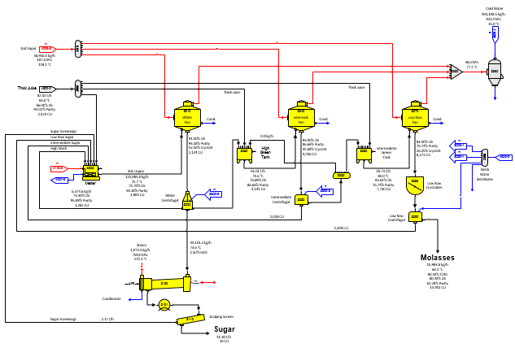
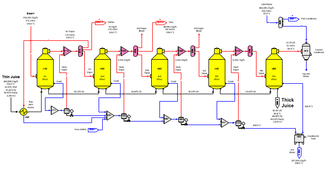
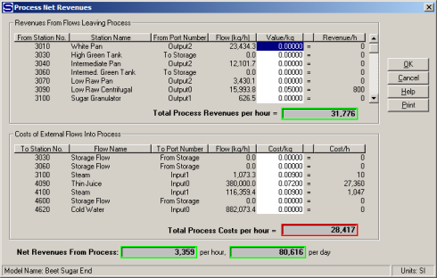
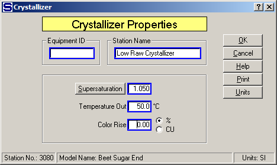

# Beet Sugar End

 

The flow diagram for a beet factory sugar end with a multiple-effect
evaporator is a two page model. The first page covers crystallization
and is shown in the diagram below.

Page 1

 

The second page covers 5-effect evaporation with condensate flashing and
is shown on page 2.

 

Page 2

 

External flows into the model are: (1) thin juice to a juice heater on
1st vapor, (2) steam to the 1st effect, (3) cold water to the
condensers, and (4) steam to the sugar dryer/granulator. Output flows
from the model are: (1) sugar from the scalping screen, (2) molasses
from the low raw centrifugal, (3) 2nd and 3rd bleed vapor, (4) hot
condensate water, and (5) warm leg line water from the condensers.

 

This is a three boiling model with only one melter. Bleed vapors from
the multiple-effect are used to provide all of the steam for the pans,
melter and thin juice heater in the process. Wash water for the
centrifugals is provided by condensates from the evaporator bodies.
Steam of higher pressure than the exhaust steam pressure is used for the
sugar dryer.

 

Heat transfer coefficients are used for each effect in the evaporator;
so as changes are made to the model, the vapor temperatures and
pressures for each effect's vapor will change as the vapor loads change.
Also, note that vapor from each effect contains a small amount of
entrained liquid with sucrose. The entrainment is higher in the first
two effects where the evaporation rate is highest and diminishes to
smaller amounts for the last two effects. Because of the entrainment,
condensates from the 2nd, 3rd and 4th effects contain a small amount of
sucrose. Some of this sucrose is recovered when the condensates are used
for centrifugal wash water and the remainder is lost to the leg line
water from the condensers (station nos. 3360 and 4610), condensates
leaving each pan and hot water out of the model (from distributor
station no. 3300).

 

Condensate from the 1st effect (station no. 4100) is flashed to 1st
vapor and then sent to a receiver to be combined with other condensates
to be flashed to 2nd, 3rd and 4th vapor.

 

 

The Net Process Revenues for the model are shown in the above
window.  Value and Cost figures for the
entries in each section can be edited directly from this window by
clicking the left mouse button on the value to be
changed.  As shown for the value and cost
entries given, the Net Process Revenues for the model are 80,616
currency units per day.  Other windows in
Sugars can be used to review all of the input data used for this model
and the balance results.

 

Changes can be made to the input data and comparisons
can be made between the output results to evaluate the impact of each
change.  Also, the
effect on the process from changes in the operating characteristics of a
station can be evaluated quickly to determine their value to the
performance of the process; for example, improving the performance of
the crystallizer will cause a reduction in the massecuite temperature
and sucrose
supersaturation.  Entering
the new improved values can help to decide whether additional
crystallizer capacity and cooling are worth the investment
expense.

 

For example, the performance of crystallizer station no. 3080 on low raw
massecuite can be changed to simulate more crystallizer capacity with
better cooling.  More crystallizer capacity
will result in the massecuite having more time to achieve equilibrium in
the crystallizers that will give a lower supersaturation of the
massecuite as it leaves the
crystallizer.  More cooling in the
crystallizer will result in a lower temperature of the massecuite as it
leaves the crystallizer.  Thus, simply
lowering the supersaturation coefficient and temperature values would
simulate a change in performance of the crystallizer station.

 

The window below shows the input parameter's window for the crystallizer
before any changes are made (Supersaturation Coefficient = 1.100 and
Temperature = 54.0°C).

 

 

And, the window below shows the input parameter's window after changes
are made to the Supersaturation Coefficient (=1.050) and Temperature
(=50.0°C) values.

 

 

The resulting change in process revenues is shown on the window below.

 

 

No change is made in the Color Rise (%) parameter, and color rise in the
massecuite (input value is 0.0), as it passes through the crystallizer,
is not considered in this example; however, increasing the holding time
of massecuite in the crystallizer may affect the massecuite
color.  This could be considered by entering a
different value than 0.00 for the Color Rise
(%).  As shown on the above window, the net
process revenues increase to 89,208 currency units when the change is
made.  **This is an increase in revenues of
8,592 currency units per day, or a 10.66% increase in
revenues. ** This increase in revenues can be
used to evaluate the economics for making an investment in additional
crystallizer capacity and cooling.  Other
detailed changes in the model can be evaluated by printing out the
results from both before and after the changes are made, displaying data
on the drawing and noting the changes, or by reviewing the pertinent
flow streams using the properties windows.

 

The results of each process modification may depend on the operating
conditions and the characteristics of each station in the model; that
is, the conclusions reached for one process model may not apply to
another and checking them for each case is best.
