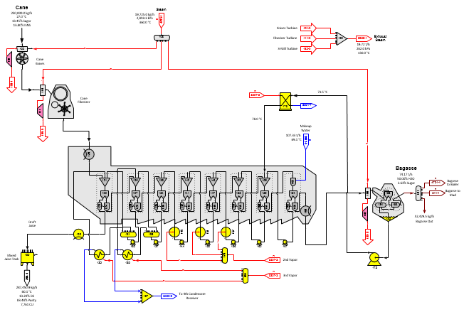
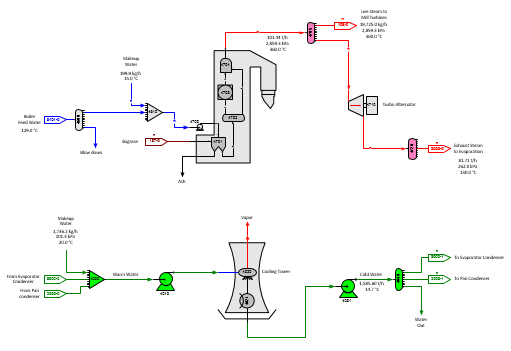

# Cane Factory (Diffusion)

 

Diffusion

 

The model of a cane factory with a diffuser is the
same as the milling factory except for the first
page.  The above
figure shows the first page (Diffusion page) with a
diffuser.  Cane
preparation is done by one set of knives and a fiberizer - both of which
are driven by steam
turbines.  Bagasse
after the diffuser is dewatered in a steam driven
mill.  A separator
station controls the quantity of steam to the knife and fiberizer as a
ratio to the quantity of the total cane
flow.  The ratio
could be set to the fiber in the cane as an alternative method for
controlling the steam quantity.

 

The diffuser is modeled using cells/stages that
consist of a receiver, separator, distributor and blender stations in an
arrangement that allows for fiber to move through the diffuser with
decreasing amounts of sucrose and non-sucrose
components.  Seven
identical combinations are used so that injection steam and
recirculation juice flow streams are modeled like the actual
diffuser.  The
results of the model can be adjusted in the separator and blender
stations to give the same operating results as measured in the
factory.  Because
the separation of sucrose and non-sugars from fiber can be controlled in
each of the cells, it is not necessary to have as many cells to achieve
the same performance in the model as in the actual diffuser in the
factory; however, a diffuser model could be constructed to have the same
number of cells as the actual diffuser.

 

Draft for the diffuser is controlled by blender station no. 161 which
ratios the quantity of makeup water to the fiber content of the flow
into the blender. Changing the ratio will quickly change the draft on
the diffuser, sucrose extraction and mixed juice characteristics.

Steam/Water

 

The figure above shows the Steam/Water page for the boiler, turbo
alternator and cooling water loop with cooling
tower.  The boiler grouping is a simple model
for the boiler that uses a separator station (no. 4701) to ratio the
fuel to the boiler feed water.  The reactor
station no. 4703 is used to convert feed water to
steam.  The efficiency of the conversion is
100% (all of the feed water is converted to steam) and the heat of
reaction is set to give a temperature for the steam leaving the reactor
that is higher than the live steam out of the
boiler.  A blender station (no. 4704) is used
to control the temperature of the live steam by using feed water to
reduce the steam temperature to the actual live steam
temperature.  The pressure of the live steam
is set in the boiler feed water pump.  Other
boiler groupings are available on the Equipment stencil that can provide
automatic adjustment of the fuel depending on the moisture content of
the fuel.

 

The cooling tower is modeled using a flash tank (station no. 4020) and a
cooler (station no. 4021) to give cooling water at the correct
temperature for the pan and evaporator
condensers.  Excess water from the cooling
loop is discharged from distributor station no. 4040.
