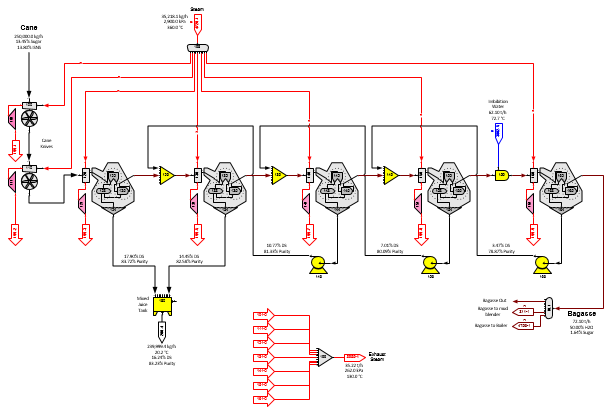
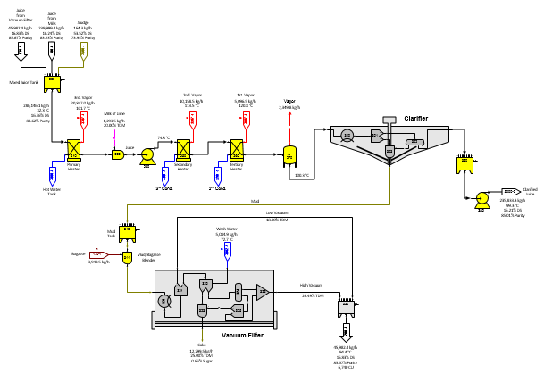
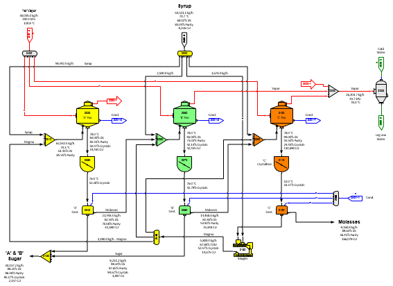
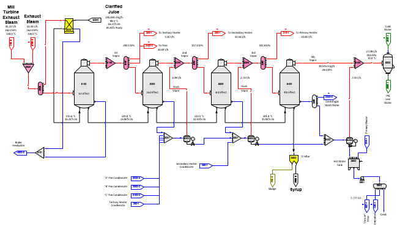
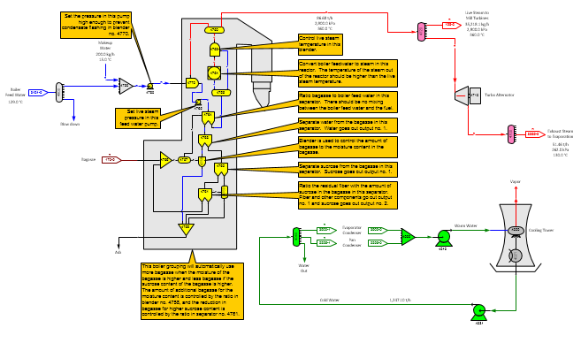
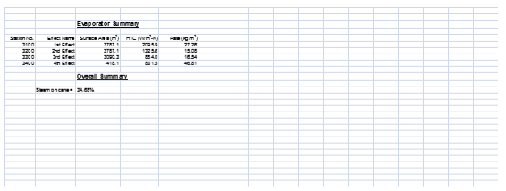
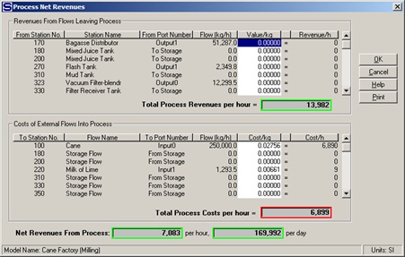
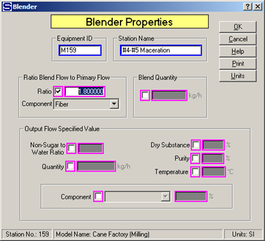

# Cane Factory (Milling)

 

Page 1

 

The model of a complete cane raw sugar factory is
given in the Cane Factory (Milling)
example.  A
five-mill train with compound imbibition and steam driven mills is shown
in the figure above (page
1).  A separator
station controls the quantity of steam to each of the knives and mills
as a ratio to the quantity of the total cane or bagasse flow into each
knife or mill.  The
ratio could be set to the fiber in the cane as an alternative method for
controlling the steam
quantity.  Each mill
grouping behaves in the same manner; that is, cane or bagasse flows into
the separator station where it is separated into fiber and
juice.  The fiber
with some bound sucrose and non-sucrose components passes through the
separator and leaves in output no. 1, and all of the juice passes
through the separator and leaves in output no. 2 after losing some of
its sucrose and non-sucrose components to the fiber that goes out output
no. 1.  The moisture
content of the bagasse leaving each mill is set in the blender
station.  Setting
the mill separator and blender data involves getting typical moisture
values for the bagasse leaving each mill and setting the blenders to the
measured moisture
values.  Then, the
separator stations in each mill grouping are first set to only separate
fiber from the juice and then doing a balance to see how much adjustment
is needed in each mill separator station to match the final bagasse
sucrose content and mixed juice %DS and Purity.

 

Page 2

 

Clarification using hot liming is shown on page 2
(see figure
above).  Mixed juice
from the mill train is combined in the mixed juice tank with clarifier
sludge from the syrup clarifier and sweet water from the vacuum
filter.  Flow from
the mixed juice tank goes to the primary heat exchanger and is heated up
to 75°C with 3rd vapor from the
multiple-effect.  Milk
of lime is added after the primary heat exchanger and limed juice is
heated in a secondary heat exchanger on 2nd vapor and a tertiary heat
exchanger on 1st
vapor.  The
temperature of the flow after the tertiary heat exchanger is 105°C and
it goes to a flash tank where the temperature drops to approximately
100°C.  From the
flash tank, flow goes to the clarifier for settling the precipitates in
the juice.

 

The clarifier is constructed from four Sugars
stations: (1) cooler, (2) separator, (3) blender, and (4)
distributor.  Heat
loss is allowed for in the cooler station no.
300.  In the
separator station no. 301, all of the CaO and some dissolved non-sucrose
are sent to blender station no.
303.  All remaining
components of the flow into the clarifier (separator) are sent to
distributor station no.
302.  Juice content
of the mud leaving the clarifier is controlled by blender station no.
303 with the moisture content of the mud held to the value set in the
blender.

 

Mud from the clarifier is sent to the vacuum filter
after bagasse is added in blender station no. 311 to aid in
filtering.  The
vacuum filter is modeled using three (3) separator stations, one (1)
cooler station, one (1) blender station, one (1) distributor station and
one (1) receiver
station.  The first
separator station no. 321 is used to extract the cloudy
filtrate.  This
represents the low vacuum section of the filter when the mud is first
drawn to the rotating
drum.  The remaining
stations in the model represent the high vacuum and washing sections of
the filter.  The
final cake moisture content is controlled by blender station no. 323
where the percent (%) moisture content of the cake is
specified.  Sugar
content in the cake is controlled by values entered for sucrose
separation in separator station nos. 322 and
325.  The
performance of each separator station and the one blender station in a
vacuum filter model should be based on data taken from an actual vacuum
filter in the factory.

 

Pump stations are used in the model to increase the pressure of the
imbibition juice (station nos. 146, 156 and 166), limed juice (station
no. 230), and clarified juice (station no. 355). Increasing the pressure
of these flow streams prevents any water/vapor phase changes that could
possibly occur if the temperature of the flow exceeds the vaporization
temperature at the flow stream pressure. If phase change (flashing) does
occur in these flow streams, the heat exchanger and blender stations
associated with these flow streams will be affected by the phase change
and the heating flow quantities into the heat exchangers will increase
significantly resulting in balance problems for the model.

 

Page 3

 

Crystallization for raw sugar production is by
three-massecuite boilings as shown on page 3 (see figure
above).  ‘C’ sugar
is used to make magma for footings in the ‘A’ and ‘B’
boilings.  The ‘A’
and ‘B’ crystallizers are really holding tanks for the massecuite before
it is sent to the
centrifugals.  Using
a crystallizer for these stations allows some cooling and crystal
growth.  Mingler
station no. 2130 is used to create magma as a footing for the
pans.

 

Page 4

 

In the multiple-effect (page 4 shown in the figure above), condensate
flashing is used on 2nd, 3rd and 4th condensates; however, the 4th
condensate is split in distributor station no. 3401 so that some
condensate can be used for centrifugal wash water at its higher
temperature (the rest is flashed and sent to the hot water tank). Hot
water is used for imbibition and for vacuum filter wash water.

 

Page 5

 

Page 5 (above figure) shows the boiler and turbo
alternator with the cooling water loop and cooling
tower.  Bagasse
from the mills is proportioned to the boiler feed water using a series
of separator, blender, distributor and receiver stations and then
discharged as
ash.  Sugars does
not consider any combustion calculations and the quantity of bagasse is
simply controlled by the quantity of boiler feed water in the same ratio
as actually used by the
boiler.  Feed water
is converted to steam in the reactor station no. 4754 and the steam
temperature is controlled to the actual steam temperature by blender
station no.
4753.  Other
stations are used to adjust the bagasse consumption based on the
moisture and sucrose content in the
bagasse.  Annotations
are given for the significant stations in the boiler grouping.

 

The cooling tower is modeled using a flash tank (station no. 4020) and a
cooler (station no. 4021) to give cooling water at the correct
temperature for the pan and evaporator condensers. Excess water from the
cooling loop is discharged from distributor station no. 4040.

 

Page 6

 

A summary page as an embedded Microsoft Excel spreadsheet is included
(see Page 6 above) to summarize various aspects of the
model.  Data from the model is exported to the
spreadsheet using Visual Basic that is included with
Visio.  The Visual Basic code can be reviewed
by clicking **DEVELOPER** \> **Visual
Basic**.  This code can be modified to export
any of the Shape Data from the model into the spreadsheet and all of the
features of Excel are available to manipulate the data as
needed.  See
[Program Operation \> Exporting Data to
Excel](../Program_Operation/Exporting_Data_to_Excel.htm) for
further details about the Visual Basic export code.

 

 

 

The Net Process Revenues window for the complete model is shown above.
Using this window, any changes made to the model can be evaluated
quickly for their impact on the process revenues. For example, what
would be the effect on the revenues if the imbibition water were
changed?

 

 

The imbibition water used by the mill train is controlled by blender
station no. 159. The properties window for blender station no. 159
before changing the imbibition water is shown above. As shown, the
imbibition water is controlled by a ratio of 1.8 to the fiber content in
the cane. Increasing this ratio will increase the imbibition water.
Change the blender's ratio to 2.2
to give a 22.22% increase in the imbibition water rate used by the mill;
and then, redo the balance calculations (that is, click on the full
balance icon) to see how the model will change with the new imbibition
water quantity. After the balance is completed, changes that occur in
each flow stream can be reviewed by double clicking on the flow stream
to display its properties, or by printing out the results for evaluation
and review. However, a quick method for finding the impact on the
performance of the factory with additional imbibition water is to
display the Net Process Revenues window and compare the new net process
revenues with the revenues before the change was made.

 

 

The above window shows the new net process revenues after increasing the
imbibition water ratio to 2.2 and rebalancing the model. As shown, the
revenues increase to 174,240 currency units per day. This is an increase
of 4,248 currency units per day (US dollars in this example) and over a
300 day campaign the total increase would amount to 1,274,400 currency
units. Review of the data for the two balance calculations shows that
when increasing the imbibition water for the model: (1) sugar content of
the bagasse out decreases, (2) A and B sugar production increases, (3)
exhaust steam consumption increases, (4) molasses leaving the model
increases, (5) milk of lime consumption increases, and (6) cold water
consumption increases. The cake from the vacuum filter shows a slight
reduction in the quantity of cake and a small reduction in its sugar
content. This is a result of the dilution of the juice at the higher
rate of imbibition water used in the mill train and the specified
moisture content for the cake leaving the vacuum filter.

 

Other stations in the model can be evaluated easily for their impact on
the process revenues generated by the factory using procedures similar
to the one shown above for the increase in imbibition water.
