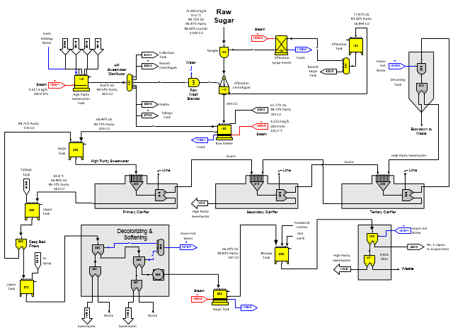
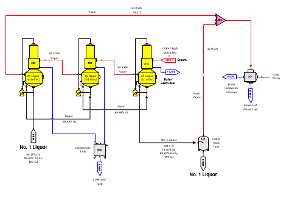
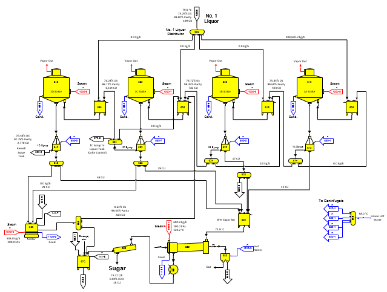
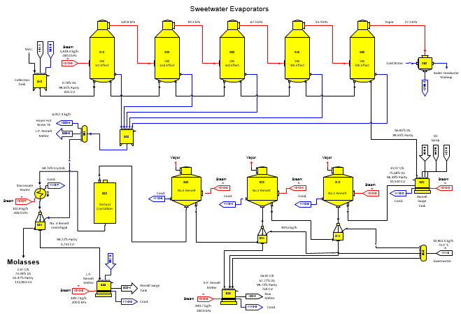

# Refinery

 

Page 1

The affination and purification model for a cane sugar refinery is shown
in the above diagram. Raw sugar from storage goes to the mingler
(station no. 100) where it is mixed with heated syrup and the magma is
sent to the affination centrifugals (station no. 110). Wash in the
affination centrifugals is provided by condensate water cooled by cold
water in blender station no. 142. Sugar from the affination centrifugals
goes to the raw melter (station no. 150) where it is mixed with high
purity sweet water and remelt while being heated with steam. Raw liquor
leaves the raw melter and goes to the screens station to remove any
solids (e.g., wood, twine, etc. from shipping which is not model by any
stations from Sugars) and then to the surge tank (station no. 300) where
backwash syrup from the deep bed filters is mixed with the raw liquor.

 

Clarification of raw liquor after screening is done by flotation
clarification with the clear effluent going to deep bed filters and the
scum desweetened by a countercurrent desweetening operation (secondary,
tertiary and decanting). The clarifiers are modeled using a receiver and
separator station for each clarifier. Lime is considered in the model;
however, P2O5, polymer and air are not considered (their effect on the
material balance is negligible). The tertiary scum is diluted with hot
water and decanted in a tank with automatic blow down. The decanting
tank is modeled with a blender and separator (station nos. 339 and 340).

 

Liquor leaving the primary clarifier goes to a liquor tank (station no.
350) and then to the deep bed filters modeled with a separator station
(no. 360). Liquor leaving the deep bed filters goes to another liquor
tank (station no. 370), where 1C syrup can be added if necessary for
color control, and then to ion exchange modeled with two separator
stations (nos. 380, 381) for decolorization. Further ash removal is done
in the softening resin that is modeled with two separator stations (nos.
386 and 387) and a reactor station no. 388 for controlling the
solubility coefficients following ion exchange. The solubility of liquor
changes when ash is removed and this can be accounted for by setting new
solubility coefficients in the reactor station.

 

Liquor from the softening resin goes to a surge tank (station no. 390)
and then to a polishing filter modeled with two separator stations (nos.
400 and 401). The polishing filter is used for final filtering of the
liquor before evaporation. The diatomaceous earth and powdered carbon
used in the blowup tank and polishing filter are not considered in the
model. Sweet water from the polishing filter results from hot water used
to clear the filter before rinse water is used to sluice the filter
residue to waste. Sweet water is discharged to the high purity sweet
water tank (station no. 140) along with sweet water that comes from ion
exchange. The models of the deep bed filters, ion exchange and the
polishing filter are simple models using separators that could be
replaced with more elaborate models for these stations (for example, see
the [Ion Exchange](Ion_Exchange.htm) example and filter models given in
other examples).

 

Page 2

 

Liquor from the polishing filter is sent to a falling film three effect
countercurrent evaporator station (station nos. 510, 520 and 530) to
concentrate the liquor up to 73% dry substance (%DS). Liquor flows into
the 3rd effect and steam flows into the 1st effect of the multiple and
the %DS for the liquor out of the multiple is specified in the 1st
effect (station no. 510). Hence, the %DS of the liquors out of the 2nd
and 3rd effects are not directly tied to the %DS of the flow leaving the
multiple-effect. Because of this, the model is not as stable as models
where the evaporator station uses co-current flow. Trying to balance the
model several times may be necessary before a balance is achieved when
changes are made. Countercurrent evaporator stations are more difficult
to balance than a co-current evaporator because the %DS of the flow out
of the evaporator is specified in the same effect as the steam flow into
the evaporator and the other effects float.

 

Vapors from the three-effect evaporator and flash tank (station no. 540)
are condensed with cold water (station no. 591). The cold water, after
being heated by the condensing vapors, is used for boiler feed water
makeup.

 

Liquor from the 3-effect evaporator station goes to a flash station (no.
540) to cool the liquor from more than 100°C (temperature of liquor as
it leaves evaporation) to about 80°C. The flash tank further
concentrates the liquor to about 75% dry substance. Normally, all of the
concentrated no. 1 liquor is sent to the first strike (1A Strike,
station no. 610) of the four strike boiling stations (pan station nos.
610, 620, 630 and 640); however, the model uses a distributor station
no. 600 to allow no. 1 liquor to go to each strike for in-boiling, if
necessary.

 

Page 3

 

Massecuite from the 1A Strike pan is discharged to a centrifugal station
(no. 612) for separation of the crystalline sucrose from the mother
liquor. Hot wash water is used to help the separation of the mother
liquor (syrup) and crystals. Syrup from the 'A' centrifugal is sent to a
tank (station no. 616) that supplies the 1B Strike pan (station no.
620). Also, 1A syrup can be sent back to the supply tank (station no.
606) for the 1A strike pan to allow for back-boiling, if needed. Sucrose
crystals are grown in the 1B Strike pan as water is evaporated from the
feed syrup and the resultant massecuite is sent to the 'B' centrifugal
(station no. 622) for separation of the mother liquor and sucrose
crystals by centrifugal force and hot wash water. 1B syrup is sent to
the supply tank (station no. 626) for the 1C Strike pan (station no.
630), or some of it can be sent back to the 1B Strike pan supply tank
for back-boiling, if desired. Sucrose crystals are grown in the 1C
Strike pan and the massecuite is discharged to the 'C' centrifugal
(station no. 632) for recovery of the sucrose crystals. The 1C syrup
discharged from the 'C' centrifugal is sent to the supply tank (station
no. 636) for the 1D Strike pan (station no. 640), or to the supply tank
for the 1C Strike pan if it is needed to back-boil 1C syrup. Massecuite
from the 1D Strike pan is sent to the 'D' centrifugal (station no. 642)
for separation of the sucrose crystals from the massecuite. 1D syrup
from the centrifugal separation is sent to the remelt section of the
refinery.

 

Spun sugar from the 'A' centrifugal (station no. 612) is sent directly
to the wet sugar bin (station no. 650) since it is the sugar with the
lowest color. Spun sugar from the 'B', 'C' and 'D' centrifugals is sent
to either the wet sugar bin or the melt tank (station no. 660) if the
color of the sugar is not acceptable. Sugar that is above the color
specification from 'B', 'C' and 'D' strikes may still be acceptable when
it is combined with lower color sugar from earlier strikes to give a
final resultant sugar color that is within specification. Sugar from the
wet sugar bin goes to the granulator (station nos. 680 and 681) and then
to the sugar screens (station no. 685). Dust from the granulator is
washed in the Rotoclone (station nos. 683) with the washings that
contain sugar sent to the tailings tank (station nos. 670). Other sugar
sources (for example, sweepings, etc.) are collected and melted in the
tailings tank and sent back to the liquor tank (station no. 350) for
mixing with the main liquor flow. Two and one-half percent (2.5%) of the
sugar production is assumed to be lost in the sugar screens and recycled
back to the tailings tank.

 

Page 4

 

1D syrup from the 1D centrifugal (station no. 642) is sent to the remelt
surge tank (station no. 800) for further sugar extraction in the remelt
pans. Excess affination syrup is also sent to the remelt surge tank
along with the melt from the low purity remelt melter (station no. 838)
and concentrated sweet water from the 5th effect (station no. 950) of
the sweet water evaporators. Steam heating is used on the remelt surge
tank to control the liquor flow out to 80°C before it is sent to the no.
1 remelt pan (station no. 810). Massecuite from the no. 1 remelt pan is
sent to the no. 1 remelt centrifugal (station no. 814) and the separated
syrup is sent to the no. 2 remelt pan (station no. 820). Sugar from the
no. 1 remelt centrifugal is sent to the high purity remelt melter
(station nos. 828) where it is combined with the sugar from the no. 2
remelt centrifugal (station no. 824) sugar and diluted with high purity
sweet water from distributor station no. 141 and 850 while being heated
with steam in the melter to dissolve all of the sucrose crystals. The
remelt liquor is sent to the raw melter (station nos. 150, 151 and 152)
for addition to the raw liquor. No. 1 remelt centrifugal syrup is sent
to the no. 2 remelt pan (station no. 820).

 

Massecuite from the no. 2 remelt pan is sent to the no. 2 remelt
centrifugal (station no. 824) where the sucrose crystals are separated
and sent to the high purity remelt melter and the separated syrup is
sent to the no. 3 remelt pan (station no. 830). Massecuite from the no.
3 remelt pan (station no. 830) is sent to a vertical crystallizer
(station no. 832) for cooling and additional crystal growth and then
heated in the massecuite heater (station no. 833) to reduce the
viscosity of the massecuite before it is spun in the no. 3 remelt
centrifugal (station no. 834). Steam is used for heating the no. 3
remelt massecuite before spinning. Sugar from the no. 3 remelt
centrifugal (station no. 834) goes to the low purity remelt melter
(station no. 838) where condensate from the sweet water evaporator
station and steam heating in the melter is used to dissolve the sucrose
crystals. The liquor (no. 3 liquor) from this melter is sent back to the
remelt surge tank (station no. 800).

 

Sweet water evaporator condensate from distributor station no. 991 is
used for wash water in the no. 3 remelt centrifugal and the syrup
discharged from this centrifugal is the final molasses from the
refinery. Sweet water evaporator condensate is also used in the low
purity remelt melter (station no. 838) for dissolving sugar from the no.
3 remelt centrifugal (station no. 834). Excess sweet water evaporator
condensate is sent to the house hot water tank.

 

The complete color balance for all flow streams and the net process
revenues are given in this example model.
