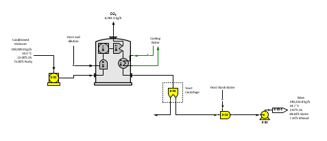
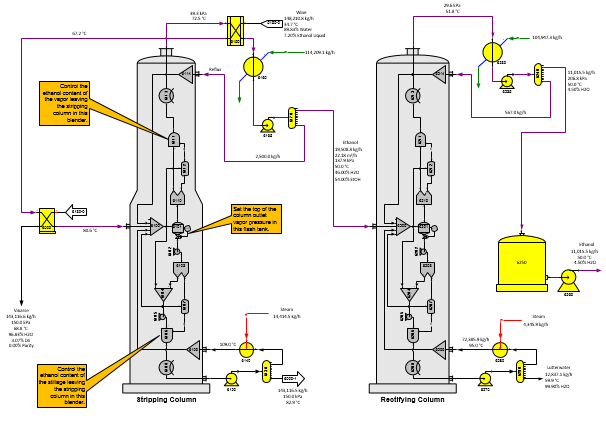

# Fermentation and Distillation

 

 

 

Page 1

 

Page 1 shows molasses conditioning to convert sucrose
to invert using a reactor station (no. 5100) and fermentation of invert
in molasses to
ethanol.  The
fermenter is a grouping of a blender, reactor, separator and heat
exchanger stations to model the behavior of an actual
fermenter.  Sugars
does not have a component for yeast and the blender station no. 5110
just allows for the addition of a yeast solution to be added to the
fermenter.  The
yeast centrifuge allows for the loss of invert from the yeast.

 

Page 2

 

The model of distillation to produce hydrous ethanol is shown in Page 2
above.  The fermented solution (wine) passes
through a heat exchanger (station no. 6150) that preheats the solution
using vapors from the stripping column and then through another heat
exchanger that heats it further using
stillage.  The station grouping for the
stripping and rectifying columns is the same and the performance of the
two columns is controlled by the data entered for the stations in the
grouping and the reflux and recirculation defined for the
columns.  Liquid ethanol in the wine is
converted to vapor in the flash tank (station no. 6101 for the stripping
column and 6201 for the rectifying column).  A
separator station is used to separate ethanol and water vapors from the
vapor leaving the flash tank and then a blender station is used to
control the water content of the vapor leaving each
column.  The water content is obtained from
factory data; however, the water content should not be less than 4.37%
for the vapor leaving the rectifying column which is the water content
at the azeotrope for ethanol-water
mixtures.  The water content of the vapor out
of the stripping column is much higher (normally around 45% to 50%) and
achieving a balance in this column is not as sensitive to the
recirculation and/or reflux quantities.  The
rectifying column is more difficult to balance because of the low water
content in the vapor leaving the
column.  Insufficient recirculation and/or
reboiler outlet temperature will cause insufficient water vapor from the
separator station no. 6210 in the rectifying column to satisfy the
column vapor out water content.

 

Other equipment can be added to this model to produce anhydrous ethanol.

 
