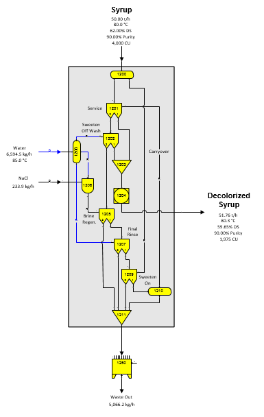

# Ion Exchange

 

 

The flow diagram for the Ion Exchange example of a generic ion exchange
model for decolorization of syrup is shown in the figure above.
Separator stations are used to control the flow of material from one
stage to the next for a complete ion exchange system cycle. The material
remaining in the column, when changing stages is the carryover that goes
to the next stage. This is shown as a bed volume of material in above
diagram; however, it may be either more, or less, than one bed volume
depending on the design of the columns and the system. The model shown
is a simple model for decolorization. More complicated models can be
built for demineralization, juice softening, or other ion exchange
processes. A grouping of these stations is provided on the "Equipment -
miscellaneous" stencil.

 

Solubility coefficients for both output flows from a separator are
always the same as the coefficients for the input flow; therefore, if
the melassigenic components in the flow streams are shifted from one
flow to the other, the solubility coefficients should be reset for the
output flows from the separator by using a reactor station (see station
no. 1204 above) on the affected flows to control the solubility
coefficients to their proper values. For example, if juice softening is
used where Ca ions are exchanged for Na ions in the juice, the
melassigenic components in the juice will change. Therefore, the
solubility coefficients for the juice should change to reflect its new
solubility characteristics.
