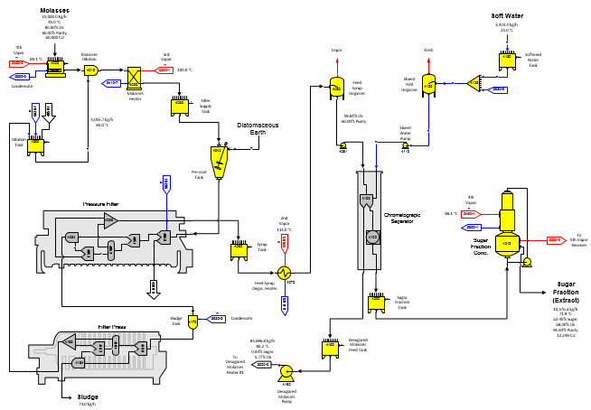
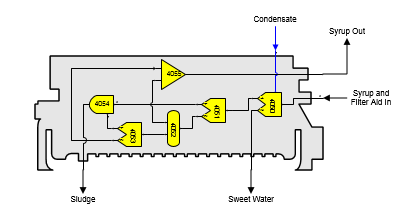
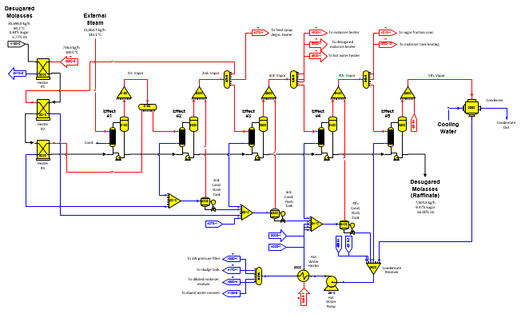

# Molasses Desugarization

 

The example model for molasses desugarization is a two page model. Page
1 is shown below and it covers molasses receiving, filtering,
chromatographic separation and extract concentration. Page 2 covers
desugared molasses (raffinate) concentration. This example model
describes the flows for the material, energy and color balances, but it
does not totally describe the actual process. However, the level of
detail is up to the user; that is, more detail can be added, such as,
decolorization, demineralization, water softening or other features.

 

Page 1

 

Molasses enters the molasses tank station no. 4000 where it is heated up
to 50°C using 4th vapor from the desugared molasses evaporator. Next, it
is diluted to 60% dry substance in blender station no. 4010 and then
heated in a heat exchanger (station no. 4020) before going to the filter
supply tank station no. 4030. Diatomaceous earth is added to the diluted
and heated molasses in the pressure filter precoat tank (modeled using
blender station no. 4040) and then it is filtered in the pressure filter
(modeled using station nos. 4050 thru 4055). The diatomaceous earth is
defined as an external flow stream at 100% dry substance of "Fiber"
component because Sugars does not have a component for diatomaceous
earth.

 

 

The model of the pressure filter is shown above. The first separator
station no. 4050 uses hot water (condensate) to produce sweet water that
goes back to the molasses dilution water supply tank station no. 4300.
The resultant syrup and filter aid flow go to a second separator station
(no. 4051) where all of the filter aid is removed and sent to the
blender station (no. 4054) for control of the sludge moisture content.
The filtered syrup then goes to a distributor station (no. 4052) that
sends part of the syrup back to a third separator station (no. 4053)
that is used to provide water for the filtered cake (sludge) and control
the amount of sucrose and non-sucrose that is discharged with the cake
from the blender station no. 4054. The remaining syrup is sent to
receiver station no. 4055 and is combined with the syrup that does not
go to the separator station no. 4053. The output flow from the receiver
goes to syrup tank station no. 4060 and the cake from blender station
no. 4054 goes to the sludge tank where it is diluted with hot water and
sent to the filter press for final dewatering and discharge from the
model.

 

The model of the filter press (station nos. 4180 thru 4184) is similar
to other models of filter presses shown in other examples. Filtrate from
the filter press goes to molasses dilution tank station no. 4300. Hot
water coming from distributor station no. 5630 is the required flow into
the tank that is adjusted by Sugars to provide the additional dilution
water to the molasses dilution blender station no. 4010 after sweet
water from the pressure filter and filtrate from the filter press are
first used to satisfy the required quantity of flow to the molasses
dilution blender.

 

Syrup goes from the syrup tank (station no. 4060) to the feed syrup
degassing heater station no. 4070 where it is heated to 85°C. Vapor
heating for this heater is 2nd vapor from the desugared molasses
multiple-effect evaporator. After the syrup is heated, it goes to flash
tank station no. 4080 where the syrup flashes and cools down to 80°C.
Following the flash tank, the syrup goes through a pump (station no.
4081) to raise the flow stream pressure to 3.0 bars absolute and then to
the separator columns that are modeled using separator station no. 4100
and reactor station no. 4102.

 

The separator station uses eluent water to separate sucrose and
non-sucrose components. The separator also removes color, and the color
removed in the separator should be adjusted to match with the actual
separator column performance of the process used. Two flow streams leave
the separator columns: (1) a sugar fraction and (2) a desugared
molasses. Because of the removal of non-sucrose components from the
sugar fraction, the sucrose solubility characteristics of the sugar
fraction are different from the syrup flow into the separator columns.
Reactor station no. 4102 is used to adjust the sucrose solubility
coefficients for the sugar fraction to account for the removal of
non-sucrose components.

 

Eluant water to the separator columns is provided by condensate water
from the desugared molasses evaporator as provided by distributor
station no. 5630 to receiver station no. 4125 and softened water from
the softened makeup water tank (station no. 4130). These two water flows
are combined in receiver station no. 4125, cooled to 80°C in a degassing
flash tank (station no. 4120), and pumped to the separator columns using
a pump station (no. 4110) to raise the water pressure to 3.0 bars
absolute. Most of the eluent water is provided by hot condensate from
the desugared molasses evaporator; however, some makeup water is needed
and the softened makeup water tank supplies it. The flow stream from the
makeup water tank station no. 4130 to the receiver station no. 4125 is a
required flow to allow Sugars to automatically calculate this makeup
flow quantity after all of the excess hot condensate from distributor
station no. 5630 is used.

 

The sugar fraction flow from the separator columns goes to a tank
(station no. 4200) and then concentrated in a falling film evaporator
(station no. 4210). Vapor for the falling film evaporator is provided by
the 4th effect of the desugared molasses multiple-effect evaporator.

 

Desugared molasses from the separator columns goes to a desugared
molasses feed tank (station no. 4150) and then pumped to 3.0 bar
absolute pressure with pump station no. 4160.

 

Page 2 of the model is shown below. It covers desugared molasses
concentration and condensate recovery with flashing.

 

Page 2

 

Desugared molasses from pump station no. 4160 goes to three heater
stations in series (station nos. 5000, 5010 and 5020) that are heated
using vapor bleeds from the multiple-effect evaporator. Following the
heaters, the desugared molasses is concentrated in a multiple-effect
evaporator using condensate flashing and then discharged from the model.
The 5th effect vapor from the multiple-effect and vapor from the sugar
fractions falling film evaporator are combined in a receiver station
(no. 5550) and condensed in a surface condenser (station no. 5560) that
uses cooling water to condense the vapors. The condensed vapors and all
condensates from the multiple-effect, sugar fraction evaporator and
molasses tank heater are combined in a receiver station no. 5600 for
reuse in the process. Condensate from the condensate receiver is pumped
in pump station no. 5610 to 3.0 bars absolute pressure, heated in heat
exchanger station no. 5620 to 85°C using 3rd vapor from the
multiple-effect and distributed by distributor station no. 5630 to
various stations in the process that uses hot water.

 

External exhaust steam only flows to the 1st effect (station no. 5100)
of the desugared molasses multiple-effect evaporator and all condensate
from the 1st effect leaves the model to be reused as boiler feed water.

 

This model could be combined with the Beet Factory model by merging the
two models together to give a complete integrated model of a beet sugar
factory with molasses desugarization. The net process revenues for the
combined beet sugar factory with molasses desugarization could then be
calculated using the Net Process Revenues window and printout in Sugars
to evaluate the economics of adding molasses desugarization to a beet
sugar factory.
