# Single Crystallization

 

The flow diagram for the Single Crystallization example is shown below.
This example is a very simple single crystallization process that only
uses a pan, crystallizer and centrifugal to boil and crystallize a syrup
into a massecuite that can be processed by a continuous centrifugal to
separate the crystalline sugar from the mother liquor. External sources
are used for the steam, syrup and centrifugal wash water (i.e., they are
external flows) and the molasses and sugar leave the flow diagram
without any recycle. All flows that leave each station are internal
flows. For example, the massecuite flow from the pan to the
crystallizer, from the crystallizer to the centrifugal, vapor and
condensate flows out of the pan, and sugar and molasses flows out of the
centrifugal. Crystallization is controlled by the input data for the pan
and crystallizer stations, and the separation of mother liquor and sugar
from the massecuite is controlled by the input data used for the
centrifugal to define the performance characteristics of the centrifugal
station. More complicated models are developed using the same techniques
as used for this simple model.

 

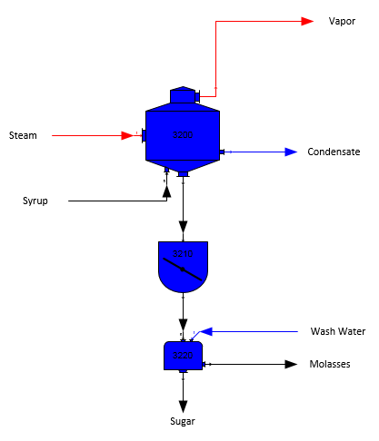

 

The Single Crystallization model is already built and located in the
"...\Sugars\Examples" directory. Either double click on the "Single
Crystallization.vsd" file from Windows Explorer, or open it from within
Visio.

 

The two external flows into the pan are "Steam" and "Syrup". The steam
flow is a required flow; that is, Sugars will calculate the quantity of
steam consumed by the pan. The syrup flow has to be completely defined,
with pressure, temperature, quantity, components, color, and solubility
coefficients. Also, currency value numbers can be given if the net
process revenues are to be calculated by Sugars.

 

To enter data for the characteristics of the steam flow into the pan,
place the cursor on the steam flow line (the cursor will change to have
four crossing arrows when the line is selected) and double click the
left mouse button to get the external flow input window shown below
(shown with data already entered). 

 

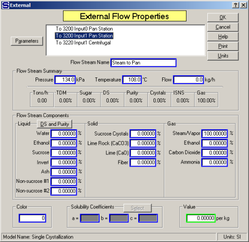

 

Enter the name of the flow stream as "Steam to Pan", enter 0.0 for
pressure, 108°C for the steam temperature and 100% for the "Gas"
component "Steam/Vapor". No entry is needed for the solubility
coefficients because the steam flow does not contain any non-sucrose
components. And, no entry is made for the quantity of flow because it
will be calculated by Sugars; that is, it is a required flow. Place the
cursor on the OK button and press the left mouse button. Sugars will
calculate the pressure from the steam temperature for saturated steam.
The window should appear as shown above after the OK button is pressed.
After the OK button is pressed, Sugars will calculate the steam pressure
assuming that the steam into the pan is saturated at the entered
temperature of 108°C.

 

Next, place the cursor on the syrup flow line (the cursor will change to
have four crossing arrows with a large white arrow when the line is
selected) and double click the left mouse button to get the external
flow input window shown below (shown with data already entered).

 

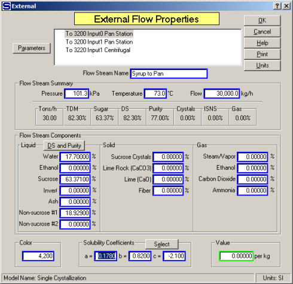

 

The entries for the syrup flow to the pan should appear as shown in the
above window. The quantity of syrup flow into the pan must be specified
(30,000 kg/h for this example) before Sugars can do the balance
calculations. Also, the temperature of the flow (73°C for this example),
the solubility equation coefficients (Grut values are used for this
example) and component fractions (entered as 82.30%DS and 77.0 Purity)
must be given. Use the "DS and Purity" button to the right of "Liquid"
and above "Water (H2O)" in the Flow Stream Components grouping to obtain
a small window to enter 82.30%DS and 77.0 Purity values. Sugars will
calculate the "Water (H2O)", "Sucrose" and "Non-Sucrose \#1" components
using the %DS and Purity values entered in the small popup window. A
color value of 4,200 is entered for the syrup. When all of the entries
have been made, place the cursor on the OK button and click the left
mouse button to accept the input values and return to the flow diagram.

 

Next, move the mouse cursor over the pan station until the cursor
changes to a large white arrow with four crossing black arrows and then
double click the left mouse button to bring up the pan station input
parameter’s window as shown below (shown with entries already made).

 

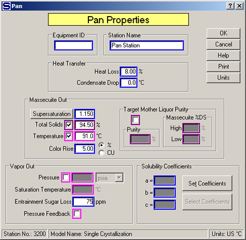

 

Enter the name "Pan Station" for the pan and then enter the values as
shown on above window. That is, enter Supersaturation = 1.150, Total
Solids = 94.50%, Temperature = 91.0°C, Color Rise % = 5.00, Entrainment
Sugar Loss PPM = 75 and Heat Loss % = 8.00. See [Pan
Properties](../Pan/Pan_Properties.htm) for an explanation of each of the
input values. When all entries are made, place the cursor on the OK
button and click the left mouse button to accept the input values and
return to the flow diagram. Notice that the pan station color is now
yellow.

 

Move the mouse cursor over the crystallizer station
until the cursor changes black crossing
arrows.  Double
click the left mouse button to bring up the Crystallizer Properties
window as shown below (shown with entries already made).

 

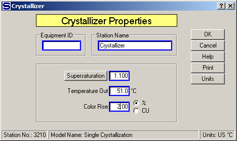

 

Enter the name of the crystallizer (e.g., "Crystallizer") in the Station
Name field. Next, enter a 1.100 supersaturation coefficient, a
temperature of 51°C and a color rise of 2.00% for the massecuite leaving
the crystallizer; that is, the massecuite will be cooled from 91°C to
51°C with a drop in supersaturation from 1.15 to 1.10 as it passes
through the crystallizer after leaving the pan (see the [Crystallizer
Properties](../Crystallizer/Crystallizer_Properties.htm) for an
explanation of each input parameter). When all entries are made, place
the cursor on the OK button and click the left mouse button to accept
the input values and return to the flow diagram (crystallizer station
color is now yellow).

 

Next, enter the characteristics of the wash flow
going to the
centrifugal.  Move
the mouse cursor over the wash flow line going to the centrifugal until
it has four black crossing
arrows.  Double
click using the left mouse button to obtain the data entry window for
the wash water going to the centrifugal as shown in the window below
(shown with data already entered).

 

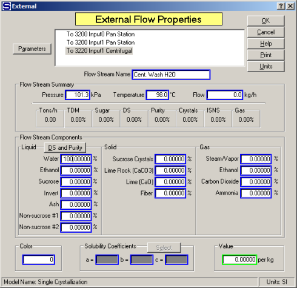

 

Enter a name for the external flow; for example, "Cent. Wash H2O". Next,
enter the pressure (101.3kPa) and temperature (98.0°C) of the wash
water. The quantity of water flow will be calculated by Sugars since the
wash water is required by the centrifugal and the quantity of wash water
is controlled by the performance data entered for the centrifugal.
Finally, enter 100.00 in the Water (H2O) component entry field. If syrup
washing is used, flow fractions for the syrup could be enter instead of
100% water, and if steam is used, a percentage can be entered for the
fraction of the flow that is made up of steam. When all entries are
completed, place the cursor on the OK button and click the left mouse
button to accept the input values and return to the flow diagram view in
Visio.

 

Next, select the centrifugal shape with the cursor
and double click the left mouse button (or click the right mouse button
and select "S<u>u</u>gars Properties" from the drop-down
menu).  This will
bring up a window from Sugars about the start of a centrifugal
evaluation (see the window shown below).

 

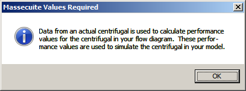

 

A centrifugal evaluation must be done to determine the performance of
the centrifugal that is being used in the model. Actual operating data
is necessary to provide the performance data used for the evaluation,
and the results of the evaluation will be used to predict the results
from the centrifugal when the balance calculations are done. Press the
Enter key, or click the left mouse button on the
OK button, to begin the evaluation and
advance to the massecuite evaluation window (see window shown below with
data already entered).

 

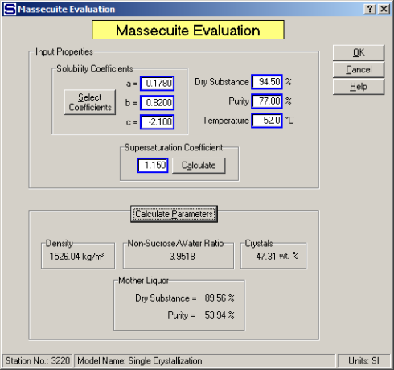

 

Enter the characteristics of the massecuite flowing to the centrifugal
from actual operating data (for example, select Grut Solubility
Coefficients, Supersaturation Coefficient = 1.150, Dry Substance =
94.50%, Purity = 77.00% and Temperature = 52.0°C). The solubility
equation coefficients, %DS, Purity, temperature and supersaturation
values entered for this massecuite may be different then the massecuite
that flows into the centrifugal when the balance calculations are done -
the data entered should be from actual operating data. The massecuite
Specific Weight, Non-Sucrose/Water Ratio, crystal weight content
(Crystals), and mother liquor %DS and Purity are displayed as the data
is entered. Also, the Calculate Parameters
button can be pressed to update the results at any time.

 

Next, click on the OK button to advance to
the centrifugal evaluation window (see the window shown below with data
already entered).

 

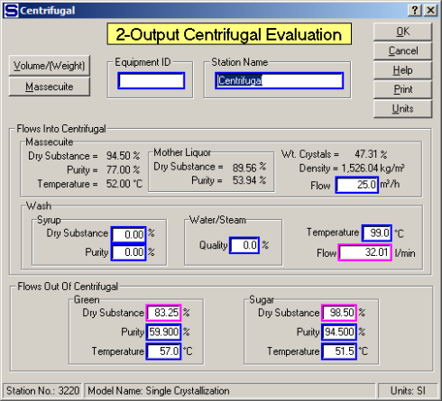

 

See the [2-Output Centrifugal
Properties](../Centrifugal/2-Output_Centrifugal_Properties.htm) section
for an explanation of each of the input parameters. The results from an
actual centrifugal operation, using the same massecuite as used for the
massecuite evaluation, should be entered as shown on the window above
(i.e., Massecuite Flow = 25.0, Wash Temp. = 99.0°C, Green %DS = 83.25,
Purity = 59.90 and Temperature = 57.00°C, Sugar %DS = 98.50, Purity =
94.50 and Temperature = 51.5°C). Fields in magenta color (three fields)
are optional fields in which only two of the three fields need entries -
the third field, where an entry isn't made, will be calculated by
Sugars. For example, enter values for the "Green Dry Substance" and
"Sugar Dry Substance" and the "Wash Flow" in l/min will be calculated.
Or, if the "Wash Flow" in l/min is entered along with the "Green Dry
Substance", the "Sugar Dry Substance" will be calculated. After making
all of the necessary entries, click on the OK
button to accept the entries and the unknown value will be calculated
and displayed by Sugars. Click the OK button
again to get the window showing the "2-Output Centrifugal Performance
Calculation" results as shown in the window below.

 

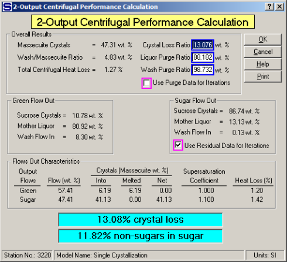

 

The results from this window show that 57.41% of the massecuite and wash
water into the centrifugal go out the green (molasses) flow line and
47.41% go out the sugar line. Some crystals pass through the screen to
the green flow (6.19% by weight) by melting. No crystals are lost in the
sugar flow out. The total loss of sucrose crystals is 13.076% from the
crystals in the massecuite entering the centrifugal (highlighted section
at bottom of the window). Also, 98.732% of the wash water in and 88.182%
of the mother liquor is purged out to the green (molasses). The total
heat loss in the centrifugal is 1.27%. Of the non-sucrose components
into the centrifugal, 11.82% of them remain with the sugar flow out. The
total crystal loss and non-Sugars remaining with the sugar are
highlighted at the bottom of the window. Good centrifugal operation will
result in low values for these parameters. The sugar flow out parameters
of mother liquor and wash water residues will be held during the balance
calculations (this is the default selection by Sugars as shown by the
check in the check box next to the "Use Residual Data for Iterations"
option). The Crystal Loss Ratio, Liquor Purge Ratio and Wash Purge Ratio
parameters can be selected for use during the balance calculations
(instead of the residue values) by clicking in the box next to the "Use
Residual Data for Iterations". The choice of residue, or ratio, value is
optional and may depend on the operating conditions in the factory.
Also, the performance evaluation results for ratio values can be edited
by entering new values for "Crystal Loss Ratio", "Liquor Purge Ratio",
or "Wash Purge Ratio". Changing ratio values will result in new values
for %DS and Purity of green and sugar flows out of the centrifugal (they
will be displayed on the input data window if the performance results
are edited).

 

Click the OK button to return to the flow
diagram display in Visio after reviewing the 2-Output Centrifugal
Performance Calculation results.

 

All of the required input data has been entered for this example.
Therefore, the balance calculations can be done. The full balance icon
on the Sugars ribbon tab (see the window shown below) shows a red box to
indicate that the model is unbalanced.

 

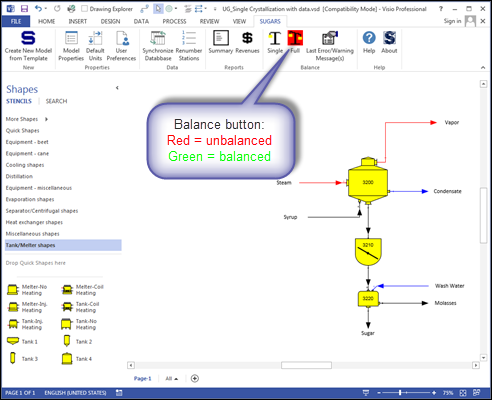

 

Click on the full balance icon, and the balance calculations will start.
The calculations should proceed quickly and the full balance icon should
change to the color green to indicate that a balance was achieved.

 

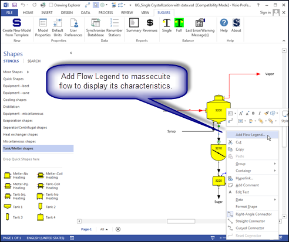

 

Right click on the massecuite flow stream connected to the output of the
vacuum pan and the input of the crystallizer and select "Add Flow
Legend" (see the above window).

 

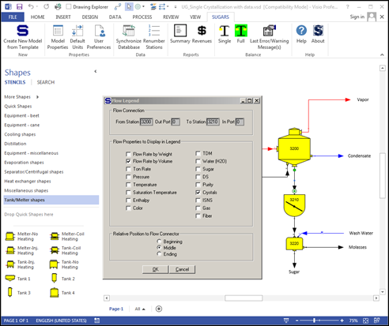

 

On the Flow Legend selection windows (see above), select "Flow Rate by
Volume", "Crystals" and "Middle" to display the volume quantity of
massecuite leaving the pan and the crystal content of the massecuite.
Middle is selected to display the data in the middle of the flow stream
(see window below). Click the OK button to
display the data. The data can be moved to the desired location on the
drawing after it is displayed.

 

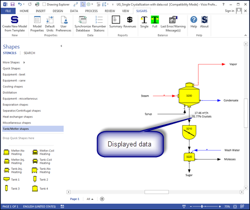

 

Double click with the left mouse button on any flow stream to see the
details of the flow stream. Click on the Parameters button to display
engineering parameters of the flow (volume, specific weight, enthalpy,
specific heat, supersaturation, and boiling point elevation) while
viewing the details of a flow stream. For example, double click on the
massecuite flow from the pan to see the characteristics of the
massecuite from the pan and then click on the parameters button to
determine the enthalpy of the massecuite leaving the pan (see the window
below). This information is available for any flow stream in the model.

 

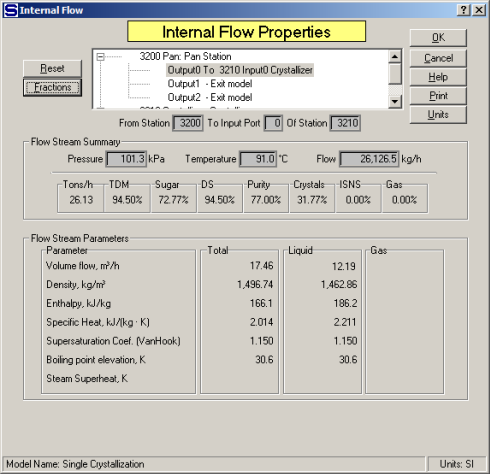

 

From the flow diagram window, click the "Summary report" icon to display
a report of all of the flow streams in the model (see the window below).
Material and heating flows to and from each station are shown on the
report with the quantity, % sugar, % purity, % crystallization,
temperature, color and other flow characteristics given for each flow
stream.

 

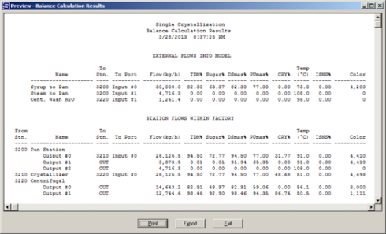

 

Reviewing the results of the material flows printout, it can be seen
that the percent crystallization of the massecuite out of the pan is
31.77% and after the massecuite leaves the crystallizer, the percent
crystallization has increased to 48.68%.

 

Reviewing the results for the steam flow to the pan shows that the pan
requires 4,728.2 kg/h of steam to accomplish the evaporation and
crystallization for this example. Also, the vapor flow from the pan
shows a 0.01% TDM and 0.01% Sugar content: these values are due to the
entrainment (droplets) loss in the vapor.

 

After the results from the calculations are printed out, the model can
be saved by clicking on the save icon on the Visio toolbar, or clicking
on the Visio file menu item and selecting
Save, or Save as
from the drop-down menu. Saving the model will save the results from the
balance calculations and all of the input data entered for the
performance of each station and the characteristics of each external
flow.

 

Making changes to this example is useful to become more familiar with
Sugars. Additional stations can be added to gain experience with adding
stations and the results obtained from further processing of the flow
streams using other stations. For example, add more boilings and try a
different juice (syrup) input flow to see the effect on molasses purity
and sugar yield.
