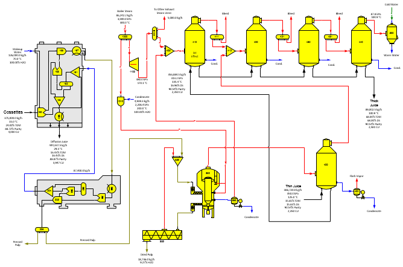

# Steam Pulp Dryer

 

 

The flow diagram for the Steam Pulp Dryer example model of a high
pressure steam pulp dryer with a diffuser, pulp press, steam pressure
reducer and desuperheater, turbo generator and thin juice
pre-concentrator and four effect-multiple evaporator is shown in the
above diagram. The pressed cossettes are dried in a high-pressure steam
pulp dryer and vapor from the dryer is sent to a thin juice
pre-concentrator. Hot dried pulp is flashed (station no. 352) to a
receiver station (no. 351) to preheat the pressed pulp and condensate
from the dryer is flashed (station no. 355) to the steam receiver
(station no. 405) for the thin juice multiple-effect evaporators. The
flash tank for the hot dried pulp does not use pressure feedback, but
the condensate flash tank does use pressure feedback. Steam flow into
the thin juice pre-concentrator (station no. 400) is not a required flow
because a value is not specified for the dry substance of the thin juice
going from the pre-concentrator to the multiple-effect. Instead, the
amount of evaporation done in the pre-concentrator is controlled by the
amount of vapor from the steam dryer. The pressure reducer and
desuperheater are modeled using a blender station (no. 1010). The
pressure of the condensate into the desuperheater controls the output
pressure of the desuperheater (blender), and the temperature of the
desuperheater steam is set in the blender station (no. 1010). A turbine
(station no. 1100) provides exhaust steam for the process. High-pressure
steam into the model is an external flow.
