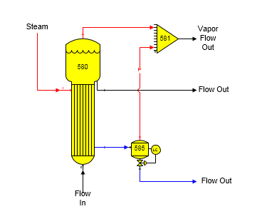

# Flash Tank Examples

 

In some cases, the Output Flow Temperature, or Vapor Out Pressure aren't
known before the balance calculations are done by Sugars. By sending the
vapor flow to a receiver station that has one, or more, other input flow
streams that have a flow stream pressure, the flash tank can be made to
flash to the pressure of the other flow stream, or the minimum pressure
of all other flow streams, if there is more than one other input flow to
the receiver. For example, in the diagram below, a condensate flash tank
has vapor flashing to a vapor line from an evaporator station. Note the
small 'P' on the flash vapor line from station no. 585 to 581 to
indicate that the vapor line is a pressure feedback line. In this case,
the Pressure Feedback box is checked on the Flash Tank Properties
window. An input value may still be given for the Sugar Loss, if
applicable.

 

 

Water vapor flashing will occur in the flash tank station if: (1) the
pressure of the condensate flow in is equal to, or greater than, the
feedback pressure, and (2) the temperature of the condensate flow in is
greater than the saturation temperature plus boiling point elevation at
the feedback pressure; otherwise, no changes will occur in the
condensate flow and the output flow pressure, temperature and quantity
will be the same as the input flow pressure. The small 'P' on the vapor
line from the flash tank is displayed by Sugars when the vapor line is a
pressure feedback flow.

 

 

[Flash Tank Features](Flash_Tank_Features.htm)

[Flash Tank Properties](Flash_Tank_Properties.htm)
