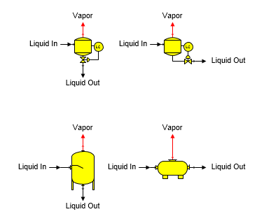

# Flash Tank Features

 

Flash Tank A flash tank station is used to cool a material flow stream
by allowing water vapor to flash. Different flash tank shapes provided
with Sugars are shown below.

 

 

General Features Sucrose crystals are not grown in a flash tank even if
the output flow temperature and dry substance are suitable for
crystallization; hence, the output flow may be supersaturated. Sucrose
crystals (if any) in the input flow will remain the same by weight in
the output flow. The value entered for either the vapor out pressure (or
saturation temperature), or the liquid out temperature is used to
control flashing in the flash tank. Alternately, pressure for the flash
tank is provided by pressure feedback from another station in the model
when neither of the temperatures is entered and the pressure feedback
option is selected for the flash tank. The vapor flow out pressure will
be set to atmospheric pressure (see [Program Overview \> User
Interface](../Overview/Program_Overview.htm)) if the vapor out leaves
the model (that is, it is not connected to another station) and it is a
pressure feedback flow.  Either the vapor out or the liquid out can be a
required flow, but not both output flows.  Sugars will calculate the
liquid input flow rate if either output flow is required.

 

 

[Flash Tank Properties](Flash_Tank_Properties.htm)

[Flash Tank Examples](Flash_Tank_Examples.htm)
