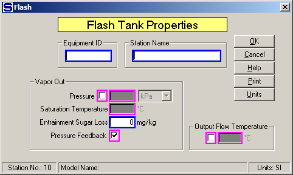

# Flash Tank Properties

 

 

Equipment ID An equipment ID of up to 11 characters can be used to
identify the station with an actual station in the process. Any
combination of numbers and letters that are used in the factory/refinery
to identify equipment can be entered. For example, Equipment ID =
123.456A. It is not necessary to make an entry in the Equipment ID field
if the station in the model does not have a corresponding station in the
factory/refinery.

 

Station Name A name of up to 20 characters must be entered for the
station. For example, Station Name = 3rd Cond. Flash Tank.

 

Flashing will occur if the temperature of the output flow is less than
the input flow. If a Vapor Out Pressure (or Saturation Temperature) is
entered, Sugars will calculate the temperature of the output flow with
consideration given to the boiling point elevation, if any. Sugars will
give an error message if this calculation results in an output flow
temperature that is greater than the input flow temperature, or if the
entered value for the Output Flow Temperature is greater than the
temperature of the flow into the flash tank. Hence, entering a value for
the Output Flow Temperature, or a Vapor Out Saturation Temperature, will
result in water vapor flashing if the input flow temperature is either
greater than the output flow temperature, or greater than the vapor out
temperature plus boiling point elevation. Sugars will give an error
message if the pressure of the flow into the flash tank is less than the
pressure of the vapor out. No heating occurs, or is considered, in a
flash tank station.

 

Vapor Out An entry can be made for either the Vapor Out Pressure (or
Saturation Temperature), Pressure Feedback, or for the Output Flow
Temperature. The borders of these entry fields are in magenta color to
indicate that only one of them can be selected. If Pressure Feedback is
selected, the vapor flow out will be a pressure feedback flow and the
pressure of both the vapor and process flows out will be at the feedback
pressure. The feedback pressure will be at atmospheric pressure if the
vapor flow leaves the model.

 

Pressure Left click the check box next to the Pressure field to select
the Vapor Out Pressure and Saturation Temperature instead of the Output
Flow Temperature. Vapor Out Saturation Temperature may be entered
instead of Pressure when the check box next to the Pressure field is
selected. The drop-down box next to the Pressure field can be used to
select the pressure units for entry. The Saturation Temperature will be
calculated and displayed by Sugars when an entry is made for the
Pressure. For example, Pressure = 0.5 bar gives 81.3°C. If "mm Hg" or
"in Hg" units are used for the Pressure, the entered value should be \<
0.0 if the pressure is below standard atmospheric pressure.

 

Saturation Temperature Enter the saturation temperature of the vapor
flow out of the flash tank. Sugars will calculate a value for the
pressure of the vapor leaving the flash tank when the cursor is indexed
to another field. For example, Saturation Temperature = 85.00 °C gives
57.9 kPa.

 

Entrainment Sugar Loss Enter entrained sugar loss to vapor out as
parts-per-million (PPM) of sugar in vapor excluding any non-condensable
gases in the vapor flow (e.g., CO2, NH3, etc.). Sugar loss is measured
by the parts-per-million of sugar in the condensed vapor. Also, this
parameter allows for entrainment of sucrose and non-sucrose material in
the vapor flow. The input parameter is for the sugar loss; however,
Sugars will consider the droplets entrained with the vapor to have the
same %DS and Purity as the syrup (or, mother liquor if the flow contains
crystals) leaving the flash tank. Because Sugars considers the entrained
droplets to have both sucrose and non-sucrose, the Sugar Loss parameter
will give a non-sucrose loss if the input flow purity is less than 100%.
For example, Entrainment Sugar Loss = 80 ppm.

 

Pressure Feedback Left click the check box to use pressure feedback to
define the pressure of the vapor leaving the flash tank. For example, if
the vapor out goes to a receiver, the output pressure of the receiver
will be fed back to the flash tank as the vapor out pressure. The output
pressure of a receiver will be the minimum pressure of all the flows
into the receiver that are not pressure feedback flows. If the vapor
flow out goes out of the model and pressure feedback is used, the
atmospheric pressure for the model (see [Program Overview \> User
Interface](../Overview/Program_Overview.htm)) will be used as the
feedback pressure.

 

Output Flow Temperature Left click the check box next to the Output Flow
Temperature field to select the process flow out temperature instead of
Vapor Out Pressure or Pressure Feedback. Only one of these three options
can be selected. For example, Output Flow Temperature = 103.5°C.

 

 

[Flash Tank Features](Flash_Tank_Features.htm)

[Flash Tank Examples](Flash_Tank_Examples.htm)
