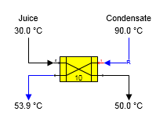
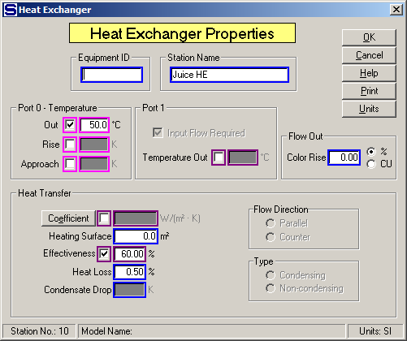
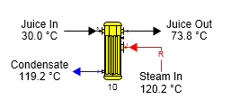
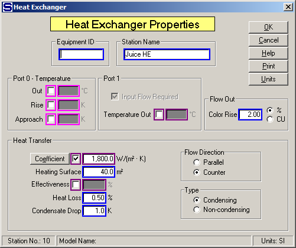

# Heat Exchanger Examples

 

Condensate heating using a plate heat exchanger is
shown in the figure
below.  The
condensate (port 1) flow in is a required flow because a temperature was
specified for the juice (port 0) flow out and the port 1 output flow
temperature is not known and is calculated by Sugars.

 

 

The figure below shows the Heat Exchanger Properties window.
Effectiveness is used to specify the heat exchange between the hot and
cold flow streams. If the quantity of condensate is known, then leave
the Port 0 Temperature Out unspecified (uncheck the Out box) and the
condensate flow into the heat exchanger will not be required. The
temperature of the juice out will then be calculated by Sugars.

 

 

Juice heating using steam is shown in the figure below. In this case,
the heat exchanger is a condensing heat exchanger; hence, the
temperature of the juice flow out is calculated by Sugars using the heat
transfer coefficient and heating surface area.

 

 

The figure below shows the Heat Exchanger Properties window with entries
for entries for the heat transfer coefficient and heating surface area.
The Type of Heat Transfer is "Condensing" which allows Sugars to
calculate the juice output flow temperature and the quantity of steam
(steam flow in is required) into the heat exchanger based on the heating
surface area and heat transfer coefficient.

 

 

Other examples of heat exchangers are shown in the
[Examples](../Examples/Examples.htm) section where many of the example
processes that are shown use heat exchangers.

 

 

[Heat Exchanger Features](Heat_Exchanger_Features.htm)

[Heat Exchanger Properties](Heat_Exchanger_Properties.htm)
