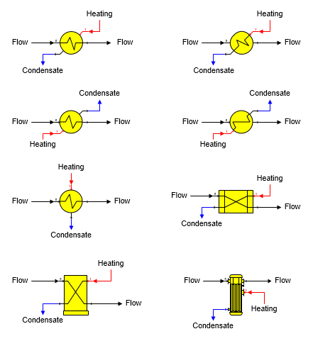

# Heat Exchanger Features

 

Heat Exchanger A heat exchanger station is used to transfer heat between
two flow streams. Different heat exchanger shapes provided with Sugars
are shown below.

 

 

General Features  A heat exchanger station is used to
heat a process flow stream (goes into port 0) with a heating flow stream
(goes into port 1), or cool a process flow stream with a cooling flow
stream.  The two
flow streams do not mix and only heat is transferred from one flow to
the other.  If
either flow stream contains sucrose crystals and heating the flow causes
the flow to become undersaturated, then sucrose crystals will melt until
the output flow stream is at sucrose
saturation.  Also,
vapor flashing can occur if the flow stream temperature is above the
vapor saturation temperature for the pressure of the
flow.  To avoid
flashing, a pump can be used to raise the pressure of the flow before it
passes through the heat
exchanger.  Heat
transfer calculations are done using the vapor saturation temperature of
the heating flow in if it is steam and it is superheated; however, the
total heat content of the steam flow in is
used.  Condensate
Drop is considered if a value is entered with the heat loss in the
condensate added to the heat
transferred.  Also,
effectiveness is calculated using the actual temperature for the input
flow instead of the vapor saturation temperature if the input flow is
superheated.

 

 

[Heat Exchanger Properties](Heat_Exchanger_Properties.htm)

[Heat Exchanger Examples](Heat_Exchanger_Examples.htm)
