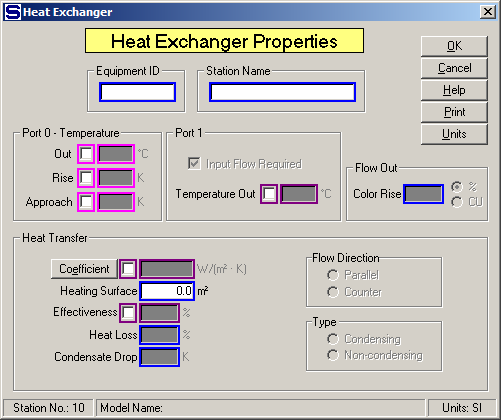

# Heat Exchanger Properties

 

 

Equipment ID  An equipment ID of up to 11 characters can be used to
identify the station with an actual station in the process. Any
combination of numbers and letters that are used in the factory/refinery
to identify equipment can be entered. For example, Equipment ID =
123.456A. It is not necessary to make an entry in the Equipment ID field
if the station in the model does not have a corresponding station in the
factory/refinery.

 

Station Name  A name of up to 20 characters must be entered for the
station. For example, Station Name = 2nd Carb. Heaters.

 

Port 0 - Temperature  Out, Rise, and Approach entries
control the port 0 flow out tempera­ture to the value entered and cause
the port 1 flow in to be a required flow unless the Port 1 “Input Flow
Required” check box is
unchecked.  If the
port 1 flow is steam/vapor and the port 1 input flow is required, Sugars
will calculate the required quantity of steam/vapor to give the
specified
temperature.  Also,
a value must be entered for either the effectiveness or the heat
transfer coefficient and heating surface if the port 1 flow is a liquid
(e.g., condensate) instead of steam or
vapor.  Magenta
colored borders on the entry fields are used to indicate that only one
of the entries can be selected; that is, when one is selected the others
are not accessible.

 

Out  Temperature of the port 0 flow out; for example, Out = **90.0**
(flow out = 90°C).

 

Rise  Temperature increase in the port 0 flow going through the heat
exchanger; for example, Rise = **7.5**.

 

Approach  Difference between the port 1 flow out
(T1o) and the port 0 flow out (T0o) temperatures; for example, Approach
= **5.5**°C (T1o-T0o =
5.5°C).  Value can
be less than 0.0; for example, Approach = **-7.5**°C.

 

Port 1 Flow into port 1 can be made either a required
flow (quantity of port 1 flow is to be calculated by Sugars), or a not
required flow when the quantity of the port 1 flow is known.  Also, a
temperature out can be specified to calculated the effectiveness and/or
the heat transfer coefficient for heat exchanges with known input and
output temperatures.

 

**Input Flow Required**  This is the normal
selection when a temperature value is
entered.  Sugars will calculate the quantity
of the flow into port no. 1 when the "Input Flow Required" check box is
checked.  Uncheck the box when the quantity of
the input flow is known and port 1 output flow temperature is to be
calculated by Sugars.

 

**Temperature
Out**  Enter an output
temperature for the port 1 flow when temperature values for the output
flows are known and the heat transfer coefficient is to be
calculated.  Selecting
Temperature Out will cause the port 1 input flow to be a required
flow.  Normally,
this is used for liquid-liquid heat exchange.

 

Heat Transfer  Entries for the heat transfer are used
when the output flow temperatures are to be calculated and known port 0
and port 1 flows go to the heat exchanger, or when the port 1 flow isn't
steam/vapor and a port 0 output flow temperature is
specified.  Also,
Sugars will calculate the steam/vapor flow to the heat exchanger if the
heat exchanger condenses the port 1
steam/vapor.  If a
Coefficient is entered, a Heating Surface entry must be
made.  Sugars will
use the saturation temperature (not the actual superheated temperature)
for heat transfer coefficient (LMTD) calculations (but the total
enthalpy is used) if the port 1 input flow is superheated vapor;
however, for effectiveness calculations, the actual port 1 input flow
temperature is used.

 

Coefficient  Enter a heat transfer coefficient for
the heat exchange between port 0 and port 1 flow streams across the
Heating
Surface.  For
example,

 

 Heat Transfer Coefficient = 455 Watts/m2-°C

 Heat Transfer Coefficient = 80.1 BTU/h-ft2-°F

 

Heating Surface  Enter the Heating Surface area (in units shown) for the
heat exchanger. If a Heat Transfer Coefficient is input, a Heating
Surface entry must be made. For example,

 

 Heating Surface = 35 m2

 Heating Surface = 376.7 ft2

 

 

Effectiveness (%)  Enter Effectiveness in percent (%)
for transfer of heat between hot and cold flow
streams.  Effectiveness
equals the ratio of actual heat transfer to the maximum possible heat
transfer between the flow streams, and the actual input temperatures are
used - not vapor saturation temperature if the input flow is superheated
steam.  The amount
of actual heat transferred is the amount of heat given to the flow being
heated.  Heat loss
is considered and it is heat lost from the transfer of heat from the hot
flow to the cold
flow.  Use
effectiveness to have Sugars calculate output flow temperatures when
known port 1 and port 0 flows go to the heat exchanger, or when the port
1 flow isn't a steam/vapor and a port 0 output flow temperature is
specified.  High
values of effectiveness depend on large heat transfer coefficient and
heating surface area and low flow rates to give a large Number of
Transfer Units
(NTU).  For
example,

 

 Effectiveness = 30% (shell and tube)

 Effectiveness = 60% (plate type)

 

Heat Loss (%)  Enter the Heat Loss in percent (%) for
the heat that is lost in the heat exchanger
station.  The heat
loss is the percentage loss of heat from the total heat that is
transferred to the cold flow from the hot
flow.  For example,
Heat Loss = **0.5**% to give 1/2% of heat loss.

 

Condensate Drop  Enter a temperature drop for the condensate (port 1flow
out) if it leaves the heat exchanger with a temperature that is lower
than the saturation temperature for the
condensate.  For example, if the vapor
saturation temperature for the vapor flow into the heat exchanger is
119°C and condensate leaves the heat exchanger at 115°C, then Condensate
Drop = **4.0**K.  The heat lost from the
condensate is considered for the heat transferred to the port 0 flow.

 

Flow Direction  Select either counter (counter-current) or parallel
(co-current) flow between port 0 and port 1 flow streams.

 

Type  The heat exchanger can be either condensing, or
non-condensing.  Condensing is used when the
port 1 flow is steam or vapor and all of the steam or vapor is condensed
in the heat exchanger.  Sugars can calculate
the output temperature using the coefficient and heating surface values
knowing that all of the steam will condense.

 

 

[Heat Exchanger Features](Heat_Exchanger_Features.htm)

[Heat Exchanger Examples](Heat_Exchanger_Examples.htm)
