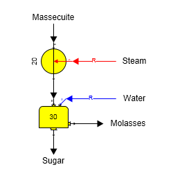
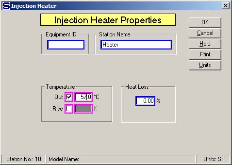

# Injection Heater Examples

 

A model of an injection heater on massecuite before a centrifugal is
shown in the figure below. The steam is a required flow and Sugars will
calculate the quantity of the flow necessary to raise the temperature of
the massecuite.

 

 

The Injection Heater Properties window is shown below for the model
shown in the above figure. Temperature of the massecuite leaving the
injection heater is specified; however, the temperature rise across the
heater could be specified instead.

 

 

 

 

[Injection Heater Features](Injection_Heater_Features.htm)

[Injection Heater Properties](Injection_Heater_Properties.htm)
