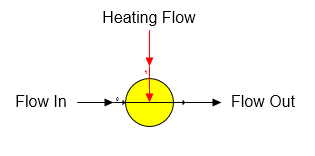

# Injection Heater Features

 

Injection Heater An injection heater station is used to heat a flow
stream by direct injection of steam or vapor into the flow. The
injection heater shape provided with Sugars is shown below.

 

 

 

General Features An injection heater station is used to heat a process
flow stream (goes into port 0) with a heating flow stream (goes into
port 1) by direct injection of the hot flow into the process flow;
hence, the output flow stream from the station is a combination of the
two flows. If either flow stream contains sucrose crystals and heating
the flow causes the flow to become under-saturated, then sucrose
crystals will melt until the output flow stream is at saturation.

 

 

[Injection Heater Properties](Injection_Heater_Properties.htm)

[Injection Heater Examples](Injection_Heater_Examples.htm)
