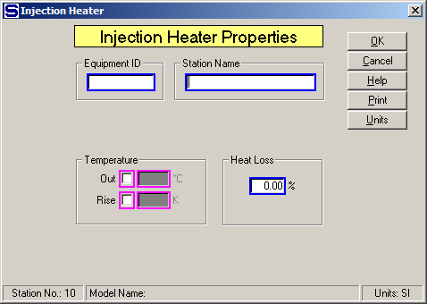

# Injection Heater Properties

 

 

Equipment ID An equipment ID of up to 11 characters can be used to
identify the station with an actual station in the process. Any
combination of numbers and letters that are used in the factory/refinery
to identify equipment can be entered. For example, Equipment ID =
123.456A. It is not necessary to make an entry in the Equipment ID field
if the station in the model does not have a corresponding station in the
factory/refinery.

 

Station Name A name of up to 20 characters must be entered for the
station. For example, Station Name = Massecuite Heater.

Magenta colored borders on the entry fields are used to indicate that
only one of the entries can be selected; that is, when one is selected
the others are not accessible. For example, if Temperature Out is
selected, Temperature Rise cannot be selected.

 

Temperature Out and Rise entries control the process flow out
temperature to the value entered. The injection heating flow will be a
required flow. If heating flow is steam/vapor, Sugars will calculate the
required quantity of steam/vapor to give the specified temperature.

 

Out Temperature of the process flow out; for example, Out = 90.0 (flow
out = 90°C).

 

Rise Temperature increase in process flow going through the injection
heater; for example, Rise = 7.5 K (flow out temperature = flow in
temperature plus 7.5°C).

 

Heat Loss (%) Enter the Heat Loss in percent (%) for the heat that is
lost in the injection heater station. The heat loss is the percentage
loss of heat from the total heat that is transferred to the process flow
from the heating flow. For example, Heat Loss = 0.5 % to give
1/2% of heat loss.

 

 

[Injection Heater Features](Injection_Heater_Features.htm)

[Injection Heater Examples](Injection_Heater_Examples.htm)
